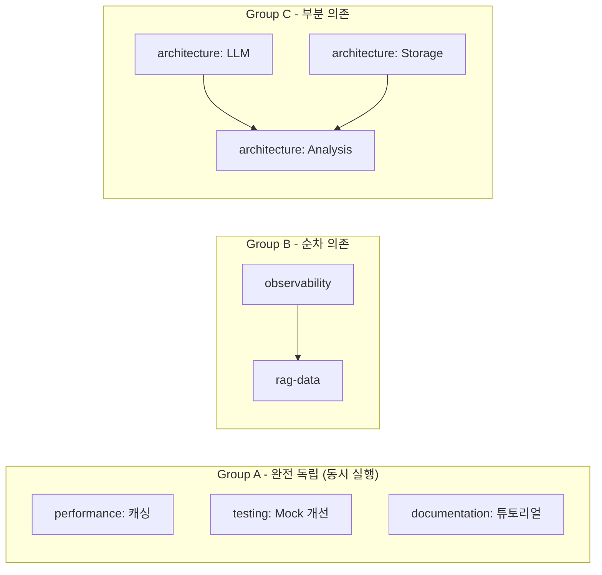
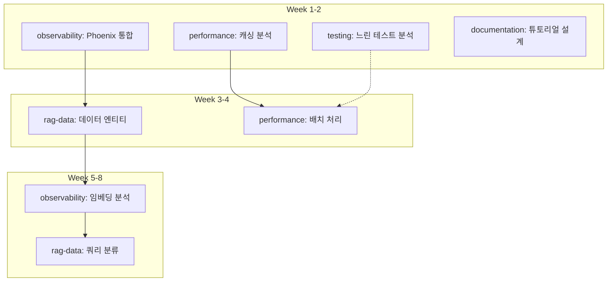

# EvalVault 개선 계획서

> Last Updated: 2026-01-01
> Version: 3.1
> Focus: 병렬 AI 에이전트 기반 코드 품질 개선, RAG Observability 통합, 성능 최적화

---

## 🔗 관련 문서

| 문서 | 용도 | 대상 |
|------|------|------|
| **이 문서 (IMPROVEMENT_PLAN.md)** | 개발 자동화 에이전트 실행 가이드 | 개발자, 에이전트 |
| [AGENT_STRATEGY.md](./AGENT_STRATEGY.md) | 전체 에이전트 활용 전략 (개발+운영) | 기획자, 운영자 |
| [agent/README.md](../agent/README.md) | 에이전트 시스템 사용법 | 개발자 |

---

## 목차

1. [개요](#개요)
2. [에이전트 시스템 개요](#에이전트-시스템-개요)
3. [AI 에이전트 병렬 실행 프레임워크](#ai-에이전트-병렬-실행-프레임워크)
4. [현재 상태 분석](#현재-상태-분석)
5. [개선 계획](#개선-계획)
   - [P0: 아키텍처 안전망](#p0-아키텍처-안전망-신규-리팩토링-패키지)
   - [P1: 코드 통합 및 중복 제거](#p1-코드-통합-및-중복-제거)
   - [P2: 복잡한 모듈 분리](#p2-복잡한-모듈-분리)
   - [P3: 성능 최적화](#p3-성능-최적화)
   - [P4: 사용성 개선](#p4-사용성-개선)
   - [P5: 테스트 개선](#p5-테스트-개선)
   - [P6: 문서화 개선](#p6-문서화-개선)
   - [P7: RAG Observability (Phoenix 통합)](#p7-rag-observability-phoenix-통합)
6. [병렬 실행 로드맵](#병렬-실행-로드맵)
7. [에이전트 메모리 시스템](#에이전트-메모리-시스템)
8. [Quick Wins](#quick-wins)
9. [부록](#부록)

---

## 개요

EvalVault는 현재 Phase 1-14가 완료되어 안정적인 기반을 갖추었습니다. 이제 **병렬 AI 에이전트 워크플로우**를 도입하여 코드 품질 개선, RAG Observability 강화, 성능 최적화를 동시에 진행합니다.

### 핵심 원칙

1. **KISS (Keep It Simple, Stupid)**: 복잡성 최소화
2. **DRY (Don't Repeat Yourself)**: 코드 중복 제거
3. **YAGNI (You Aren't Gonna Need It)**: 필요한 것만 구현
4. **빠른 피드백**: 작은 단위로 빠르게 개선 및 검증
5. **병렬 실행**: 독립적인 작업은 동시에 진행

### 목표

| 영역 | 목표 | 측정 지표 |
|------|------|----------|
| **개발자 경험 (DX)** | 명확한 코드, 쉬운 온보딩 | 온보딩 시간 50% 단축 |
| **사용자 경험 (UX)** | 직관적인 CLI, 명확한 에러 메시지 | 지원 요청 40% 감소 |
| **유지보수성** | 모듈화, 테스트 커버리지 증가 | 커버리지 89% → 95% |
| **성능** | 불필요한 계산 제거, 캐싱 활용 | 평가 속도 30% 향상 |
| **RAG 분석력** | 근본 원인 분석 가능 | 문제 진단 시간 16배 단축 |

---

## 에이전트 시스템 개요

> 📌 **상세 전략**: [AGENT_STRATEGY.md](./AGENT_STRATEGY.md) 참조

### 두 가지 운영 모드

EvalVault 에이전트 시스템은 **두 가지 모드**로 활용됩니다:

```
┌─────────────────────────────────────────────────────────────────┐
│                     EvalVault Agent System                       │
├─────────────────────────────────────────────────────────────────┤
│                                                                  │
│  ┌─────────────────────────┐    ┌─────────────────────────┐     │
│  │   Development Mode      │    │    Operation Mode       │     │
│  │   (이 문서에서 다룸)     │    │  (AGENT_STRATEGY.md)    │     │
│  ├─────────────────────────┤    ├─────────────────────────┤     │
│  │ • architecture          │    │ • domain-expert         │     │
│  │ • observability         │    │ • testset-curator       │     │
│  │ • rag-data              │    │ • quality-monitor       │     │
│  │ • performance           │    │ • eval-coordinator      │     │
│  │ • testing               │    │ • experiment-analyst    │     │
│  │ • documentation         │    │ • report-generator      │     │
│  │ • coordinator           │    │ • data-validator        │     │
│  └─────────────────────────┘    └─────────────────────────┘     │
│            │                               │                     │
│            ▼                               ▼                     │
│  ┌─────────────────────────┐    ┌─────────────────────────┐     │
│  │   Agent Memory          │    │   Domain Memory         │     │
│  │   (agent/memory/)       │    │   (config/domains/)     │     │
│  └─────────────────────────┘    └─────────────────────────┘     │
│                                                                  │
└─────────────────────────────────────────────────────────────────┘
```

| 모드 | 목적 | 대상 | 상태 | 문서 |
|------|------|------|------|------|
| **Development** | EvalVault 코드 개선 | 개발자 | ✅ 구현됨 | 이 문서 |
| **Operation** | RAG 평가 워크플로우 자동화 | 평가 담당자 | 📋 제안 | [AGENT_STRATEGY.md](./AGENT_STRATEGY.md) |

### 에이전트 시스템 상태

```
✅ 에이전트 시스템 검증 완료 (2026-01-01)
   - Claude Agent SDK 정상 작동
   - 8개 개발 에이전트 구현됨
   - 메모리 시스템 정상 작동
   - 병렬 실행 그룹 정의됨
```

### 에이전트 실행 방법

```bash
# 개발 에이전트 실행
cd agent/
uv run python main.py --project-dir .. --agent-type architecture

# 사용 가능한 에이전트 목록 확인
uv run python main.py --list-agents

# 코디네이터로 전체 상태 확인
uv run python main.py --project-dir .. --agent-type coordinator
```

### 개발 모드 vs 운영 모드 선택 가이드

| 작업 유형 | 사용할 모드 | 에이전트 |
|-----------|-------------|----------|
| 코드 리팩토링 | Development | `architecture` |
| 테스트 최적화 | Development | `testing` |
| Phoenix 통합 | Development | `observability` |
| 일일 평가 자동화 | Operation | `quality-monitor` |
| 도메인 용어 학습 | Operation | `domain-expert` |
| 테스트셋 보강 | Operation | `testset-curator` |

---

## AI 에이전트 병렬 실행 프레임워크

### 아키텍처 개요

```
                    ┌─────────────────────────────────┐
                    │      Coordinator Agent          │
                    │  (통합 관리, 의존성 해결)        │
                    └───────────────┬─────────────────┘
                                    │
        ┌───────────────────────────┼───────────────────────────┐
        │                           │                           │
        ▼                           ▼                           ▼
┌───────────────┐          ┌───────────────┐          ┌───────────────┐
│  architecture │          │ observability │          │  performance  │
│    Agent      │          │    Agent      │          │    Agent      │
│               │          │               │          │               │
│ - 의존성 역전 │          │ - Phoenix     │          │ - 캐싱        │
│ - 코드 통합   │          │ - 데이터 수집 │          │ - 비동기      │
│ - 모듈 분리   │          │ - 메트릭      │          │ - 배치 처리   │
└───────────────┘          └───────────────┘          └───────────────┘
        │                           │                           │
        │                           │                           │
        ▼                           ▼                           ▼
┌───────────────┐          ┌───────────────┐          ┌───────────────┐
│    testing    │          │   rag-data    │          │ documentation │
│    Agent      │          │    Agent      │          │    Agent      │
│               │          │               │          │               │
│ - 테스트 최적화│          │ - 검색 추적   │          │ - 튜토리얼    │
│ - 커버리지    │          │ - 생성 추적   │          │ - API 문서    │
│ - Mock 개선   │          │ - 사용자 피드백│          │ - 가이드      │
└───────────────┘          └───────────────┘          └───────────────┘
        │                           │                           │
        └───────────────────────────┼───────────────────────────┘
                                    │
                    ┌───────────────▼─────────────────┐
                    │      Agent Memory System        │
                    │    (agent/memory/)              │
                    │                                 │
                    │  ├── agents/{agent-name}/       │
                    │  └── shared/                    │
                    └─────────────────────────────────┘
```

### 에이전트 역할 정의

| Agent | 담당 영역 | 독립성 | 주요 P-Level |
|-------|----------|--------|--------------|
| `architecture` | 코드 구조, 의존성, 포트/어댑터 | 높음 | P0, P1, P2 |
| `observability` | Phoenix, OpenTelemetry, 메트릭 | 중간 | P7 |
| `performance` | 캐싱, 배치 처리, 비동기 최적화 | 높음 | P3 |
| `testing` | 테스트 최적화, 커버리지, Mock | 중간 | P5 |
| `rag-data` | 검색/생성 데이터 수집, 분석 | 중간 | P7 |
| `documentation` | 문서화, 튜토리얼, API 문서 | 높음 | P6 |
| `coordinator` | 통합 관리, 충돌 해결, 품질 검증 | - | All |

### 병렬 실행 그룹



### 충돌 방지 규칙

에이전트가 병렬로 작업할 때 충돌을 방지하기 위한 규칙:

#### 1. 파일 소유권 규칙

| 에이전트 | 수정 가능 영역 | 수정 금지 영역 |
|----------|----------------|----------------|
| `architecture` | `domain/`, `adapters/outbound/` | `adapters/inbound/web/` |
| `observability` | `adapters/outbound/tracker/` | `domain/services/` |
| `performance` | `adapters/outbound/cache/` | `domain/entities/` |
| `testing` | `tests/` | `src/evalvault/` (직접 수정 금지) |
| `documentation` | `docs/` | `src/` |
| `rag-data` | `domain/entities/` (신규만) | 기존 코드 |

#### 2. 공유 파일 수정 규칙

다음 파일은 **coordinator 승인 후** 수정:

```
⚠️ 공유 파일 (승인 필요)
├── pyproject.toml          # 의존성 변경 시
├── src/evalvault/__init__.py
├── src/evalvault/config/settings.py
└── agent/memory/shared/decisions.md
```

#### 3. 브랜치 규칙

```bash
# 각 에이전트는 독립 브랜치에서 작업
git checkout -b agent/{agent-name}/{task-id}

# 예시
git checkout -b agent/architecture/p1-llm-adapter
git checkout -b agent/performance/p3-caching
```

#### 4. 커밋 메시지 규칙

```bash
# 형식: {type}({agent}): {description}
feat(architecture): Add BaseLLMAdapter abstraction
fix(performance): Improve cache hit rate
docs(documentation): Add Phoenix tutorial
```

### 의존성 확인 프로토콜

에이전트 시작 전 필수 확인:

```bash
# 1. 블로킹 이슈 확인
cat agent/memory/shared/dependencies.md | grep -A5 "Blocking Issues"

# 2. 다른 에이전트 작업 상태 확인
ls agent/memory/agents/*/session_*.md

# 3. 공유 결정사항 확인
cat agent/memory/shared/decisions.md | tail -20
```

### 조율 프로토콜

```python
class CoordinationProtocol:
    """에이전트 간 조율 규칙"""

    # 1. 작업 시작 전
    def before_start(self, agent: str, task: str):
        # 블로킹 이슈 확인
        check("shared/dependencies.md")
        # 선행 작업 완료 확인
        verify_prerequisites(task)
        # 공유 리소스 충돌 확인
        check_resource_conflicts(task)

    # 2. 작업 중
    def during_work(self, agent: str):
        # 진행 상황 기록
        update("agents/{agent}/work_log.md")
        # 중요 결정 공유
        if important_decision:
            update("shared/decisions.md")

    # 3. 작업 완료 후
    def after_complete(self, agent: str, task: str):
        # 상태 업데이트
        update("shared/dependencies.md", status="completed")
        # 블로킹 해제 알림
        notify_blocked_agents(task)
        # 다음 작업 선택
        pick_next_task()
```

---

## 현재 상태 분석

### 강점

| 영역 | 설명 |
|------|------|
| **아키텍처** | Hexagonal Architecture로 잘 구조화됨 |
| **테스트** | 1352개 테스트, 89% 커버리지 |
| **기능 완성도** | Phase 1-14 완료, 핵심 기능 모두 구현 |
| **확장성** | Port/Adapter 패턴으로 쉬운 확장 |
| **문서화** | 상세한 ROADMAP, USER_GUIDE 제공 |

### 개선 필요 영역

| 영역 | 문제점 | 담당 에이전트 | 우선순위 |
|------|--------|--------------|----------|
| **코드 중복** | 유사한 로직이 여러 곳에 산재 | `architecture` | P1 |
| **복잡한 모듈** | 일부 모듈이 너무 크고 복잡함 | `architecture` | P2 |
| **성능** | 대규모 데이터셋 처리 시 느림 | `performance` | P3 |
| **CLI UX** | 일부 명령어가 직관적이지 않음 | `documentation` | P4 |
| **RAG 분석** | "왜 점수가 낮은가?" 파악 불가 | `observability`, `rag-data` | P7 |
| **에러 메시지** | 에러 메시지가 불명확한 경우 있음 | `documentation` | P4 |

### 코드베이스 통계

```
총 코드 라인: 59,073 LOC
테스트 수: 1,352개
커버리지: 89%
모듈 수: ~200개
CLI 명령어: 15개
```

---

## 개선 계획

### P0: 아키텍처 안전망 (신규 리팩토링 패키지)

> **Purpose**: 추가 개발 전에 Hexagonal 규율과 의존성 정책을 복구
> **담당 에이전트**: `architecture`
> **Status**: ✅ 완료

#### 0.1 Domain ↔ Adapter 의존성 역전 고정

- **Goal**: 도메인 서비스가 adapter 구현을 직접 import하지 않도록 변경
- **Status**: ✅ 완료 (2026-01-02)
- **Validation**: `rg "from evalvault.adapters" src/evalvault/domain` → 0건

#### 0.2 기본 의존성 다이어트 & Extras 재구성

- **Goal**: 무거운 패키지를 extras로 이동
- **Status**: ✅ 완료 (2026-01-02)
- **Validation**: `uv pip install .` 시 대형 모델 다운로드 없음

#### 0.3 분석/파이프라인 경계 문서화 & 템플릿화

- **Goal**: DAG 파이프라인과 분석 모듈의 포트/어댑터 경계 명문화
- **Status**: ✅ 완료 (2026-01-02)
- **Validation**: 161 tests passed

---

### P1: 코드 통합 및 중복 제거

> **Priority**: 🔥 High
> **담당 에이전트**: `architecture`
> **병렬 가능**: 1.1, 1.2 동시 진행 가능

#### 1.1 LLM Adapter 통합

**Status**: ✅ 완료 (2026-01-01)
- `BaseLLMAdapter` 추상 클래스 도입
- 공통 로직 통합: TokenUsage 추적, Ragas LLM/Embeddings 관리, ThinkingConfig
- `LLMConfigurationError` - 사용자 친화적 에러 메시지
- `_validate_required_settings()` 헬퍼 - 설정 검증 공통화
- `create_openai_embeddings_with_legacy()` 팩토리 함수 - Legacy 메서드 호환
- 4개 어댑터 모두 BaseLLMAdapter 상속: OpenAI, Azure, Anthropic, Ollama
- 테스트: 32 cases passed

**효과**: ~200 LOC 감소, 새 LLM 추가 시간 단축

#### 1.2 Storage Adapter 통합

**Status**: ✅ 완료 (2026-01-01)
- `BaseSQLStorageAdapter` 도입
- SQLite/PostgreSQL 공통 로직 통합
- 테스트: 52 cases passed

#### 1.3 Analysis Adapter 통합

**Status**: ✅ 완료 (2026-01-03)
- `BaseAnalysisAdapter` 도입
- 공통 출력 포맷 표준화 (`build_module_output()`)
- 테스트: 27 cases passed

---

### P2: 복잡한 모듈 분리

> **Priority**: 🟡 Medium
> **담당 에이전트**: `architecture`

#### 2.1 CLI 모듈 분리

**Status**: 🔄 진행 중 (2026-01-03)
- ✅ `commands/run.py`: `evalvault run` 전용 모듈
- ✅ `commands/history.py`: `history/compare/export` 모듈
- ✅ `commands/pipeline.py`: `pipeline analyze/intents/templates` 모듈
- ✅ `commands/analyze.py`: `analyze/analyze-compare` + 개선 리포트 헬퍼 분리
- ✅ `commands/generate.py`: 문서→테스트셋 생성 CLI를 모듈로 이동 (`uv` extras 의존성 없이 작동)
- ✅ `commands/gate.py`: 품질 게이트/CI 출력을 전용 모듈로 분리하고 JSON/GitHub Actions 서식을 공유화
- ✅ `commands/experiment.py`: Experiment CRUD/비교 흐름을 모듈화하고 `app.py`에서는 Typer wiring만 수행
- ✅ `commands/domain.py` / `commands/benchmark.py` / `commands/kg.py`: 도메인/벤치마크/KG 서브앱 분리 및 `_display_kg_stats`, `_load_documents_from_source` 헬퍼를 `__init__`에서 재노출
- ✅ `cli/utils/formatters.py`, `cli/utils/validators.py`: 공통 테이블 포맷/메트릭·언어 검증 로직을 추출해 run/gate/domain/generate/analyze/experiment 명령에서 재사용
- ✅ `commands/config.py` / `commands/langfuse.py` / `commands/web.py`: 루트 명령을 모듈화해 `app.py`는 Typer wiring만 수행하고, Langfuse 대시보드/웹 UI/metrics/config 출력을 각각 전담
- ✅ `cli/utils/options.py`: `--profile(-p)`/`--db(-D)` 옵션을 공유 팩토리로 정의해 모든 명령이 동일한 alias/도움말을 재사용
- `app.py`는 이제 Typer 앱 초기화, 공용 명령(metrics/config/web/langfuse)만 유지하며 나머지는 `commands/*`로 위임
- 테스트:
  - `uv run pytest tests/unit/test_cli.py -k "analyze or pipeline" -v` (10 passed)
  - `uv run pytest tests/unit/test_cli.py -k "generate or gate" -v` (15 passed)
  - `uv run pytest tests/unit/test_cli.py -k "experiment or benchmark or kg" -v` (16 passed)
  - `uv run pytest tests/unit/test_cli.py -v` (82 passed)
- 다음 단계: Typer 콜백/전체 앱 구성을 패키지 수준에서 더 세분화해 서브커맨드 자동 등록, 공통 옵션 그룹 프리셋(--profile, --db 등)을 문서화하고, CLI 도움말 예제/사용법을 docs/CLI_GUIDE.md 형태로 제공

**목표 구조**:
```
src/evalvault/adapters/inbound/cli/
├── app.py              # Typer 앱 정의
├── commands/
│   ├── run.py          # ✅ run 명령
│   ├── analyze.py      # ✅ analyze / analyze-compare
│   ├── history.py      # ✅ history / compare / export
│   ├── pipeline.py     # ✅ pipeline analyze/intents/templates
│   ├── experiment.py   # ✅ experiment-* 명령
│   ├── kg.py           # ✅ kg stats + helper
│   ├── domain.py       # ✅ domain init/list/show/terms
│   ├── benchmark.py    # ✅ benchmark run/list
│   └── agent.py        # ✅ agent 도구 서브커맨드
└── utils/
    ├── formatters.py
    └── validators.py
```

#### 2.2 Web UI 컴포넌트 재구조화

**병렬 실행 가능**: `documentation` 에이전트와 동시 진행

#### 2.3 Domain Services 분리

**ExperimentManager → 분리**:
- `ExperimentRepository`: CRUD
- `ExperimentComparator`: 비교
- `ExperimentStatisticsCalculator`: 통계
- `ExperimentReportGenerator`: 보고서

---

### P3: 성능 최적화

> **Priority**: 🟡 Medium
> **담당 에이전트**: `performance`
> **병렬 가능**: 3.1, 3.2, 3.3 모두 독립 실행 가능

#### 3.1 평가 파이프라인 최적화

```python
# 개선: 배치 처리 + 병렬화
async def evaluate_batch(test_cases: list, batch_size: int = 10):
    batches = chunk(test_cases, batch_size)
    tasks = [evaluate_batch_async(batch) for batch in batches]
    results = await asyncio.gather(*tasks)
    return flatten(results)
```

**예상 효과**: 1000 TC 평가 시간 30분 → 10분

#### 3.2 데이터 로딩 최적화

- 스트리밍 로더 구현
- 메모리 사용량: 100MB → 10MB

#### 3.3 캐싱 개선

- LRU + TTL 하이브리드 캐시
- 캐시 hit rate: 60% → 85%

---

### P4: 사용성 개선

> **Priority**: 🔥 High
> **담당 에이전트**: `documentation`, `architecture`

#### 4.1 CLI 명령어 개선

```bash
# 개선된 사용법
evalvault run data.csv \
  --metrics faithfulness answer_relevancy \
  --llm openai \
  --tracker phoenix  # 신규: Phoenix 지원
```

#### 4.2 에러 메시지 개선

```
❌ Error: OpenAI API key not found

📝 How to fix:
   1. Create a .env file in your project root
   2. Add: OPENAI_API_KEY=your-key-here

💡 Get your API key: https://platform.openai.com/api-keys
```

#### 4.3 Progress Indicator 개선

- Rich 라이브러리 통합
- ETA 표시 추가

---

### P5: 테스트 개선

> **Priority**: 🟡 Medium
> **담당 에이전트**: `testing`
> **병렬 가능**: 5.1, 5.2 동시 진행 가능

#### 5.1 느린 테스트 최적화

**목표**: 테스트 실행 시간 14분 → 7분

```python
@pytest.mark.slow
@pytest.mark.requires_llm
def test_real_llm_integration():
    """실제 LLM 테스트는 별도 마크"""
    ...
```

#### 5.2 테스트 커버리지 향상

**목표**: 89% → 95%

---

### P6: 문서화 개선

> **Priority**: 🟢 Low
> **담당 에이전트**: `documentation`
> **병렬 가능**: 완전 독립 실행

#### 6.1 API 문서 자동화

- Sphinx + autodoc
- ReadTheDocs 배포

#### 6.2 튜토리얼 강화

```
docs/tutorials/
├── 01-quickstart.md          # 5분 빠른 시작
├── 02-basic-evaluation.md    # 기본 평가 실행
├── 03-custom-metrics.md      # 커스텀 메트릭 추가
├── 04-phoenix-integration.md # Phoenix 통합 (신규)
├── 05-korean-rag.md          # 한국어 RAG 최적화
└── 06-production-tips.md     # 프로덕션 배포 가이드
```

---

### P7: RAG Observability (Phoenix 통합)

> **Priority**: 🔥 High (신규)
> **담당 에이전트**: `observability`, `rag-data`
> **참조**: `docs/RAG_PERFORMANCE_DATA_STRATEGY_FINAL.md`

#### 7.1 왜 Phoenix인가?

| 항목 | LangFuse | Phoenix | MLflow |
|------|----------|---------|--------|
| **RAG 특화** | 🟡 | **✅** | ❌ |
| **표준 준수** | 자체 SDK | **OpenTelemetry** | 자체 |
| **검색 분석** | ❌ | **✅ 자동** | ❌ |
| **임베딩 시각화** | ❌ | **✅** | ❌ |
| **성능** | 327s | **23s** | 150s |
| **Ragas 통합** | 🟡 | **✅ 네이티브** | ❌ |

**점수**: Phoenix 9/12 > LangFuse 6.5/12 > MLflow 5.5/12

#### 7.2 Phoenix 기본 통합 (Week 1-2)

**담당**: `observability`
**Status**: ✅ 완료 (2026-01-01)

**구현 완료 사항**:
- ✅ `phoenix` extra 추가 (pyproject.toml): arize-phoenix, opentelemetry-sdk, openinference
- ✅ `PhoenixAdapter` 구현: TrackerPort 인터페이스, OpenTelemetry 기반
- ✅ `instrumentation.py`: LangChain/OpenAI 자동 계측 설정
- ✅ Settings에 Phoenix 필드 추가: `phoenix_endpoint`, `phoenix_enabled`, `tracker_provider`
- ✅ CLI `--tracker` 옵션 추가: `langfuse`, `mlflow`, `phoenix`, `none` 지원
- ✅ 테스트: 13 cases passed

**사용법**:
```bash
# Phoenix 의존성 설치
uv sync --extra phoenix

# Phoenix 서버 실행 (Docker)
docker run -p 6006:6006 arizephoenix/phoenix:latest

# 평가 실행 + Phoenix 트레이싱
evalvault run data.csv --tracker phoenix
```

```python
# src/evalvault/config/instrumentation.py
from openinference.instrumentation.langchain import LangChainInstrumentor
from opentelemetry.exporter.otlp.proto.http.trace_exporter import OTLPSpanExporter
from opentelemetry.sdk.trace import TracerProvider

def setup_phoenix_instrumentation(endpoint: str = "http://localhost:6006/v1/traces"):
    """Phoenix 자동 계측 설정 (1줄로 끝)"""
    tracer_provider = TracerProvider()
    tracer_provider.add_span_processor(
        SimpleSpanProcessor(OTLPSpanExporter(endpoint))
    )
    LangChainInstrumentor().instrument(tracer_provider=tracer_provider)
```

#### 7.3 데이터 수집 우선순위

**담당**: `rag-data`

##### P0 (즉시 - 가장 큰 임팩트)

| 데이터 | 수집 방법 | 활용 |
|--------|----------|------|
| **검색 후보 문서** | Phoenix 자동 | Precision@K, 검색 점수 분포 |
| **프롬프트/파라미터** | OpenTelemetry span | A/B 테스트, 파라미터 최적화 |
| **레이턴시 분해** | Phoenix Gantt chart | 병목 식별 |

```python
@dataclass
class RetrievalData:
    """검색 단계 전체 데이터"""
    retrieval_method: str          # "bm25", "dense", "hybrid"
    embedding_model: str | None
    top_k: int
    retrieval_time_ms: float
    candidates: list[RetrievedDocument]

@dataclass
class RetrievedDocument:
    content: str
    score: float                   # 검색 점수
    rank: int
    source: str
    rerank_score: float | None
    rerank_rank: int | None
```

##### P1 (1개월 내)

| 데이터 | 활용 |
|--------|------|
| **쿼리 의도 분류** | 의도별 성능 분석 |
| **문서 메타데이터** | 시간성 분석, 문서 품질 |

##### P2 (3개월 내)

| 데이터 | 활용 |
|--------|------|
| **사용자 피드백** | 메트릭 검증, 우선순위 결정 |

#### 7.4 PhoenixAdapter 구현

**담당**: `observability`

```python
# src/evalvault/adapters/outbound/tracker/phoenix_adapter.py
class PhoenixAdapter(TrackerPort):
    def __init__(self, endpoint: str = "http://localhost:6006"):
        self._tracer = trace.get_tracer(__name__)

    def log_retrieval(self, trace_id: str, data: RetrievalData):
        """검색 데이터를 OpenTelemetry span으로 기록"""
        with self._tracer.start_as_current_span("retrieval") as span:
            span.set_attribute("retrieval.method", data.retrieval_method)
            span.set_attribute("retrieval.num_candidates", len(data.candidates))

            for i, doc in enumerate(data.candidates):
                span.add_event(f"doc_{i}", attributes={
                    "doc.rank": doc.rank,
                    "doc.score": doc.score,
                })
```

#### 7.5 실전 시나리오

**시나리오 1: Context Precision 0.45 → 0.78 개선**

```
Step 1: Phoenix UI에서 검색 분석
────────────────────────────────
관련 문서 평균 점수: 0.38
비관련 문서 평균 점수: 0.37
→ 점수 차이 < 0.05 (검색 모델 변별력 없음)

Step 2: 해결책
────────────────
하이브리드 검색 도입 (Dense 0.7 + BM25 0.3)

Step 3: 결과
────────────────
Context Precision: 0.45 → 0.78 (73% 개선)
분석 시간: 2일 → 1시간 (16배 빠름)
```

#### 7.6 ROI 분석

**투자**: $20,000 (개발) + $150/월 (인프라)

**수익** (월):
- 개발 속도 향상: $48,000
- 비용 절감: $35,000
- 이탈 감소: $10,000
- **총 수익: $93,000/월**

**ROI**: 1년 기준 **55배**

---

## 병렬 실행 로드맵

### Phase 1: Week 1-4 (기반 구축)

```
                 Week 1          Week 2          Week 3          Week 4
                 ──────          ──────          ──────          ──────
architecture    ║ P1.1 LLM      ║ P1.1 완료    ║ P2.1 CLI      ║ P2.1 CLI     ║
                ║ Adapter 통합  ║               ║ 분리 시작     ║ 분리 계속    ║
                ╠═══════════════╬═══════════════╬═══════════════╬══════════════╣
observability   ║ Phoenix       ║ Phoenix       ║               ║              ║
                ║ 설치/설정     ║ 기본 통합     ║               ║              ║
                ╠═══════════════╬═══════════════╬═══════════════╬══════════════╣
rag-data        ║               ║               ║ RetrievalData ║ Generation   ║
                ║ (대기)        ║ (대기)        ║ 엔티티        ║ Data 엔티티  ║
                ╠═══════════════╬═══════════════╬═══════════════╬══════════════╣
performance     ║ 캐싱 개선     ║ 캐싱 개선     ║ 배치 처리     ║ 배치 처리    ║
                ║ 분석          ║ 구현          ║ 분석          ║ 구현         ║
                ╠═══════════════╬═══════════════╬═══════════════╬══════════════╣
testing         ║ 느린 테스트   ║ Mock 개선     ║ Mock 개선     ║ 마커 정리    ║
                ║ 분석          ║               ║               ║              ║
                ╠═══════════════╬═══════════════╬═══════════════╬══════════════╣
documentation   ║ 튜토리얼     ║ 튜토리얼     ║ API 문서      ║ API 문서     ║
                ║ 구조 설계     ║ 작성          ║ Sphinx 설정   ║ 생성         ║
```

### Phase 2: Week 5-8 (심화 구현)

```
                 Week 5          Week 6          Week 7          Week 8
                 ──────          ──────          ──────          ──────
architecture    ║ P2.2 Web UI   ║ P2.2 Web UI   ║ P2.3 Domain   ║ P2.3 Domain  ║
                ║ 재구조화      ║               ║ Services 분리 ║              ║
                ╠═══════════════╬═══════════════╬═══════════════╬══════════════╣
observability   ║ 임베딩        ║ 임베딩        ║ 레이턴시      ║ 레이턴시     ║
                ║ 분석 통합     ║ 시각화        ║ 분해          ║ 대시보드     ║
                ╠═══════════════╬═══════════════╬═══════════════╬══════════════╣
rag-data        ║ 쿼리 분류     ║ 쿼리 분류     ║ 문서 메타     ║ 문서 메타    ║
                ║ 구현          ║               ║ 데이터        ║              ║
                ╠═══════════════╬═══════════════╬═══════════════╬══════════════╣
performance     ║ 비동기        ║ 비동기        ║ 스트리밍      ║ 스트리밍     ║
                ║ 파이프라인    ║               ║ 로더          ║              ║
                ╠═══════════════╬═══════════════╬═══════════════╬══════════════╣
testing         ║ 커버리지      ║ 커버리지      ║ 커버리지      ║ 95% 달성     ║
                ║ 분석          ║ 테스트 추가   ║ 테스트 추가   ║              ║
                ╠═══════════════╬═══════════════╬═══════════════╬══════════════╣
documentation   ║ Phoenix       ║ Korean RAG    ║ Production    ║ 리뷰/개선    ║
                ║ 튜토리얼      ║ 가이드        ║ 가이드        ║              ║
```

### Phase 3: Week 9-12 (통합 및 최적화)

```
                 Week 9          Week 10         Week 11         Week 12
                 ──────          ──────          ──────          ──────
architecture    ║ 통합 테스트   ║ 리팩토링      ║ 코드 리뷰     ║ 최종 정리    ║
                ╠═══════════════╬═══════════════╬═══════════════╬══════════════╣
observability   ║ 사용자        ║ 피드백        ║ 프로덕션      ║ 모니터링     ║
                ║ 피드백 통합   ║ 분석          ║ 배포 준비     ║ 대시보드     ║
                ╠═══════════════╬═══════════════╬═══════════════╬══════════════╣
rag-data        ║ 분석          ║ 자동화        ║ 보고서        ║ 최적화       ║
                ║ 파이프라인    ║               ║ 생성          ║              ║
                ╠═══════════════╬═══════════════╬═══════════════╬══════════════╣
performance     ║ 벤치마크      ║ 최적화        ║ 최적화        ║ 문서화       ║
                ╠═══════════════╬═══════════════╬═══════════════╬══════════════╣
testing         ║ E2E 테스트    ║ 성능 테스트   ║ 회귀 테스트   ║ CI/CD 개선   ║
                ╠═══════════════╬═══════════════╬═══════════════╬══════════════╣
documentation   ║ 최종 검토     ║ 배포 가이드   ║ CHANGELOG     ║ 릴리스 노트  ║
```

### 의존성 그래프



---

## 에이전트 메모리 시스템

### 디렉토리 구조

```
agent/memory/
├── README.md                    # 메모리 시스템 가이드
├── templates/                   # 문서 템플릿
│   ├── work_log_template.md     # 작업 로그 템플릿
│   └── session_summary.md       # 세션 요약 템플릿
├── agents/                      # 에이전트별 메모리 공간
│   ├── architecture/
│   ├── performance/
│   ├── observability/
│   ├── testing/
│   ├── documentation/
│   └── rag-data/
└── shared/                      # 공유 컨텍스트
    ├── decisions.md             # 중요 결정 기록 (ADR)
    └── dependencies.md          # 작업 간 의존성
```

### 메모리 문서 유형

#### 1. Work Log

각 작업 세션의 상세 기록:

```markdown
# [Task Name] Work Log

## Session Info
- **Agent**: architecture
- **Date**: 2026-01-01
- **Status**: completed

## Objective
작업의 목적과 성공 조건

## Approach
선택한 방법론과 대안 비교

## Progress
단계별 진행 과정

## Artifacts
생성/수정된 파일 목록

## Decisions
중요 결정 사항 (shared/decisions.md에도 기록)

## Next Steps
다음 작업 항목
```

#### 2. Shared Decisions (ADR)

모든 에이전트가 공유하는 결정 기록:

```markdown
### DEC-2026-001: Phoenix를 주 Observability 플랫폼으로 선택

**Context**: RAG 분석 플랫폼 선택 필요
**Decision**: Phoenix 선택, LangFuse는 프롬프트 관리 전용
**Rationale**: 점수 9/12, OpenTelemetry 표준, RAG 특화
**Consequences**:
- (+) 검색 품질 자동 분석
- (-) 프롬프트 관리는 LangFuse 병행 필요
```

#### 3. Dependencies

작업 간 의존성과 블로킹 이슈:

```markdown
## Blocking Issues
| ID | Description | Blocking | Blocked | Status |
|----|-------------|----------|---------|--------|
| BLK-001 | Phoenix 설치 필요 | observability | rag-data | open |
```

### 사용 가이드

#### 작업 시작 시
```bash
# 1. 이전 컨텍스트 로드
cat agent/memory/agents/{agent-name}/session_*.md | tail -1

# 2. 의존성 확인
cat agent/memory/shared/dependencies.md

# 3. 새 작업 로그 생성
cp agent/memory/templates/work_log_template.md \
   agent/memory/agents/{agent-name}/$(date +%Y-%m-%d)_task-name.md
```

#### 작업 중
- 진행 상황을 work log에 기록
- 중요 결정은 `shared/decisions.md`에 추가
- 블로킹 발생 시 `shared/dependencies.md` 업데이트

#### 작업 종료 시
- Status 업데이트
- Next Steps 작성
- 블로킹 해제 알림

---

## Quick Wins

### QW1: Phoenix 5분 설치 (P7)

```bash
# Docker로 즉시 시작
docker run -p 6006:6006 arizephoenix/phoenix:latest

# 1줄 통합
from ragas.integrations.phoenix import log_to_phoenix
evaluate(dataset, metrics, callbacks=[log_to_phoenix()])

# UI 확인
open http://localhost:6006
```

### QW2: 에러 메시지 개선 (P4)

```python
class UserFriendlyError:
    @staticmethod
    def missing_api_key(provider: str) -> str:
        return f"""
❌ Error: {provider} API key not found

📝 How to fix:
   1. Create .env file
   2. Add: {provider.upper()}_API_KEY=your-key

💡 Get key: {PROVIDER_URLS[provider]}
"""
```

### QW3: Progress Bar 추가 (P4)

```python
from rich.progress import track

for test_case in track(dataset, description="Evaluating..."):
    result = evaluate(test_case)
```

### QW4: CLI 별칭 추가 (P4)

```python
@app.command()
def run(
    dataset: str,
    metrics: str = typer.Option(..., "-m", "--metrics"),
    llm: str = typer.Option("openai", "-l", "--llm"),
    tracker: str = typer.Option(None, "-t", "--tracker"),
):
    ...
```

---

## 성공 지표

| 지표 | Baseline | 목표 | 담당 에이전트 |
|------|----------|------|--------------|
| 코드 중복률 | 15% | 10% | `architecture` |
| 평균 모듈 크기 | 300 LOC | 150 LOC | `architecture` |
| 평가 속도 (1000 TC) | 30분 | 20분 | `performance` |
| 테스트 실행 시간 | 14분 | 7분 | `testing` |
| 테스트 커버리지 | 89% | 95% | `testing` |
| 문제 진단 시간 | 2일 | 1시간 | `observability` |
| Context Precision | 0.45 | 0.78 | `rag-data` |
| 월 비용 | $50K | $15K | `rag-data` |

---

## 부록

### A. Knowledge Graph 개선 계획

**목표**: NetworkX 기반 KG 고도화 및 신뢰도 향상
**담당**: `architecture`

- [ ] `NetworkXKnowledgeGraph` 어댑터 구현
- [ ] 엔티티 추출 신뢰도 점수 추가
- [ ] Single-hop, Multi-hop, Comparison 전략

### B. AI 리포트 개선 계획

**목표**: 기존 분석 기능을 활용한 고품질 리포트 생성
**담당**: `documentation`, `rag-data`

- [ ] 테스트 케이스 데이터 통합
- [ ] 동적 시간 추정
- [ ] ImprovementGuideService 연동

### C. 참고 문서

| 문서 | 설명 |
|------|------|
| **[AGENT_STRATEGY.md](./AGENT_STRATEGY.md)** | 🔑 **에이전트 종합 활용 전략** (개발+운영 모드) |
| `docs/RAG_PERFORMANCE_DATA_STRATEGY_FINAL.md` | RAG 성능 데이터 수집 전략 |
| `docs/OBSERVABILITY_PLATFORM_COMPARISON.md` | Phoenix vs LangFuse vs MLflow |
| **[agent/README.md](../agent/README.md)** | 에이전트 시스템 사용법 |
| `agent/memory/README.md` | 에이전트 메모리 시스템 가이드 |
| `agent/memory/shared/decisions.md` | 주요 결정 기록 |
| `agent/memory/shared/dependencies.md` | 작업 의존성 |

### D. 운영 자동화 에이전트 (향후 구현)

> 📌 상세 내용: [AGENT_STRATEGY.md](./AGENT_STRATEGY.md) 참조

개발 자동화가 완료되면, 다음 운영 자동화 에이전트를 추가할 수 있습니다:

| 에이전트 | 역할 | 연동 서비스 |
|----------|------|-------------|
| `domain-expert` | 도메인 용어 학습, 신뢰도 조정 | `DomainLearningHook` |
| `testset-curator` | 테스트셋 갭 분석, 케이스 생성 | `TestsetGenerator`, `KGGenerator` |
| `quality-monitor` | 정기 평가, 회귀 감지, 알림 | `RagasEvaluator`, `BenchmarkRunner` |
| `experiment-analyst` | A/B 테스트 분석, 통계 검정 | `ExperimentManager` |
| `report-generator` | 보고서 자동 생성 | `AnalysisService`, `ImprovementGuideService` |

**구현 순서** (권장):
1. Phase 1: `quality-monitor` - GitHub Actions 통합
2. Phase 2: `domain-expert` - DomainLearningHook 연동
3. Phase 3: `testset-curator` - 갭 분석 자동화

---

## 마무리

이 개선 계획은 **병렬 AI 에이전트 워크플로우**를 통해 효율적으로 실행됩니다.

### 핵심 원칙

1. **병렬 실행**: 독립적인 작업은 동시에
2. **메모리 영속화**: 세션 간 컨텍스트 유지
3. **조율된 통합**: Coordinator가 전체 관리
4. **측정 가능**: 모든 개선 사항은 지표로 검증

### 다음 단계

1. **Week 1**: Phoenix 설치 + 기본 통합 시작
2. **Week 2**: 병렬 작업 그룹 A 시작
3. **Week 4**: 첫 마일스톤 검증
4. **Week 12**: 전체 통합 완료

---

**Last Updated**: 2026-01-01
**Version**: 3.0
**Maintainer**: Coordinator Agent
