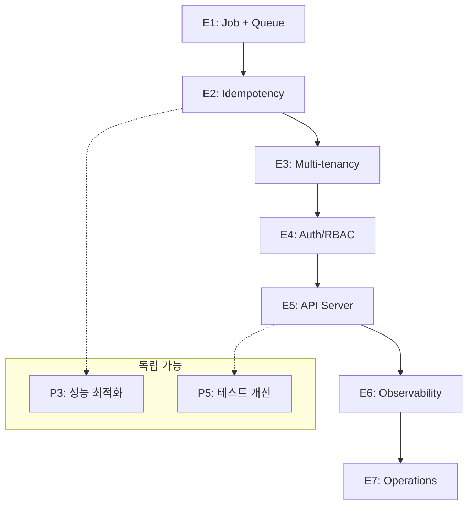

# EvalVault Development Roadmap

> Last Updated: 2026-01-07
> Current Version: 1.5.0
> Status: Phase 1-14 Complete ✅ | Focusing on Improvement & Future Features

---

## 목차

1. [개요](#개요)
2. [완료된 작업 (Phase 1-14)](#완료된-작업-phase-1-14)
3. [현재 진행 중 (2026 Q1)](#현재-진행-중-2026-q1)
4. [향후 계획 (2026 Q2-Q4)](#향후-계획-2026-q2-q4)
5. [Enterprise Track](#enterprise-track)
6. [미래 연구 (2027+)](#미래-연구-2027)

---

## 개요

EvalVault는 RAG (Retrieval-Augmented Generation) 평가 시스템으로, Phase 1-14를 완료하여 안정적인 기반을 갖추었습니다. 이제 코드 품질 개선과 새로운 가치 창출에 집중합니다.

### 현재 상태 요약

| 지표 | 값 |
|------|-----|
| Version | 1.5.0 |
| Tests | 1,671 tests collected (`pytest --collect-only`) |
| Coverage | 89% |
| LOC | ~59,000 |
| Phases Completed | 14/14 (100%) |
| PyPI | ✅ Published |
| CI/CD | ✅ Cross-platform |

### 문서 구조

| 문서 | 역할 | 설명 |
|------|------|------|
| **[ROADMAP.md](./ROADMAP.md)** (이 문서) | 전체 로드맵 | 현재 상태 요약 + 향후 개발 계획 |
| [STATUS.md](./STATUS.md) | 현재 상태 | 버전, 테스트 수, 완료 항목 요약 |
| [README.md](./README.md) | 문서 인덱스 | 전체 문서 구조 및 탐색 가이드 |
| [internal/DEVELOPMENT_GUIDE.md](./internal/DEVELOPMENT_GUIDE.md) | 개발 가이드 | 개발 환경, 코드 품질, 에이전트 시스템 |

> **참고**: 완료된 작업 추적 문서들은 `internal/archive/`로 이동되었습니다.

---

## 완료된 작업 (Phase 1-14)

> 상세 내용은 [internal/archive/COMPLETED.md](./internal/archive/COMPLETED.md) 참조

### 완료 현황

| Phase | Description | Status | Tests |
|-------|-------------|--------|-------|
| Phase 1-3 | Core System | ✅ Complete | 118 |
| Phase 4 | Foundation Enhancement | ✅ Complete | +60 |
| Phase 5 | Storage & Domain | ✅ Complete | +42 |
| Phase 6 | Advanced Features | ✅ Complete | +160 |
| Phase 7 | Production Ready | ✅ Complete | +10 |
| Phase 2 NLP | NLP Analysis | ✅ Complete | +97 |
| Phase 3 Causal | Causal Analysis | ✅ Complete | +27 |
| Phase 8 | Domain Memory Layering | ✅ Complete | +113 |
| Phase 9 | Korean RAG Optimization | ✅ Complete | +24 |
| Phase 10-13 | Streamlit Web UI | ✅ Complete | +138 |
| Phase 14 | Query-Based DAG Analysis Pipeline | ✅ Complete | +153 |
| **Total** | | **✅ 100%** | **1,671** |

### 주요 달성 사항

#### 아키텍처
- ✅ Hexagonal Architecture (Port/Adapter 패턴)
- ✅ Domain-Driven Design
- ✅ 확장 가능한 플러그인 시스템

#### 기능
- ✅ Multi-LLM (OpenAI, Azure, Anthropic, Ollama)
- ✅ Multi-DB (SQLite, PostgreSQL)
- ✅ Multi-Tracker (Langfuse, MLflow)
- ✅ 6 Ragas Metrics + 1 Custom Metric
- ✅ Korean NLP (형태소 분석, BM25, Dense, Hybrid)
- ✅ Web UI (Streamlit 기반)
- ✅ DAG Analysis Pipeline

#### 개발 인프라
- ✅ 1,671 tests collected (89% coverage)
- ✅ CI/CD (Ubuntu, macOS, Windows)
- ✅ PyPI 자동 배포
- ✅ Semantic Versioning

---

## 현재 진행 중 (2026 Q1)

> **Focus**: 코드 품질 개선 및 사용성 향상
>
> **개발 자동화**: AI 에이전트 기반 병렬 개발 워크플로우 도입

### 진행 중인 개선 작업 (병렬)

| ID | 작업 | 상태 | 참고 |
|----|------|------|------|
| P2.2 | Web UI 재구조화 | 🚧 진행 중 | `docs/internal/PARALLEL_WORK_PLAN.md` |
| P3 | 성능 최적화 | 🚧 진행 중 | `docs/internal/PARALLEL_WORK_PLAN.md` |
| P4.1 | CLI UX 개선 | 🚧 진행 중 | `docs/internal/PARALLEL_WORK_PLAN.md` |
| P5 | 테스트 개선 | 🚧 진행 중 | `docs/internal/PARALLEL_WORK_PLAN.md` |
| P6 | 문서화 개선 | 🚧 진행 중 | `docs/internal/PARALLEL_WORK_PLAN.md` |

상세 범위와 일정은 `docs/internal/PARALLEL_WORK_PLAN.md`에서 관리합니다.

### 개발 자동화 에이전트 시스템

Claude Agent SDK 기반 자율 에이전트 시스템으로 개선 작업을 병렬화합니다.

**에이전트 구성**:
| Agent | 역할 | 담당 P-Level |
|-------|------|-------------|
| `architecture` | 코드 구조, 헥사고날 아키텍처 | P0, P1, P2 |
| `observability` | Phoenix 통합, OpenTelemetry | P7 |
| `rag-data` | RAG 데이터 수집, 메트릭 | P7 |
| `performance` | 캐싱, 배치 처리 | P3 |
| `testing` | 테스트 최적화, 커버리지 | P5 |
| `documentation` | 튜토리얼, API 문서 | P6 |
| `coordinator` | 병렬 워크플로우 관리 | All |

**병렬 실행 그룹**:
- **Group A (독립)**: performance, testing, documentation - 동시 실행 가능
- **Group B (순차)**: observability → rag-data (의존성)
- **Group C (내부 순서)**: architecture (P0 → P1 → P2)

**메모리 시스템**: `agent/memory/`에 에이전트별 세션 로그, 공유 결정사항, 의존성 추적

**참조**: [agent/README.md](../agent/README.md), [internal/DEVELOPMENT_GUIDE.md](./internal/DEVELOPMENT_GUIDE.md)

---

### P1: 코드 통합 및 중복 제거 (Week 1-2)

**목표**: 코드 중복 30% 감소

#### 1.1 LLM Adapter 통합 ✅ 완료
- [x] `BaseLLMAdapter` 생성
- [x] 토큰 추적 공통화
- [x] 에러 핸들링 공통화
- [x] 기존 어댑터 리팩토링

**예상 효과**:
- 코드 중복: -300 LOC
- 새 LLM 추가 시간: 2시간 → 30분

#### 1.2 Storage Adapter 통합 ✅ 완료
- [x] `SQLQueries` 클래스 생성
- [x] `BaseSQLAdapter` 생성
- [x] 스키마 관리 통합

**예상 효과**:
- 코드 중복: -400 LOC
- 새 DB 지원: 4시간 → 1시간

#### 1.3 Analysis Adapter 통합 ✅ 완료
- [x] `AnalysisDataProcessor` 생성
- [x] `BaseAnalysisAdapter` 생성
- [x] 데이터 처리 로직 통합

**예상 효과**:
- 코드 중복: -200 LOC

---

### P2: 모듈 분리 (Week 3-4)

**목표**: 모듈 복잡도 50% 감소

#### 2.1 CLI 모듈 분리 ✅ 완료
- [x] CLI 명령어별 파일 분리
- [x] 공통 유틸리티 추출
- [x] 명령어 라우팅 개선

**구조**:
```
src/evalvault/adapters/inbound/cli/
├── app.py
├── commands/
│   ├── run.py
│   ├── analyze.py
│   ├── history.py
│   ├── generate.py
│   ├── domain.py
│   ├── gate.py
│   ├── web.py
│   └── pipeline.py
└── utils/
    ├── formatters.py
    ├── validators.py
    └── errors.py
```

**예상 효과**:
- 파일당 LOC: 1,500 → 150
- 명령어 추가 시간: 50% 감소

---

### P4: 사용성 개선 (Week 5-6)

**목표**: 신규 사용자 온보딩 시간 50% 단축

#### 4.1 CLI UX 개선 🔥 High Priority

**명령어 별칭**:
```bash
# 현재
evalvault run data.csv --metrics faithfulness,answer_relevancy

# 개선
evalvault run data.csv -m faithfulness answer_relevancy
```

**프리셋 지원**:
```bash
evalvault run data.csv --preset production
# production = faithfulness + answer_relevancy + context_precision + context_recall
```

**작업 항목**:
- [ ] 명령어 옵션 재설계
- [ ] 짧은 별칭 추가
- [ ] 프리셋 시스템 구현
- [ ] 도움말 메시지 개선

#### 4.2 에러 메시지 개선 🔥 High Priority

**현재**:
```
Error: The api_key client option must be set
```

**개선**:
```
❌ Error: OpenAI API key not found

📝 How to fix:
   1. Create a .env file
   2. Add: OPENAI_API_KEY=your-key
   3. Or: export OPENAI_API_KEY=your-key

💡 Get key: https://platform.openai.com/api-keys
```

**작업 항목**:
- [ ] 에러 메시지 템플릿 시스템
- [ ] 모든 에러 케이스 재작성
- [ ] 해결 방법 문서화

#### 4.3 Progress Indicator ⚡ Quick Win

```python
from rich.progress import track

for test_case in track(dataset, description="Evaluating..."):
    result = evaluate(test_case)
```

**작업 항목**:
- [ ] Rich 라이브러리 통합
- [ ] Progress bar 구현
- [ ] ETA 표시 추가

---

### Quick Wins (즉시 실행 가능)

> **Duration**: 1-2일

#### QW1: 에러 메시지 개선 (1일) ✅
```python
class UserFriendlyError:
    @staticmethod
    def missing_api_key(provider: str) -> str:
        return f"""
❌ Error: {provider} API key not found
📝 Fix: Add {provider.upper()}_API_KEY to .env
💡 Get key: {PROVIDER_URLS[provider]}
"""
```

#### QW2: Progress Bar 추가 (0.5일) ⚡
```bash
pip install rich
```

#### QW3: 명령어 별칭 (0.5일) ⚡
```python
@app.command()
def run(
    metrics: str = typer.Option(..., "-m", "--metrics"),
    llm: str = typer.Option("openai", "-l", "--llm"),
):
    ...
```

#### QW4: 설정 검증 (1일) ✅
```python
class ConfigValidator:
    def validate(self) -> list[str]:
        issues = []
        if not os.getenv("OPENAI_API_KEY"):
            issues.append("OPENAI_API_KEY not set")
        return issues
```

---

## 향후 계획 (2026 Q2-Q4)

### 2026 Q2 (4-6월): 성능 최적화 및 모듈화

P2.2, P3는 병렬 작업으로 선행 진행 중이며 상세 범위는
`docs/internal/PARALLEL_WORK_PLAN.md`에서 관리합니다.

#### P3: 성능 최적화

**3.1 평가 파이프라인 최적화**
- [ ] 배치 처리 로직 개선
- [ ] 비동기 평가 파이프라인
- [ ] 캐싱 메커니즘 추가

**목표**: 1000 TC 평가 시간 30분 → 10분

**3.2 데이터 로딩 최적화**
- [ ] 스트리밍 로더 구현
- [ ] 대용량 파일 지원

**목표**: 10MB 파일 메모리 사용량 100MB → 10MB

**3.3 캐싱 개선**
- [ ] LRU + TTL 하이브리드 캐시
- [ ] 캐시 hit rate 측정

**목표**: 캐시 hit rate 60% → 85%

#### P2 (Part 2): 모듈 분리 완료

**2.2 Web UI 재구조화**
- [ ] 서비스 레이어 생성
- [ ] 비즈니스 로직 분리
- [ ] UI 컴포넌트 슬림화

**2.3 Domain Services 분리**
- [ ] 단일 책임 원칙 적용
- [ ] 서비스 클래스 분리

---

### 2026 Q3 (7-9월): RAGAS 래퍼 탈피 - 고유 가치 강화

> **Goal**: EvalVault만의 차별화된 가치 제공
>
> **전략적 방향**: 단순 RAGAS 래퍼를 넘어서는 평가 OS로 진화
> - 메트릭 엔진 독립성 확보
> - 지식/데이터 레이어 내재화
> - 운영 자동화와 피드백 루프 구축

#### Phase 15: Custom Metric Framework

**목표**: 사용자가 쉽게 커스텀 메트릭을 추가할 수 있는 프레임워크

**구현 내용**:
```python
# 사용자 정의 메트릭
from evalvault.domain.metrics import BaseMetric

class MyCustomMetric(BaseMetric):
    name = "my_custom_metric"
    description = "My custom evaluation metric"

    def score(self, test_case: TestCase) -> float:
        # 커스텀 로직
        return 0.85

# 등록
evalvault.register_metric(MyCustomMetric())

# 사용
evalvault run data.csv --metrics my_custom_metric
```

**작업 항목**:
- [ ] `BaseMetric` 추상 클래스 설계
- [ ] Metric Registry 구현
- [ ] CLI 통합
- [ ] 메트릭 플러그인 로더
- [ ] 예제 메트릭 5개 작성

**예상 기간**: 2주

#### Phase 16: Auto-Prompting System

**목표**: LLM 평가 시 자동으로 최적의 프롬프트 생성

**구현 내용**:
```python
class AutoPrompter:
    """자동 프롬프트 생성"""

    def generate_prompt(
        self,
        metric: str,
        test_case: TestCase,
        domain: str = "general",
    ) -> str:
        """메트릭별 최적화된 프롬프트 생성"""
        # 도메인 지식 활용
        domain_context = self.domain_memory.get_context(domain)

        # 메트릭별 템플릿
        template = METRIC_TEMPLATES[metric]

        # 프롬프트 생성
        prompt = template.format(
            question=test_case.question,
            answer=test_case.answer,
            context=test_case.contexts,
            domain_context=domain_context,
        )

        return prompt
```

**작업 항목**:
- [ ] 메트릭별 프롬프트 템플릿 수집
- [ ] 도메인별 프롬프트 최적화
- [ ] A/B 테스트로 프롬프트 성능 비교
- [ ] 프롬프트 버전 관리

**예상 기간**: 3주

#### Phase 17: Improvement Suggestion Engine

**목표**: 평가 결과를 분석하여 구체적인 개선 제안 제공

**현재 상태**:
- Phase 3 Causal Analysis로 근본 원인 파악
- 하지만 제안이 일반적이고 구체성 부족

**개선 방향**:
```python
class ImprovementEngine:
    """개선 제안 엔진"""

    def generate_suggestions(
        self,
        run: EvaluationRun,
        use_llm: bool = True,
    ) -> list[ImprovementSuggestion]:
        """구체적인 개선 제안 생성"""
        # 1. 패턴 분석
        patterns = self.pattern_detector.detect(run)

        # 2. 근본 원인 분석 (기존 Causal Analysis 활용)
        root_causes = self.causal_analyzer.analyze(run)

        # 3. 플레이북 기반 제안 생성
        suggestions = []
        for pattern in patterns:
            playbook = self.playbook_registry.get(pattern.type)
            suggestion = playbook.generate_suggestion(
                pattern=pattern,
                root_cause=root_causes.get(pattern.metric),
                domain=run.domain,
            )
            suggestions.append(suggestion)

        # 4. LLM 기반 제안 (선택적)
        if use_llm:
            enriched = self.llm_enricher.enrich(suggestions, run)
            suggestions = enriched

        return suggestions
```

**Playbook 예시**:
```yaml
# config/playbooks/faithfulness_playbook.yaml
patterns:
  - name: long_context_low_faithfulness
    conditions:
      - metric: faithfulness
        threshold: 0.7
      - feature: context_length
        operator: ">"
        value: 500
    suggestions:
      - action: chunk_context
        priority: high
        rationale: "긴 컨텍스트는 LLM이 충실하게 따르기 어렵습니다"
        implementation:
          - "DocumentChunker를 사용하여 컨텍스트를 500자 이하로 분할"
          - "chunk_size=500, overlap=50 권장"
        expected_improvement: "+15% faithfulness"
        verification:
          command: "evalvault run data.csv --chunk-size 500"
```

**작업 항목**:
- [ ] Pattern Detector 구현
- [ ] Playbook YAML 포맷 설계
- [ ] 기본 Playbook 작성 (10개 패턴)
- [ ] LLM 기반 제안 enrichment
- [ ] CLI 통합 (`evalvault suggest <run_id>`)

**예상 기간**: 3주

---

### 2026 Q4 (10-12월): 고급 기능 및 생태계 확장

#### Phase 18: RAG Pipeline Integration

**목표**: RAG 파이프라인을 직접 EvalVault에서 실행하고 평가

**현재 한계**:
- 사용자가 외부에서 RAG 파이프라인 실행 → 결과를 CSV로 저장 → EvalVault로 평가
- 번거롭고 실수하기 쉬움

**개선 방향**:
```python
# RAG 파이프라인 정의
from evalvault.pipeline import RAGPipeline

pipeline = RAGPipeline(
    retriever=BM25Retriever(documents),
    llm=OpenAI(model="gpt-4"),
    prompt_template="...",
)

# 평가 + 파이프라인 실행을 한 번에
result = evalvault.evaluate(
    questions=["질문1", "질문2", ...],
    pipeline=pipeline,
    metrics=["faithfulness", "answer_relevancy"],
)

# 또는 CLI로
evalvault run-pipeline config.yaml \
  --questions questions.csv \
  --metrics faithfulness
```

**작업 항목**:
- [ ] `RAGPipeline` 추상 클래스 설계
- [ ] Retriever 통합 (BM25, Dense, Hybrid)
- [ ] LLM 통합 (기존 LLMPort 활용)
- [ ] 파이프라인 설정 파일 포맷 (YAML)
- [ ] CLI 통합
- [ ] LangChain/LlamaIndex 호환성

**예상 기간**: 4주

#### Phase 19: Knowledge Graph 고도화

**목표**: NetworkX 기반 고급 KG 기능 및 KG 기반 평가

**현재 상태**:
- Phase 6에서 기본 KG 생성 및 테스트셋 생성 완료
- 하지만 KG 분석, 시각화, KG 기반 메트릭 부족

**개선 방향**:

**19.1 NetworkX 마이그레이션**
```python
# 현재: 단순 dict 기반 그래프
class KnowledgeGraph:
    nodes: dict[str, Entity]
    edges: list[Relation]

# 개선: NetworkX 기반
import networkx as nx

class KnowledgeGraph:
    def __init__(self):
        self.graph = nx.MultiDiGraph()

    def add_entity(self, entity: Entity):
        self.graph.add_node(
            entity.id,
            type=entity.type,
            **entity.attributes
        )

    def add_relation(self, relation: Relation):
        self.graph.add_edge(
            relation.source,
            relation.target,
            type=relation.type,
            **relation.attributes
        )

    # NetworkX 기능 활용
    def shortest_path(self, source, target):
        return nx.shortest_path(self.graph, source, target)

    def centrality(self):
        return nx.betweenness_centrality(self.graph)
```

**19.2 KG 기반 평가 메트릭**
```python
class KGCoverageMetric(BaseMetric):
    """KG 커버리지 메트릭"""

    def score(self, test_case: TestCase, kg: KnowledgeGraph) -> float:
        """답변이 KG의 엔티티/관계를 얼마나 커버하는지"""
        answer_entities = self.extract_entities(test_case.answer)
        kg_entities = kg.get_entities()

        coverage = len(answer_entities & kg_entities) / len(kg_entities)
        return coverage

class KGConsistencyMetric(BaseMetric):
    """KG 일관성 메트릭"""

    def score(self, test_case: TestCase, kg: KnowledgeGraph) -> float:
        """답변이 KG의 관계와 일치하는지"""
        claims = self.extract_claims(test_case.answer)

        consistent_claims = 0
        for claim in claims:
            if self.verify_with_kg(claim, kg):
                consistent_claims += 1

        return consistent_claims / len(claims)
```

**19.3 KG 통계 및 분석**
```python
class KGAnalyzer:
    """KG 분석기"""

    def analyze(self, kg: KnowledgeGraph) -> KGStats:
        """KG 통계 분석"""
        return KGStats(
            num_entities=kg.graph.number_of_nodes(),
            num_relations=kg.graph.number_of_edges(),
            entity_types=self._count_entity_types(kg),
            relation_types=self._count_relation_types(kg),
            centrality=self._calculate_centrality(kg),
            clusters=self._detect_clusters(kg),
            density=nx.density(kg.graph),
        )

    def visualize(self, kg: KnowledgeGraph, output: str):
        """KG 시각화 (Plotly/Graphviz)"""
        ...
```

**19.4 CLI 통합**
```bash
# KG 생성
evalvault kg build documents.md -o knowledge_graph.json

# KG 분석
evalvault kg analyze knowledge_graph.json

# KG 시각화
evalvault kg visualize knowledge_graph.json -o graph.html

# KG 기반 평가
evalvault run data.csv \
  --kg knowledge_graph.json \
  --metrics kg_coverage kg_consistency
```

**작업 항목**:
- [ ] NetworkX 마이그레이션
- [ ] KG 기반 메트릭 구현
- [ ] KG 분석 기능
- [ ] KG 시각화 (Plotly)
- [ ] CLI 통합

**예상 기간**: 4-5주

---

## Enterprise Track

> **목표**: 멀티테넌트, 비동기 작업 처리, RBAC 기반 엔터프라이즈 운영 환경 구축
>
> **상세 계획**: [enterprise/IMPLEMENTATION_PLAN.md](./enterprise/IMPLEMENTATION_PLAN.md)

### Enterprise Phases

| Phase | 범위 | 설명 | 선행 조건 |
|-------|------|------|-----------|
| **E1** | Job + Queue | Job 엔티티, JobQueuePort (Celery+Redis), 비동기 제출/상태 조회 | - |
| **E2** | Idempotency + Store | JobStorePort, IdempotencyPort, 중복 제출 방지, DLQ | E1 |
| **E3** | Multi-tenancy | Tenant/Project/User 계층, DB 스키마 확장, Row-Level Security | E2 |
| **E4** | Auth/RBAC | AuthPort, OIDC/JWT, RBAC 스코프 (admin/write/read) | E3 |
| **E5** | API Server | FastAPI 서버, REST 엔드포인트, 인증 미들웨어 | E4 |
| **E6** | Observability | Prometheus 메트릭, Grafana 대시보드, SLO 알럿 | E5 |
| **E7** | Operations | Alembic 마이그레이션, Helm 차트, Terraform 모듈 | E6 |

### 핵심 아키텍처 결정

#### Job vs EvaluationRun 분리

```
Job (운영 단위)              EvaluationRun (결과)
├── job_id                   ├── run_id
├── tenant_id / project_id   ├── dataset_name
├── status (QUEUED→RUNNING→…)├── metrics / scores
├── idempotency_key          └── tracker_metadata
└── result_ref ──────────────→ (1:1 연결)
```

- **Job**: 작업 상태 추적, 재시도/취소 관리 (운영 관점)
- **EvaluationRun**: 평가 결과 저장, 분석 (데이터 관점)

#### 신규 Port 인터페이스

```
Outbound Ports                 Inbound Ports
┌─────────────────────┐       ┌─────────────────────┐
│ JobQueuePort        │       │ AuthPort            │
│ JobStorePort        │       │ RunSubmissionPort   │
│ IdempotencyPort     │       │ JobQueryPort        │
│ AuditPort           │       └─────────────────────┘
│ RegistryPort        │
│ ObjectStoragePort   │
└─────────────────────┘
```

### 구현 의존성 그래프



### Operations Checklist

#### 신뢰성 / 운영
- [ ] Job retry policy (transient vs deterministic error 구분)
- [ ] Dead Letter Queue 구현
- [ ] Graceful shutdown (SIGTERM 처리)
- [ ] Health check 엔드포인트 (`/health/live`, `/health/ready`)

#### 보안 / 접근 제어
- [ ] OIDC/JWT 인증 흐름
- [ ] RBAC 스코프 정의 (`tenant:admin`, `project:write`, `project:read`)
- [ ] Audit 로그 (누가, 언제, 무엇을)
- [ ] Secret 관리 (Vault 연동 또는 K8s Secret)

#### 데이터 / 스토리지
- [ ] Alembic 마이그레이션 스크립트
- [ ] Row-Level Security (PostgreSQL)
- [ ] Object Storage 연동 (S3/MinIO)
- [ ] 데이터 보존 정책

#### Observability
- [ ] Phoenix: LLM traces (품질 디버깅)
- [ ] Prometheus: 시스템 메트릭 (SLO 모니터링)
- [ ] Grafana: 대시보드 템플릿
- [ ] Alert rules 정의

### CLI 인증 옵션 분리

```bash
# 모델 프로파일 (기존)
evalvault run data.csv --profile azure-gpt4

# 인증 프로파일 (신규, E4 이후)
evalvault run data.csv --auth-profile production

# API 서버 모드 (E5 이후)
evalvault run data.csv --endpoint https://api.company.com
```

### Quick Wins (Enterprise 준비)

| 항목 | 설명 | 난이도 |
|------|------|--------|
| Job ID 필드 추가 | EvaluationRun에 `job_id: str | None` 추가 | ⭐ |
| Celery task 스켈레톤 | `tasks/evaluation.py` 빈 구조 생성 | ⭐ |
| DB 스키마 설계 | `jobs` 테이블 DDL 작성 | ⭐⭐ |
| RBAC 스코프 enum | `RBACScope` enum 정의 | ⭐ |

---

## 미래 연구 (2027+)

> **Note**: 아래 기능들은 장기 연구 주제이며, 실제 필요성이 검증된 후 구현합니다.

### Agent System Integration

**전제 조건**: 멀티에이전트 아키텍처 도입

**현재 구조**:
```
Dataset → RagasEvaluator → Results (순차 파이프라인)
```

**미래 구조**:
```
Dataset → [Planner Agent] → [Metric Agents] → [Insight Agent] → Results
              ↑                    ↑                ↑
              └────────────────────┴────────────────┘
                      Agent Coordination
```

#### Coordination Profiler

**목표**: Scaling Agent Systems 논문 기반, 멀티에이전트 오버헤드 정량화

**CLI 스펙** (미래):
```bash
evalvault profile <dataset_path> \
  --agents single|centralized|decentralized \
  --max-calls 1000 \
  --emit-policy
```

**우선순위**: Agent Architecture 도입 후

#### Latent Evidence Bus

**목표**: LatentMAS 스타일 KV cache / hidden state 공유

**제약**:
- OpenAI/Anthropic API: hidden state 미노출 → 불가능
- HuggingFace/vLLM 로컬 모델: 가능 (별도 어댑터 필요)

**현실적 범위**:
- Q1: Anthropic Extended Thinking 캡처 (API 기반)
- 이후: HuggingFace/vLLM 직접 통합 연구

**우선순위**: Agent Architecture + 로컬 모델 인프라 확보 후

---

## 실행 로드맵 요약

### 2026 Q1 (1-3월): 코드 품질 개선

- Week 1-2: P1 코드 통합
- Week 3-4: P2 모듈 분리 (Part 1)
- Week 5-6: P4 사용성 개선

### 2026 Q2 (4-6월): 성능 최적화

- Week 7-8: P2 모듈 분리 (Part 2)
- Week 9-10: P3 성능 최적화
- Week 11-12: P5 & P6 테스트/문서화

### 2026 Q3 (7-9월): 고유 가치 강화

- Week 13-14: Phase 15 Custom Metric Framework
- Week 15-17: Phase 16 Auto-Prompting System
- Week 18-20: Phase 17 Improvement Suggestion Engine

### 2026 Q4 (10-12월): 생태계 확장

- Week 21-24: Phase 18 RAG Pipeline Integration
- Week 25-29: Phase 19 Knowledge Graph 고도화

### 2027+: 미래 연구

- Agent System Integration
- Coordination Profiler
- Latent Evidence Bus

---

## 성공 지표

### 코드 품질 (2026 Q1-Q2)

| 지표 | Baseline | 목표 |
|------|----------|------|
| 코드 중복률 | 15% | 10% |
| 평균 모듈 크기 | 300 LOC | 150 LOC |
| 테스트 실행 시간 | 14분 | 7분 |
| 신규 사용자 온보딩 | 30분 | 15분 |

### 성능 (2026 Q2)

| 지표 | Baseline | 목표 |
|------|----------|------|
| 1000 TC 평가 시간 | 30분 | 10분 |
| 캐시 hit rate | 60% | 85% |
| 메모리 사용량 (10MB 파일) | 100MB | 10MB |

### 고유 가치 (2026 Q3-Q4)

| 지표 | Baseline | 목표 |
|------|----------|------|
| 커스텀 메트릭 추가 시간 | N/A | 30분 |
| 개선 제안 구체성 | Low | High |
| RAG 파이프라인 통합 | None | Full |

---

## 참고 문서

- [README.md](./README.md): 전체 문서 인덱스
- [STATUS.md](./STATUS.md): 현재 상태 요약
- [USER_GUIDE.md](./USER_GUIDE.md): 사용자 가이드
- [ARCHITECTURE.md](./ARCHITECTURE.md): 아키텍처 문서
- [internal/DEVELOPMENT_GUIDE.md](./internal/DEVELOPMENT_GUIDE.md): 개발 가이드 (에이전트 워크플로우 포함)
- [agent/README.md](../agent/README.md): 자율 에이전트 시스템 사용 가이드

---

## 기여 방법

EvalVault는 오픈소스 프로젝트입니다. 기여를 환영합니다!

1. Issue에서 작업할 항목 선택 또는 새 Issue 생성
2. Fork & Branch 생성
3. 코드 작성 + 테스트 작성
4. PR 생성
5. Code Review 및 Merge

**기여 가이드**: [CONTRIBUTING.md](../CONTRIBUTING.md)

---

## 라이선스

EvalVault는 [Apache 2.0](../LICENSE.md) 라이선스를 따릅니다.

---

**Last Updated**: 2026-01-03
