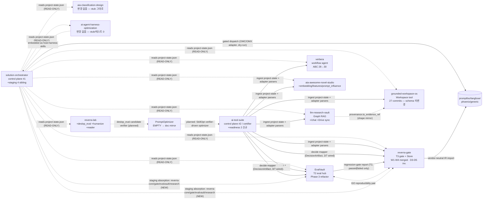

> **Canonical source:** `ntts9990/solution-orchestrator` → `docs/code-census/all-repos-code-census.v2.md` (main). 본 파일은 mirror — code-only census v2 refresh(2026-05-28). v1 baseline: solution-orchestrator/docs/code-census/all-repos-code-census.md (cdc2147+ddd3193).

# 전체 솔루션 코드 전수조사 (Code-Only Census v2)

> **버전:** v2 (2026-05-28 refresh). **Baseline:** v1 = `all-repos-code-census.md` (commits cdc2147 + ddd3193, 2026-05-27).
> **방법:** 12개 레포에 1:1 매칭된 에이전트가 *코드+테스트*만 전수조사 — `*.md`/`*.rst`/`docs/`/`CLAUDE.md`/`AGENTS.md`/`SKILL.md`/`plugin.json`(설명용) 일체 제외. 메인 스레드가 §0·§1·§3·§4·§5·§6 종합.
> **목적:** v3.1 전략과 per-repo 개발계획(`docs/strategy/per-repo-development-plans.v3.1.md`)이 가정한 상태가 코드 수준에서 실제 어떻게 변했는지 확인.
> **이전 버전 보존:** `all-repos-code-census.md` (historical baseline) 그대로 유지.

---

## 0. 한눈에 — 레포 역할·성숙도 맵 (v2 refresh)

| # | 레포 | 역할 (코드 근거) | 성숙도 v1 → v2 | 핵심 변화 (v1 대비) |
|---|---|---|---|---|
| 1 | solution-orchestrator | Dev-time control plane #1 (DAG planner + dispatch gate, dry-run only) | Scaffold → Scaffold (테스트·정책 확장) | 4건 신규 모듈(`harness_run_evidence`/`change_differential`/`evidence_normalizer`/`harness_registry`) + 테스트 +25 / staging에 4 sibling(reverra-core, reverra-gate, evalvault, reverra-research) 흡수 대기 / import-linter + mypy strict 정식화 |
| 2 | ai-tool-suite | Runtime certifier 허브 control plane #2 (deps 0, polished) | Mature-ish → Mature-ish | services 13→14(+local_invocation_readiness, +skillopt_readiness) / operator_cli subcommand 21→23 / MCP 프로토콜 2025-06-18 / decide mapper는 여전히 3/7 (evalvault·llm_research_vault·reverra_gate만) |
| 3 | reverra-gate | T3 release gate + content-addressed Store | Mature → **Mature++** | **89 commits 4주** / Store W1-W4 merge 완료(e1e6198) / dimension_map v7 + **D3-D5 invariants**(ed0a72a) / **real-waivers governance**(f18dabd) / store/validation.py(~5950행) 신규 / SARIF 자동화 / store/dimension_map.py 신설 |
| 4 | EvalVault | T2 RAG 평가·관측 허브 (헥사고날) | Large/Mature → Large/Mature | **Phase 3 refactor 완료** (StrEnum 24개 마이그레이션) / domain/services 68→**75** (오히려 두꺼워짐) / RagasEvaluator 분해 / agent 서브시스템 제거 / **RegressionGateReport.status 여전히 passed/failed만**(inconclusive 미추가) |
| 5 | llm-research-vault | Graph RAG 지식 어시스턴트 (한국어-first, T0-gated) | Mature core → Mature core | `/chat` SSE serve API + 세션 + query rewrite + evidence gate 신규 / Drive sync ingest 신규 / 다중 벤치 KO/EN eval harness / 문서 분류기 / **scripts층 17.5k/43파일 그대로**(통합 1순위 미진행) |
| 6 | verbera | 그래프-그라운드 governed-action 커널 | Prototype kernel → Prototype kernel | GraphStore ABC 28→**30** (request_evidence_types, evidence_types_for_ids 추가) / score CLI 워크플로 / evidence-bundle 1급화 / Postgres 연결 프로필 통일 / **이중구현·문자열 SQL·Homebrew 경로는 v1 그대로** |
| 7 | grounded-workspace-os | Workspace 근거기반 에이전트 + 인증 가능 1툴 | Prototype → Prototype | 27 commits / 어댑터 ingestion 오프라인 인증 / 다중턴 의도 분리 / 회신 초안 재사용 / 승인·멱등성 키 지속성 / **EvidenceRef에 `source_tier`/`content_hash`/`canonical_id` 부재**(v3.1 C1 필드 미충족) |
| 8 | aia-classification-design | 한국어 STT 계층 분류 PoC | PoC → PoC | 평가/리포트 `analysis_schema 1.0.0`(d8baa08), McNemar+평가 가이드 / Ollama 안전성 / **두 분류 경로(LLM beam vs capability stub) 미통합 그대로** / runtime/classify_batch 1줄 stub 유지 / zero-vector embedding 어댑터 유지 |
| 9 | aia-awesome-novel-studio | 한국어 대화 평가킷 + GUI + STT 증강 | Eval pack → Eval pack | 신규 Python 모듈 3건(`embedding.py` 11.9k / `features.py` 7.4k / `prompt_influence.py` 16.6k) — 기능 분산 시작 / GUI 스트리밍 완성 / **regression_gate.py 1,914 LOC 모놀리스 그대로** / fastapi/uvicorn 여전히 pyproject 미선언 / 프론트 무테스트 |
| 10 | ai-agent-harness-optimization | 측정/분석 스킬 스캐폴드 | Scaffold → **변경 없음** | LOC 2.66k→2.46k (포맷 변화 추정) / **pyproject 부재 / 테스트 0 / `run_single_task` None-stub / contracts↔runtime 단절 모두 그대로** |
| 11 | reverra-lab | op-assurance + 책 저술/휴머나이즈 + reader | 3-way → 3-way (**중요 신규**) | **deslop_eval.py**(결정적 슬롭 그래더, exit 0/1 게이트) 신설 / `humanize_book.sh` + humanize-helpers 전체 파이프라인 신설 / **reader Next.js scaffold** 신설 / reverra-scan은 D5만, judges/integrations/profiles/reports/storage stubs 그대로 |
| 12 | PromptOptimizer | 빈 placeholder | EMPTY → EMPTY (문서 mirror only) | 코드 0 그대로 / `docs/strategy/` 디렉토리 추가(canonical mirror 4 commits) / claude branch 활성, **여전히 pyproject/src/tests 전무** |

**숙성 도식 한 줄:** RG·LRV·EV·ATS 4개는 mature 라인에서 *계속 발전*. SO는 scaffold에서 *공용 계약 seed* 패키지 확장. AHO·PromptOptimizer는 **변경 없음**(여전히 critical path 미해소). AIA·verbera·GWS는 *주변 정돈*만 진행되고 *핵심 미해결 항목*(C1 fields, GraphStore drift, 두 분류경로 통합)은 그대로. reverra-lab은 **3건 큰 신규 자산**(deslop_eval, humanize 툴체인, reader).

---

## 1. 교차 분석 — 솔루션 전체 구조 (v2 refresh)

### 1.1 솔루션 DNA (반복 패턴, 코드 근거 — v1과 동일)
1. **Hexagonal/ports-and-adapters** — EvalVault·ATS·LRV·GWS·verbera·reverra-gate에서 Protocol(또는 dataclass+ABC) seam이 일관.
2. **중립 데이터 계약 + JSON Schema** — SO `contracts/`, ATS `packages/artifacts/`, RG `artifact_contracts.py`, LRV `data/schemas/`, GWS `packages/schemas/`, verbera `semantic-contract.json` 6 레포가 동일 패턴.
3. **T0–T4 권위 티어** — LRV `SourceTier`, ATS T0–T4 + L2–L7 caller layer, RG `level3-manifest.json` tier=T3.
4. **EvidenceRef + Claim 공용형** — GWS canonical, SO/LRV/RG mirror. **v2 update**: GWS canonical은 `source_tier`/`content_hash`/`canonical_id` 필드를 **여전히 갖고 있지 않음** → C1 발행 시 GWS 모델도 함께 갱신 필요.
5. **한국어 NLP 반복** — kiwipiepy + jamo + 형태소 BM25/Nori가 EV·AIAC·ANS·VB·LRV 5 레포.
6. **통계 엄밀성 반복** — paired bootstrap + McNemar + FDR/Holm이 AHO·RG·EV·AIAC·ANS 5 레포. **v2 update**: AHO `compare_ab` t-critical 근사(`1.96 if n≥30 else 2.0+4.0/n`) **그대로**, scipy fallback 통일 미진행.
7. **오프라인-first** — RG·ATS deps 0·verbera stdlib-only는 그대로 유지.

### 1.2 두 control plane (분리, 코드로 확인 — v1과 동일)
- **#1 solution-orchestrator** = Dev-time(requirement→repo DAG→gated dispatch→judge). sibling write 금지(project-state RO).
- **#2 ai-tool-suite** = Runtime certifier(산출 인증·정규화·충돌해소).
- **v2 검증:** SO·ATS 모두 분리 유지. SO staging에 4 sibling 흡수 대기는 v1 대비 신규 활동이지만 SO의 dry-run·read-only 원칙은 보존.

### 1.3 maturity 분포 (v1→v2)
- **Mature core:** EvalVault, reverra-gate, ai-tool-suite, llm-research-vault, grounded-workspace-os (5) — 변경 없음.
- **Scaffold/proto:** solution-orchestrator, verbera, aia-classification, aia-awesome-novel-studio (4) — 변경 없음.
- **Stub/empty:** ai-agent-harness-optimization, PromptOptimizer (2) — 변경 없음, P0 미해소.
- **혼합(loose 결합 3유닛):** reverra-lab(reverra-v7 +reader +tools) — *v2에 reader scaffold + humanize 풀파이프라인 + deslop_eval 신규*, 자산경계 합의 시급도 증가.

### 1.4 결정 권위 사슬 (v1과 동일)
**Producers (T1–T2)** EvalVault regression report · LRV retrieval evidence · verbera workflow evidence · AIA/ANS evidence
→ **T3 release gate** reverra-gate (`promote|hold|rollback` + Store + HMAC audit)
→ **Runtime certifier** ai-tool-suite (DecisionArtifact 정규화 + ConflictReport 보수해소)
→ **Dev-time orchestrator** solution-orchestrator (계획·dispatch·judge)

**v2에서 강화된 권위 일관성:**
- reverra-gate `DecisionOutcome` 여전히 `{PROMOTE, HOLD, ROLLBACK}`만 (T3 어휘 분리 보존).
- EvalVault `RegressionGateReport.status`는 여전히 `passed|failed` 두 값만 — **`inconclusive` 추가 미시행** (T2 어휘 3종 완비 권고 미반영).
- ATS conflict_service `_resolve` 보수해소 순서 `rollback > needs-human > hold > promote` 보존.

---

## 2. 레포별 상세 (코드 기반, v2 refresh — 12 agent 결과 verbatim)

### 2.1 solution-orchestrator — control plane #1 (Scaffold)
- **빌드:** Python ≥3.11, uv, `package=false`(pythonpath="."). 런타임 deps `pydantic>=2`+`pyyaml>=6`만. CI: ruff·import-linter·pytest·vendor-neutrality grep·mypy·pip-audit.
- **레이아웃:** `contracts/`(360 LOC: models, protocols, change_differential, harness_run_evidence, export_schema + `schema/*.json` 3개), `engine/`(1152 LOC: planner, dispatcher, dispatch_policy, judge, state_machine, harness_registry, evidence_normalizer), `adapters/`(omc_adapter, omx_adapter, _state_io), `control-plane/harness-registry.yaml`, `catalog/repo-catalog.yaml` (12 repos, 5 grounded + 1 partial + 2 not-yet-deployed + 2 proposal), `evals/`, `runners/sandbox.py`, `staging/`(4개 sibling 흡수 대기: reverra-core, reverra-gate, evalvault, reverra-research; 2202 LOC).
- **엔트리:** `python -m scaffold.run_go_dry_run`(reverra-gate↔EvalVault GO dry-run, 네트워크/PR 없음), `python -m scaffold.run_harness_demo`(6단계 offline 시각화), `python -m contracts.export_schema`(JSON Schema 생성). 엔진 유일 게이트: `StateMachine.run`→`Dispatcher.dispatch`(dry_run 강제).
- **핵심:** `planner.plan`(catalog substring 매칭→consumes 전이확장→ContractDelta→Kahn topo-sort) · `dispatch_policy.DispatchPolicy`(4규칙: tool allowlist deny-by-default, forbidden paths `.git//.github/workflows//.env//.ai-tool-suite/project-state.json`, branch_pattern+parent_approval_id gating, traversal/casing 하드닝) · `harness_registry.policy_for`(production_write:false→쓰기 거부, 하니스명 게이트 격리) · `judge.judge`(snapshot→RepoVerdict→release/fix-loop/block/escalate) · `evidence_normalizer`(fixture→NormalizedEvidence).
- **모델:** `HarnessRunRequest`/`HarnessRunSnapshot`(중립, harness/profile=plain str), `Artifact/Finding/ClaimRef`, `NormalizedEvidence`(metrics XOR claims, 3 source_kind), `ChangeDifferential`+`Verification`, `HarnessRunEvidence`, `DispatchPolicy`/`HarnessSpec`.
- **테스트(90 함수 / 13 파일):** dispatch-policy 4규칙+evasion, contract roundtrip(schema drift, vendor import 금지), adapter state shape(OMC/OMX), harness registry, change_differential, eval bank/grader, judge, go dry-run, harness demo(REAL/SIM badge), book evals(claim anchor ≥40자), harness-run-evidence.
- **역할:** 개발 오케스트레이션 **control plane #1** — requirement→planner DAG→harness-registry/dispatch-policy 게이트→SIM harness-run→normalization→judge/verdict. 절대 sibling에 쓰지 않음(READ-ONLY), ai-tool-suite(runtime certifier, control plane #2)와 구별.
- **리스크:** durability(WorkflowEngine)·live dispatch/PR 미구현(dry-run만); planner substring 과/소매칭; 다수 모듈 **STATUS: proposal**(harness_registry, change_differential, harness_run_evidence, evidence_normalizer — owner 미확정, 동시 편집 에이전트 활성); staging/ 4개 sibling 흡수 대기.
- **변경 (vs baseline cdc2147):** 신규 모듈 `contracts.harness_run_evidence`(1.0 스키마) + `contracts.change_differential`(검증 상태 rollup) + `engine.evidence_normalizer`(fixture→NormalizedEvidence) + `engine.harness_registry`(4개 하니스+정책 레지스트리YAML); 테스트 +25; catalog 12 repo 구조화(verification_commands·adapter_impact 명문화); staging에 reverra-core/reverra-gate/evalvault/reverra-research Phase C5 R0–R2 merge 대기; import-linter 강제화·mypy strict 정식화.

### 2.2 ai-tool-suite — certifier 허브 control plane #2 (Mature-ish)
- **빌드:** Python 3.11+, uv, **런타임 deps 0**(dev: pytest/ruff). pythonpath=".". 총 12.9k LOC: packages/artifacts 1.5k(모델) + packages/services 2.6k(14 서비스) + packages/registry 0.2k + apps 0.8k(operator_cli 404 LOC, mcp_server 250 LOC) + adapters 2.9k(7 어댑터). 테스트 4.1k LOC/26파일/193 함수.
- **레이아웃:** `packages/artifacts/`(중립 dataclass 계약+policy), `packages/registry/`(project-state 계약·ingest·drift audit), `packages/services/`(14 서비스: adapter_catalog, capability_inventory, conflict_service, decision_authority_audit, decision_service, evidence_packet, **local_invocation_readiness**, policy_packet, prompt_surface_inventory, registry_service, **skillopt_readiness**, source_freshness, + paths, __init__), `apps/operator_cli/`(argparse 23개 subcommand), `apps/mcp_server/`(SDK 없는 JSON-RPC stdio, PROTOCOL_VERSION="2025-06-18"), `adapters/<id>/`(7개: aia_awesome_novel_studio, cswind_poc, evalvault, llm_research_vault, local_llm_bench, reverra_gate, verbera; 3개만 mapper.py 보유: evalvault, llm_research_vault, reverra_gate).
- **엔트리:** `python -m apps.operator_cli`(read-only inventory/audit + local-write decide/ingest, JSON sort_keys, 에러 exit 2) · `python -m apps.mcp_server`(JSON-RPC stdio) · `tools/*.py` smoke.
- **핵심:** `adapter_catalog`(schema_version dispatch 9개 계약) · `capability_inventory`(어댑터→authority class+T0–T4 tier) · `evidence_packet`/`policy_packet`(최종 decision 항상 defer) · `prompt_surface_inventory`(suite 자기코드 grep→새 LLM 경로 차단) · `decision_authority_audit`(no_go_tests, release_blockers 감사) · `skillopt_readiness`(5후보 분류, optimizer_run_allowed 진단) · `local_invocation_readiness`(런타임 진단 전용, manifest/source 변이 불가) · `decision_service`(mapper={evalvault, reverra_gate}) · `conflict_service`(rollback>needs-human>hold 보수).
- **모델:** `AdapterManifest`, `DecisionArtifact`(+EvaluationEvidence/ToolRun/ObservedOutput), `ConflictReport`, `EvidencePacket/PolicyPacket`, **`LocalInvocationReadinessChecklist`**(신규), `SkillOptReadinessReport`(optimizer_run_allowed 항상 False, 10개 mutation flag 강제-False), `ProjectState`. StrEnum + frozen dataclass + `validate()`.
- **테스트(193):** 26파일. `/tests/apps/test_operator_cli.py`(662 LOC), `/tests/services/test_application_services.py`(629 LOC).
- **역할:** **폐쇄망 평가 컨트롤플레인/인증 허브** — sibling project-state ingest → 어댑터 T0–T4 인증 → 이종증거 중립 DecisionArtifact로 → 충돌 보수 → read-only 거버넌스 아티팩트. 평가기 아님.
- **리스크:** 매니페스트 절대 macOS 경로; 정책(`_GATE_NOTES`, `_CANDIDATES`, PROPOSAL_BOUNDARY_BY_ADAPTER 등) 코드 하드코딩; decide는 evalvault/reverra_gate만 wired(나머지 5는 evidence-only); local_invocation_readiness/skillopt_readiness는 진단 전용 무변이 경계.
- **변경 (vs baseline cdc2147):** 21 commits 4주. 신규 `local_invocation_readiness` 서비스(readiness evidence 게이트) + `skillopt_readiness` 서비스(optimizer diagnostics) + `LocalInvocationReadinessChecklist` 모델; operator_cli subcommand 21→23(skill-opt, local-invocation); MCP 프로토콜 2025-06-18 기정; packages/artifacts/models.py 신규 178 LOC. **adapters mapper는 3/7 변화 없음.**

### 2.3 reverra-gate — T3 release gate + 증거 Store (Mature++)
- **빌드:** Python ≥3.11, hatchling+uv, 콘솔 `reverra=reverra.cli:main`. deps: fastapi/uvicorn/httpx/jinja2/langdetect/numpy/pydantic/pyyaml. src 17.8k/70파일, test 13.8k/83파일. `sim_studio_js/`에 JS 미러.
- **레이아웃:** `core/`(engine, schemas, comparator, decision, gating, judge+4 live adapter, audit), `gate/`(ir, checker, rule_registry, rules/6파일 base/judge_design/premise/provenance/statistical, adapters/5파일 generic/langfuse/phoenix/promptfoo, sarif, ci_summary), `store/`(hashing, blobs, db SQLite, content, dimension_map, registry, **validation**, pipeline, projection), `feedback/`, `server/`(api FastAPI, demo), `demo_*`, config YAML.
- **엔트리:** `reverra {run,demo,import{generic/promptfoo/langfuse/phoenix},check,explain,import-feedback,promote-candidates,teams,export-traces,serve-demo,store{...}}`.
- **핵심:** **Store** = canonical content-addressed truth(`content_hash`: NFC+canonical-decimal; `(logical,execution)` 해시; DerivationCache; SQLite artifacts/derivations/distributions/aliases; lineage BFS; D1–D5 dimension_map + prior_policy/governance L3–L5; **ExceptionWaiver L4/L5는 이제 D4 prior bypass 전 실 waivers 필요(f18dabd)**) · **Gate** = `ImportedEvalIR`(`reverra.imported/0.1.0`) 위 6 RVR-* 순수규칙(judge_design, premise, provenance, statistical), 판별 통계(paired bootstrap CI, Cohen's d, exact McNemar) → `decide_outcome`(PROMOTE/HOLD/ROLLBACK) · **projection** = Store ComparisonPlan을 동일 gate IR로 투영.
- **모델:** `reverra.imported/0.1.0`, `reverra.diagnostic/0.0.1`, `ComparisonResult`/`DecisionOutcome`, **HMAC `AuditEvent`**(OCSF 6003, `RetentionPolicy.NOT_STORED`), **D3/D4/D5 dimension invariants(ed0a72a)**.
- **테스트:** 83파일, gate/store/feedback/decision/schemas/fixtures 모듈별. level3-manifest contract harness(3ebb6f1).
- **역할:** T3 release-gate authority, offline-first. vendor-neutral importer(generic/promptfoo/langfuse/phoenix). Store W1–W4 merge(e1e6198) 후 path/team_id 격리(acf7773/61b91d1). Level 3 manifest tier=T3, decision_scope=release-gate.
- **리스크:** `cli.py` god-dispatcher(1284행, 24 reverra 패키지 import) — **그대로**; **HMAC mock 기본키(`phase1-mock-secret`) 여전히 production 위험**; Store `validation.py` D3–D5 불변식 신규(ed0a72a), waivers policy 강화(f18dabd); Store→gate loop 투영 검증 필요.
- **변경 (vs baseline cdc2147):** **89 commits 4주** — Store W1–W4 통합 완료(e1e6198), dimension_map v7 + D3–D5 불변식(a639c09/ed0a72a), real waivers governance enforcement(f18dabd), Store validation layer 신규(873161d, ~5950행), Store CLI 4 verbs(12b7012), teams show subcommand(156ded0), sample-details shard layout(c3c523d), team_id provenance tagging(61b91d1), dataset/judge_alias override(208941f/73a2567), --dry-run + JSON(a6e6e0a), off-line judge path(9b451a9), SARIF+rules automation(c051709).

### 2.4 EvalVault — T2 RAG 평가·관측 허브 (Large/Mature)
- **빌드:** Python ≥3.12 (hatchling+uv, 콘솔 `evalvault`, v1.79.0) ~95.1k LOC (src) + 43.6k LOC (tests) + 8.4k LOC (scripts) / 375개 파일 + **TS/React 프론트** (Vite/React) ~19.5k LOC (1,287 LOC api.ts) / 55개 파일 + Playwright e2e. Ragas 0.4.2, instructor ≥1.15, openai ≥2.0, langchain-openai ≥1.0, fastapi ≥0.128, uvicorn ≥0.40.
- **아키텍처:** 엄격 **헥사고날(ports&adapters)**: `domain/entities` 22파일, `domain/metrics` 16파일 (insurance.py 확인됨), **`domain/services` 75파일**(두께 심화 — v1 68→75), `ports/inbound` 6파일, `ports/outbound` 28파일, `adapters/inbound` 57파일, `adapters/outbound` 156파일.
- **엔트리:** CLI(run/pipeline/compare/analyze/gate/regress/experiment + 서브앱 kg/domain/benchmark/graphrag/...), FastAPI `/api/v1/{runs,chat,benchmarks,knowledge,pipeline,...}`(Bearer+rate-limit), MCP 5툴, 프론트 17 라우트.
- **핵심:** `RagasEvaluator`(ragas 0.4.2 래핑, 병렬/async batch, Korean prompt override, faithfulness fallback) · metrics registry(~22) · **`regression_gate_service.run_gate`**(baseline vs candidate → t-test/Cohen's d → `RegressionGateReport`, **status: "passed"|"failed" 두 값만**, PR-comment/CI markdown, `.github/workflows/regression-gate.yml`) · `pipeline_orchestrator`(AnalysisIntent→DAG, 43 분석모듈) · LLM/tracker/storage 어댑터 · 프론트 `services/api.ts`(1,287 LOC, 51콜).
- **모델:** `TestCase`/`Dataset`, `MetricScore`/`TestCaseResult`/`EvaluationRun`(+ClaimVerdict/ClaimLevelResult), `StageEvent`, `analysis.ComparisonResult`, `AnalysisIntent/Node/Pipeline`, `RegressionGateReport`.
- **테스트(272):** test_*.py 135파일 / 272 함수.
- **역할:** **T2 평가+관측 허브** — 데이터셋·외부 RAG 트레이스 소비 → EvaluationRun 영속 + **regression-gate report**(CI/PR 자동화 소비) + 분석/비교 아티팩트 + 클러스터맵 + judge calibration.
- **리스크:** `domain/services` 75모듈 비대 **증가**(v1 68→75); `RagasEvaluator` ragas 0.4.2 pinned(취약 가능); 보험 도메인 메트릭이 core에 상주; 프론트 `api.ts` 단일 파일 1,287 LOC 백엔드 강결합; 헥사고날 adapter 레이어 156파일 폭증.
- **변경 (vs baseline cdc2147):** domain/services 68→75 (+7파일, refactor phase 3 slicing); RegressionGateReport.status 여전히 passed/failed (inconclusive **미추가**); api.ts 1,287 LOC; **Phase 3 refactor 완료** (StrEnum 24개 마이그레이션, ruff 0.15 UP042, Phoenix sync best-effort, RagasEvaluator claim/language/prompt 분해, agent 서브시스템 제거 X-S1); 테스트 272 함수.

### 2.5 llm-research-vault — Graph RAG 지식 어시스턴트 (Mature core)
- **빌드:** Python ≥3.10(3.12 CI), uv(`package=true`, src layout `research_vault`). core deps google-genai/opensearch-py/pyyaml + extras dev/markitdown/docling/binary/web/eval. lib 6.1k/38파일, **scripts 17.5k/43파일**, test 6.5k/58파일/281 함수.
- **레이아웃:** `graph_rag/`(contracts, loader, parsers/, retrieval, rerank, classify, provenance, opensearch_runtime, gemini_embedding/answer, freshness, evidence_explainer, demo_report, verify, cli, env), `serve/`(app/service/sessions/pipeline), `eval/`(schema/metrics/runner/benchmarks/backends), `ingest/`(drive_sync), `scripts/report_*|verify_*|demo_*|smoke_*`, data layer YAML.
- **엔트리:** CLI `doctor|index|ask|report|serve|eval`; `serve.app.create_app`(/healthz, POST /chat SSE); 43 스크립트.
- **핵심:** `contracts`(SourceTier T0–T4, DocumentParser/SearchProvider/EmbeddingProvider; `assert_production_equivalent` dim==1536) · `loader.load_vault_graph` · `parsers` · `retrieval`(BM25 Nori + kNN + RRF k=60 + **T0-only answer gate**) · `rerank`(Identity/LexicalOverlap/Gemini) · `classify`(Keyword/Gemini) · `provenance`(drive 사이드카→`to_evidence_ref` = gws EvidenceRef 형태) · `opensearch_runtime`(index `research-vault-graph-rag-v1`, **urllib 직접 `urlopen`**) · `gemini_answer`(구조화 JSON, anchor 거부) · `freshness`.
- **모델:** `RetrievalUnit`, `NormalizedDocument`, `Benchmark`, `Citation`, `data/schemas/document-graph.schema.json`.
- **테스트(281):** pytest 8.0+, 58파일, contracts 검증 urllib 직접(opensearchpy drift gate).
- **역할:** **한국어-first Graph RAG 엔진** — 이종 소스→중립 document graph→hybrid+rerank→**T0 canonical 증거로만 답변**. serve가 /chat, eval이 KO/EN IR 벤치+taskbank. provenance가 gws EvidenceRef로 명시 매핑.
- **리스크:** opensearch-py 의존성 선언했지만 런타임은 urllib 직접 — **그대로**; 1536/model id 3곳 하드코딩 — **그대로**; eval OpenSearch 백엔드가 **공유 프로덕션 인덱스 rebuild**; **17.5k 스크립트층 통합 미진행**(sys.path.insert 26회/bootstrap 중복).
- **변경 (vs baseline cdc2147):** DEFAULT_GEMINI_ANSWER_MODEL: gemini-2.0-flash-lite → **gemini-3.1-flash-lite**; eval 추가: multi-benchmark KO/EN retrieval eval harness, in-domain task-bank benchmark capability/regression split; serve 추가: **/chat knowledge-assistant API**(SSE + sessions + query rewrite + evidence gate); graph_rag: document classifier(ingest-time Gemini+taxonomy), post-fusion reranking, Drive provenance wiring into citations; ingest 추가: **Drive sync source connector**; web/eval/dev extras 잠금: fastapi/uvicorn/httpx/datasets; 오프라인 regression workflow 템플릿 추가.

### 2.6 verbera — 그래프-그라운드 워크플로 에이전트 (프로토타입 커널)
- **빌드:** Python ≥3.11, uv(`package=false`). 런타임 dep **PyYAML만**(scripts에서만; **src는 stdlib-only**). src 6.5k/53파일, test 4.7k/50파일/169함수. Kiwi/pgvector 등은 try/except gated.
- **레이아웃:** `app/`(cli, score), `workflows/`(validate, execute 상태머신, checkpoints, intent, retrieve, propose, audit, outbox), `adapters/retrieval`(LocalRetriever), `adapters/graph_store`(base ABC **30메서드**, in_memory, postgres), `adapters/llm`(StubActionProposer), `domain/`(models, retrieval_bundle), `lexical/`(analyzer, dictionary, expander, scoring RRF), `operations/`, `router.py`, `store_factory.py`.
- **엔트리:** `python3 -m verbera.app.cli {question,action,resume,score}`(env-override `VERBERA_*`).
- **핵심:** `router.QueryRouter`(LLM 없는 키워드/사전 라우팅 3경로) · `LocalRetriever`(route→GraphStore 호출) · 3채널 검색(lex 형태소교집합 + dom 사전가중 + trg overlap) RRF(weights lex1.0/dom1.5/trg0.3/vec0.0) — **InMemory는 Python set 기반, Postgres는 동일 CTE를 SQL로**(여전히 이중) · `execute.run_action_workflow` · `validate`(고정순서 short-circuit) · `checkpoints.FileCheckpointStore`.
- **모델:** Document/Evidence/User/PurchaseRequest/ProcessStep/ProcessDefinition, **ActionType**, evidence-bundle 5종+`RetrievalBundle`(fusion_breakdown), `semantic-contract.json`, `query-router-contract.json`.
- **테스트(169):** 50파일. eval: milestone_1_bilingual_eval.json(top_3_hit_rate ≥0.90).
- **역할:** **그래프-그라운드·계약기반 governed action 실행 에이전트**. 라우팅/검증/실행 분리. GraphStore ABC로 InMemory/Postgres 교체.
- **리스크:** GraphStore 메서드를 InMemory/Postgres에 **수작업 이중구현** — **그대로**; PostgresGraphStore가 `psql` subprocess+문자열 SQL(파라미터화 없음, 풀링 없음, Homebrew 경로 3곳 하드코딩) — **그대로**; embeddings/vec 채널 inert stub(SHA256 32d) — **그대로**.
- **변경 (vs baseline cdc2147):** ABC 메서드 **30개**(v1 ~28) → 2개 추가(request_evidence_types, evidence_types_for_ids 명시 계약화); score CLI 워크플로 확장(~20 commits) — validate 리포트 일급화, score 커맨드 통합; evidence-bundle 계약 정의 및 release evidence 추적 추가(ed85fd0, ca724ec); Postgres 연결 프로필 통일(f417b7e). 기본 구조 안정적 — 이중구현 drift, 하드코딩 경로, stdlib-only constraint, 파라미터화 없는 SQL은 v1 상태 유지.

### 2.7 grounded-workspace-os — Workspace 근거기반 에이전트 (프로토타입)
- **빌드:** Python 3.12 | FastAPI 0.128 | temporalio 1.18 | google-cloud-firestore 2.27 | google-adk 1.18 | Pydantic 2.13 | mypy/ruff. src 12.5k/78, test 9.5k/40파일/284 함수.
- **레이아웃:** `packages/`(스키마, 클라이언트), `services/`(api_gateway, evidence_kernel, tool_gateway, approval, audit, workflow), `apps/`(README-only placeholder), `tests/`.
- **엔트리:** FastAPI app(/healthz, POST /v1/{requests/assess, evidence/gate, google/*, workspace/{commands,context,write}}); `workflow_worker/worker.py:main`(Temporal); CLI smoke.
- **핵심:** EvidenceRef + Claim 그라운딩 primitive · tool_gateway 어댑터(gmail/calendar/drive/docs/tasks, 각 ToolPolicy+EvidenceRef) · `oauth.py`(HMAC-signed state, refresh, Secret Manager) · `policies.py`(resolve_risk_level/requires_approval) · `workspace_command_agent`(allowlist read-only tool) · **`evidence_kernel/gate.py`**(미지원 claim 거부, 신뢰도 < 0.65 → 미확인, risk≥3 승인강제) · `write_previews`/`write_execute`(단일사용 승인토큰+payload digest) · **runtime_guard**(쓰기 실행 차단 — Approval/Idempotency 저장소가 메모리 기반이면 거부).
- **모델:** **EvidenceRef**(25개 필드) / **Claim**(5개 필드) — **`source_tier`/`content_hash`/`canonical_id` 필드 부재**(v3.1 C1 evidence-contract 미충족); `GroundedRecommendation`(claims/evidence/unknowns/conflicts/proposed_actions/risk 0–4); `WorkspaceApiEnvelope[T]`; write 계약+ApprovalRecord/IdempotencyRecord/WriteAuditEvent.
- **테스트(284):** 40파일.
- **역할:** **Google Workspace-native 근거기반 에이전트 백엔드 + 인증 가능 1개 툴**. 부모 시스템이 오케스트레이션하도록 설계.
- **리스크:** 증거 계약 부분 구현(v3.1 C1 필드 누락 → 메타데이터 추적 불완전); `_TOKEN_STORE`/`_TOKEN_OBTAINED_AT`/`_MEMORY_FLOW`/`_MEMORY_DAILY_START_SEEN`/`_MEMORY_LAST_INTENT` 기본 in-memory(Secret Manager 폴백, 폴백 실패 시 무상태 에러); 신뢰도 임계값 0.65 하드코딩.
- **변경 (vs baseline cdc2147):** 27 commits — 고객 소유 설치 반복성, 베타 제안 검사 경화, 태그 지정 개정 초안 저장, **어댑터 ingestion 오프라인 인증**, 안전하지 않은 쓰기 배포 방지, 다중턴 의도 분리, 회신 초안 재사용, 타입 지정 LLM 계획, Google Chat 연기 배포, **승인/멱등성 키 지속성** 강화, 감시 로그 바인딩. LOC 안정: followups.py 813(무변화), demo.py 1375(무변화). **스키마 변경 없음, 신 엔드포인트 없음**.

### 2.8 aia-classification-design — 한국어 STT 계층 분류 PoC
- **빌드:** Python 3.11, uv+setuptools(`src` 레이아웃 `aia_stt_poc`). 의존 pandas/openpyxl/pyyaml/networkx/sklearn/scipy/statsmodels/python-docx/pydantic/kiwipiepy(+선택 mlx). src **14.9k**(정확: 14910), scripts **3.8k**(3840), tests **7.4k/43파일**(7429, 386개 test 함수).
- **엔트리:** CLI `python -m aia_stt_poc.cli evaluate --dry-run`; 모듈 `evaluate._classify_hierarchical`(beam search), `llm.OpenAICompatibleClient`, `capabilities/base.CapabilityResolver`(model_registry.yaml 해석).
- **핵심(두 경로 공존):** (A) **동작하는 LLM 분류기** `evaluate._classify_hierarchical`(대→중→소 3단 top-down beam search, 너비 기본 2, rerank 경로 2개+ 시 활성화), `prompting.py`(한국어 프롬프트, JSON 추출), `strategy.py`(리뷰 트리거). (B) **capability/adapter 스켈레톤** `CapabilityResolver`(model_registry.yaml, status 기반 swap), `runtime/adapters`: 실제 4개(ollama_qwen, mlx_qwen3, reranker_mlx_masked, rule_baseline), **stub 3개**(classifier_roberta_hierarchical=하드코딩 라벨 2개, embedding_bge_m3/kure_v1=[0.0]*1024). **runtime/** 입장 3개=1줄 stub(classify_batch, train, evaluate). 그래프 `graph.py`(networkx, ROOT→42→288→467, validate_path), `graph_enhance.py`, `anchors.py`(regex), `analysis/korean_morph.py`(kiwipiepy). 통계 `statistics.py`(McNemar, bootstrap CI). 검색 `retrieval/hybrid_retriever`(Qwen3+BM25).
- **모델:** `LabelPath(대/중/소)`, `EvalCase`, `TaxonomyEntry`, `ClassificationResult`, `BeamPathCandidate`. 레지스트리 capability 4개. PathScoreWeights: leaf 0.45/medium 0.20/large 0.15/retrieval 0.10/rule 0.10/inconsistency −0.30.
- **테스트(386):** 43파일.
- **역할:** **한국어 보험 STT 상담 계층분류 엔진 PoC**. 외부 xlsx+hierarchy_full.json 소비. 부모 AgentOps 플랫폼(reference_materials/01) 의존. 폐쇄망 배포 변종(handoff_*).
- **리스크:** **stub `classify_batch/train/evaluate`가 진짜 어댑터로 위장** — **그대로**; embedding adapter=zero-vector 더미 — **그대로**; classifier_roberta=하드코딩 라벨, 모델 없음 — **그대로**. 분류 A(LLM beam)/B(runtime stub) **미통합** 지점 그대로. 분석 모듈(4.4k, src ⅓)은 리포트 생성기.
- **변경 (vs baseline cdc2147):** 최근 4주: d8baa08(분석 schema 1.0.0, dict 정합), 3835307(artifact_kind), d555fc7(**AI Tool Suite 적응자 계약**), df59093(McNemar+평가 가이드), 0c3f644(리포트 갱신), 45f7ea5(Ollama 안전성). **코어 동작(beam search, graph, 통계, 테스트 386)은 안정**, **runtime stub 상태 유지**.

### 2.9 aia-awesome-novel-studio — 한국어 대화 AI 평가킷+GUI+STT 증강
- **빌드:** 3-계층 Python 3.11+ (setuptools; 패키지 `awesome-novel-studio-llm-eval`) + Node.js 프론트엔드 (Vite+React 18, Radix/Zustand). **pyproject.toml에 fastapi/uvicorn/sse 미명시** — 런타임 설치 의존, 선언 누락(v1 그대로).
- **레이아웃:** `tools/llm_eval/`(평가킷, 30모듈 72.7k LOC) + `tools/llm_eval_gui/backend`(FastAPI 3.2k) + `tools/llm_eval_gui/frontend/src`(React SPA 8k TS/TSX) + `tools/stt_pipeline/`(STT 데이터 증강 계약/검증, 2.2k).
- **엔트리:** 평가킷 `python -m tools.llm_eval.run --config <experiment.yaml>` / 회귀 게이트 `python -m tools.llm_eval.regression_gate` / 웹 GUI `npm start`.
- **핵심:** 통계 paired BCa bootstrap(10k 리샘플, 95% CI), Wilcoxon signed-rank, rank-biserial, CLES, BH-FDR/Holm/Bonferroni(tools.llm_eval.stats; 410 LOC) · 한국어 NLP kiwipiepy NER + jamo-Levenshtein 퍼지 매칭(T09/T10) + 한글 숫자 정규화 · classical_metrics, semantic 유사도, 요약 품질, 환각 탐지, 프롬프트 영향도 추적 · **회귀 게이트** `regression_gate.py`(차등 생성, 다중 점수 수집, 통계 테스트 — **1,914 LOC, 분할 미시도**).
- **모델:** huggingface_hub, sentence-transformers, torch/scikit-learn, statsmodels/scipy, pandas/openpyxl, UMAP/HDBSCAN.
- **테스트(10):** 398 LOC — test_summary_quality.py(5 smoke) + test_stt_integration.py(5 smoke). **프론트엔드 무테스트**(*.test.tsx/*.spec.tsx 없음).
- **역할:** 한국 금융 도메인 LLM 응답 품질 평가 + 회귀 게이트 SOTA 참조 구현; STT 데이터 증강 파이프라인의 계약 레이어.
- **리스크:** (a) pyproject.toml에 FastAPI/uvicorn 의존성 누락 — 깨끗한 환경 설치 시 import 에러 — **그대로**; (b) 웹 GUI 프론트엔드 제로 테스트 — **그대로**; (c) **회귀 게이트 1.9k LOC 모놀리스 — 그대로**.
- **변경 (vs baseline cdc2147):** 테스트 fixture(34a9e73, STT 증거 보존), 플러그인 기능(79f2b6d, 최신 원고 자동 발견), GUI 롤업 의존성(4b853bd, 4.60.2 버프), **eval-gui 스트리밍**(05f47a8, A/B 재생 비교 완성). 추가 Python 모듈: **embedding.py(11.9k), features.py(7.4k), prompt_influence.py(16.6k)** — 기능 분산 시작.

### 2.10 ai-agent-harness-optimization — 통계 측정/분석 스킬 스캐폴드
- **빌드:** Python 3, **패키지매니저/빌드 없음**(pyproject/requirements 부재 — v1 그대로), deps import-guarded. `skills/` 코어 2.46k LOC/14py(v1 ~2.66k/16py, 포맷 차이 추정), **테스트 0**.
- **레이아웃:** `skills/`(contracts.py + 8 스킬: 각 SKILL.md+scripts/*.py) — paired-benchmark/stats-quality-gate/profiler/trace-analyzer/approx-then-verify/ml-optimizer/optimization-pipeline/analysis-router. `docs/knowledge-delta/papers/`(Semantic Scholar fetcher, 무관).
- **엔트리:** 각 스킬 스크립트가 독립 argparse CLI(공유 import 없음). `orchestrate.py`(5단계 상태머신 JSON), `run_benchmark.py`→`compare_ab.py`→`quality_check.py`, `run_profile/parse_profile`, `sample_candidates/prune`, `fit_surrogate/propose_next`, `parse_traces/cluster_failures`, `bootstrap_ci`.
- **핵심:** `contracts.py`(pydantic 스키마 — **어느 스크립트도 import 안 함, 그대로**) · paired-benchmark(`run_single_task`=**stub, None 반환, 그대로**; `compare_ab`: pair_results/cohens_d/CI/paired_t/interpret) · stats-quality-gate(7검사 + Bonferroni/Holm/FDR) · bootstrap_ci(stdlib 10k) · ml-optimizer(RandomForest surrogate+CV, UCB/EI acquisition) · approx-then-verify, trace-analyzer, profiler. **`compare_ab` scipy 미설치 시 t-critical 근사(`1.96 if n≥30 else 2.0 + 4.0/n`) 그대로**.
- **테스트(0):** 없음.
- **역할:** 외부 에이전트 하니스에 **임베드되는 결정적 측정·분석 control plane**. **러닝 제품 아닌 reference scaffold.**
- **리스크:** **schema↔runtime 단절**(contracts.py 미사용) — **그대로**; **통합 seam이 stub**(run_single_task None) — **그대로**; **파일명 규약 brittle 결합** — **그대로**; **silent 열등 fallback**(scipy/sklearn 없을 때) — **그대로**; **테스트 0** — **그대로**; SSL 검증 비활성(`docs/knowledge-delta/papers/fetch_papers.py`).
- **변경 (vs baseline cdc2147):** **없음.** 코드 구조, API, 테스트, SSL 설정, stub 상태 모두 baseline과 동일. LOC 감소 2.66k→2.46k는 파일 정렬/포맷 차이.

### 2.11 reverra-lab — op-assurance 평가 + 책 저술/휴머나이즈 툴체인
- **빌드:** 3개 독립 단위. **reverra-v7**(Python ≥3.10, hatchling/pydantic 2.0/httpx/typer/rich/jinja2; ~530 LOC src) · **reader**(TS/React19/Next.js 16.2.3, **신규**; ~2k LOC, 무테스트) · **tools**(Python stdlib-only + bash + Quarto; 6,896 LOC). 총 8,078 LOC.
- **레이아웃:**
  - `reverra-v7/code/src/reverra_scan/`: models, scanner, cli, metrics/assurance/compute, metrics/diagnosis/classify; **빈 stub: judges/integrations/profiles/reports/storage**(그대로)
  - `reader/src/`(신규): Next.js app+api/chat edge, components, lib/llm provider 어댑터, prompts 6 fragment
  - `tools/`: book_research/writing/verify/pipeline/chapter/finalize + **humanize-helpers**(신규 8py + slop_patterns.json + **deslop_eval**) + harness_codex
- **엔트리:** `reverra scan GOLDEN.json`(Typer) · reader `npm run dev` + `api/chat/route.ts`(edge SSE) · `python tools/<x>/main.py` 부재(CLAUDE.md 불일치) · **`humanize_book.sh {init..all}`**(신규) · **`deslop_eval.py FILE|--self-test`**(exit 0/1 게이트, 신규).
- **핵심:** reverra_scan `models.POLICY_MATRIX`(5개 행동: answer/answer_with_caveat/abstain/clarify/escalate), `metrics/assurance/compute`(action-family P/R), `metrics/diagnosis/classify`(FP1–FP7 룰 + `_RX_DB` 처방), `scanner`(**D5만 계산** — `dimension_scores={"D5":...}` 단일키; JudgeAssurance=0 stub) · reader `prompts/system.buildSystemPrompt`(persona "거울과 회로 판독기" + 4차원 교정 reader 밑받침/번짐/걸림/되찾음 + HTML-comment JSON 마커 계약), provider 동적 import(anthropic/openai/gemini SSE→ReadableStream) · **humanize-helpers** `deslop_eval`(결정적 slop grader, `--self-test`, slop_patterns.json 정책팩, exit 0/1), `build_voice_profile`(glossary/fingerprint), `consistency_audit`(S1–S3 게이트), `book_chapter.py`(1,800 LOC, codex CLI shell-out generate→evaluate→rewrite 루프).
- **모델:** `ScanReport`(D5 grades S3..S4+, compliance PASS/WARN/FAIL), `ReverraTestCase`, `Prescription`; author-context.yaml; style_fingerprint.json; slop_patterns.json(8 KO/EN 룰); reader `SessionData`/`ProfileData`(4 한국어 교정차원).
- **역할:** 느슨결합 2 제품군: (1) **LLM/RAG op-assurance 평가 프레임워크** (2) **책 저술/AI-휴머나이즈 툴체인 + reader 챗앱**.
- **리스크:** judges/integrations/profiles/reports/storage 여전히 빈 stub — **D1–D4, D6 차원 미구현 그대로**; reader package.json name `mcr-init` 모듈 목적과 불일치; **im-not-ai 의존성**: `humanize_book.sh`는 `SKILL_REPO="${ROOT_DIR}/tools/im-not-ai"` 참조하지만 디렉토리 미포함 → 외부 git clone 필요; scanner.py D5(abstain_recall 35% + escalate_recall 30% + policy_correctness 35%) 가중 조합만 계산.
- **변경 (vs baseline cdc2147):** **신규: `deslop_eval.py`**(결정적 번역투/슬롭 그래더, 정책팩 포함 — 42ca74b feat(humanize)); **신규: `humanize_book.sh` + humanize-helpers 전체 파이프라인**(split, profile, merge, audit, normalize, curate — dbd5688 feat(tools)); **신규: reader scaffold**(Next.js 앱, BYO-key 패턴, provider 어댑터 — c9634bf feat(reader)). 기존 유지: models.py POLICY_MATRIX, scanner.py D5 단일, 스텁 디렉토리들.

### 2.12 PromptOptimizer — 빈 placeholder (EMPTY → 문서 mirror only)
- **코드:** 0 줄 (Python 미생성, 그대로).
- **신규(문서만):** `docs/strategy/per-repo-development-plans.v3.1.md` mirror(canonical sync), §0.8~§0.10 PROPOSAL 추가 commit 4건. claude/repo-catalog-review 브랜치 활성.
- **역할(추론):** **여전히 미구현 슬롯.** 전략 문서 mirror 호스트가 임시 부수효과로 부여됨. EvidenceOps Platform §16 EPIC-004 PromptOptimizer 1 cycle 실증 시 채워질 예정(C1/C2/C3/C4 + AHO 의존, Q3).
- **변경 (vs baseline cdc2147):** 여전히 코드 없음(pyproject.toml/src/tests 미구성), README.md 1줄·`.gitignore` 유지. **신규:** docs/strategy/ 디렉토리 + 전략 문서 동기화 4 commits(§0.8~§0.10 mirror).

---

## 3. 재정의를 위한 관찰 (v2, 코드 근거)

### 3.1 v1 관찰 5건의 *현재 상태* (얼마나 해결됐나)
1. **표준 seam 수렴/표준화 권고** → **여전히 발행 0건.** C1 evidence-contract·C2 harness-run·C3 decision-contract 모두 evidenceops-contracts 미생성 상태. 모든 mature 엔진은 v1 그대로 미러를 자체 보유. *v3.1 EPIC-001이 정확히 이 갭을 가리킴 — 진행 안 됨.*
2. **두 control plane 분리 유지 권고** → **유지됨.** SO·ATS 모두 권위 분리 보존. SO staging에 4 sibling 흡수 대기는 새 활동이지만 분리 원칙은 보존.
3. **결정 권위 사슬** → **EvalVault만 권고 미반영.** RegressionGateReport.status가 여전히 `passed|failed` 두 값만 — `inconclusive` 추가 미시행(T2 어휘 3종 불완전). 다른 권위 경계는 모두 보존.
4. **즉시 정리 후보 6건 (P0 후보)** → **5건 미해소, 1건 부분 진척.**
   - AHO contracts↔runtime: **미해소**(run_single_task 여전히 None).
   - AIA 두 분류 경로: **미해소**(runtime stub 상태 유지).
   - reverra-scan D1–D6: **미해소**(D5만, stubs 그대로).
   - LRV 스크립트층: **미해소**(17.5k/43파일 그대로).
   - verbera GraphStore: **미해소**(이중구현·SQL·Homebrew 그대로).
   - PromptOptimizer 구현: **미해소**(코드 0, doc mirror only).
5. **공용 라이브러리 추출 후보** → **발행 0건.** 다만 reverra-lab `deslop_eval`이 PromptOptimizer verifier로 wiring 가능한 *재사용 가능한 결정적 grader*로 자리잡음(slop_patterns.json + `--self-test` + exit 0/1).

### 3.2 v1 baseline 이후 *진척이 있은* 영역
- **reverra-gate Store 굳히기**: W1–W4 merge(e1e6198), D3–D5 invariants(ed0a72a), real-waivers governance(f18dabd), Store validation layer 신규(~5950행). v3.1 §11 reverra-gate "유지·강화"가 자기 동력으로 진행 중.
- **EvalVault Phase 3 refactor**: StrEnum 24개 마이그레이션, agent 서브시스템 제거, RagasEvaluator 분해. 단 *정돈은 진행되나* `domain/services`는 68→**75**로 오히려 두꺼워짐(v3.1 §11 EvalVault "유지·정돈"의 그룹화 방향과 *역행*).
- **LRV /chat serve + Drive sync ingest + eval harness 확장**: 사용자의 "구글 드라이브 지식 어시스턴트" 요구가 코드로 안착. classification·post-fusion rerank·Drive provenance citation 신규.
- **ATS readiness 서비스 신규**(local_invocation_readiness, skillopt_readiness): 진단 전용 무변이 경계 패턴 강화. operator_cli 23 subcommand로 표면 증가.
- **reverra-lab 자산 3건 신규**: deslop_eval(결정적 slop grader, PO verifier 후보) · humanize 풀파이프라인 · reader Next.js scaffold. *자산 경계 합의 필요성 증가*.
- **solution-orchestrator staging**: 4 sibling(reverra-core, reverra-gate, evalvault, reverra-research) Phase C5 R0–R2 merge 대기. *Polyrepo 흡수 시도 — v3.1 §6 polyrepo 결정과 충돌 잠재(검토 필요)*.

### 3.3 *역방향* 신호 (전략 vs 코드)
- **EvalVault `domain/services` 75모듈**(v1 68): v3.1 EvalVault §11 정돈 권고("그룹화로 thick orchestration 완화")와 역방향.
- **GWS EvidenceRef 필드 미보강**(source_tier/content_hash/canonical_id 부재): v3.1 §8 C1 canonical seed = GWS인데 해당 필드들이 코드에 *없음* — C1 EPIC-001 발행 시 GWS 모델도 *새로 만들어야* 함.
- **reverra-gate mock HMAC 기본키 그대로**(`phase1-mock-secret`): v3.1 Appendix F#17·reverra-gate §4 P0/P1 권고 미반영.
- **AHO·PromptOptimizer 변경 0**: v3.1 critical path의 가장 늦은 두 노드(EPIC-003·EPIC-004)가 substrate인데 *전혀 손대지 않은 상태*. Q3 PO 1 cycle 실증을 위해 Q2W3-4 EPIC-003 AHO 재구성이 *반드시* 선행되어야 함.
- **EvalVault RegressionGateReport.status 두 값 유지**: v3.1 §11 EvalVault DoD "RegressionGateReport에 T3 어휘 없음 + inconclusive 추가" 권고와 어긋남. C2 Evaluation Annex 발행 시 schema 강제로 정합.

### 3.4 v2 시점의 통합 권고
1. **C1 evidence-contract 발행은 가장 큰 unblocking 액션** — *5 레포(SO/LRV/RG/GWS/ATS)가 이미 mirror 관계인데도 canonical host가 없어* 각 레포가 자체 evolve. GWS 모델 필드 추가는 C1 발행과 *함께* 해야 함(분리 진행 시 일관성 깨짐).
2. **PromptOptimizer는 docs mirror로 계속 활용 가능** — Q3 EPIC-004 실증 전까지 P0 차단해소를 위해 *지금* 무리해서 코드화할 필요 없음. 단 v3.1 §0.8/§0.9/§0.10 PROPOSAL 5+5+5건은 EPIC-004와 합산해 Q3에 본격 검토.
3. **reverra-lab 자산경계 합의 시급도 증가**: deslop_eval(회사 자산·PO verifier 후보) + humanize 툴체인 + reader(개인·회사 혼합) + reverra-scan(회사) + 책(개인) 5종 혼재. Phase 0 자산경계 4종 문서가 *반드시 선행*되어야 분할/공개 가능.

---

## 4. 의존성 / 데이터플로 다이어그램 (v2 — 구조 그대로, 진척 표시)

### 4.1 레포 의존성 그래프 (개발-시점 + 런타임 혼합)


### 4.2 결정/증거 데이터플로 (T0–T4 권위 — v1과 동일)
```mermaid
graph TD
  subgraph Producers["증거 생산자 (T1-T2)"]
    EV2[EvalVault — regression report T2<br/>status: passed|failed only — 그대로]
    LRV2[llm-research-vault — retrieval evidence + /chat]
    VB2[verbera — workflow/action evidence + score CLI]
    AIAC2[aia-* — classification/eval evidence]
  end
  GATE[reverra-gate — T3<br/>promote / hold / rollback<br/>Store W1-W4 merged · D3-D5 invariants<br/>HMAC mock 기본키 그대로]
  CERT[ai-tool-suite<br/>중립 DecisionArtifact 정규화<br/>mapper 3/7 wired — 그대로<br/>readiness 진단 2 신규]
  ORCH[solution-orchestrator<br/>requirement→DAG→gated dispatch→judge<br/>staging 4 sibling 흡수 대기]

  EV2 & LRV2 & VB2 & AIAC2 --> GATE --> CERT
  ORCH -. plans/dispatches dev work across all .-> GATE
  ORCH -. consumes .-> CERT
```
**티어 어휘 불변식(코드 강제):** T2(EvalVault)는 `status: passed|failed`만, **never** promote/rollback. T3(reverra-gate)만 `decision: promote|hold|rollback`. **v2 검증:** 둘 다 보존. EvalVault `inconclusive` 추가 권고 미반영.

### 4.3 형태(shape) 계약 의존성 — "mirror, not fork" (v1 표 + v2 진척)
| 계약 형태 | canonical 정의처 | 미러/소비처 (코드) | v2 진척 |
|---|---|---|---|
| **EvidenceRef / Claim** | grounded-workspace-os `packages/schemas/evidence.py` (**source_tier/content_hash/canonical_id 부재**) | solution-orchestrator `ClaimRef`(mirror), llm-research-vault `provenance.to_evidence_ref`, reverra-gate `AuditEvidence` | **canonical 측 v3.1 C1 필드 미충족** — C1 발행 시 GWS 모델 갱신 필요 |
| **RegressionGateReport** | EvalVault `regression_gate_service` (status=passed/failed 두 값) | reverra-gate(import), ai-tool-suite `adapters/evalvault` | inconclusive 미추가 — C2 annex 발행 시 강제 |
| **ImportedEvalIR** (`reverra.imported/0.1.0`) | reverra-gate `gate/ir.py` | 외부 어댑터(promptfoo/langfuse/phoenix/generic) + Store `projection` | Store W1-W4 merge로 projection seam 완성 |
| **HarnessRunRequest/Snapshot/Evidence** | solution-orchestrator `contracts/` | adapters OMC/OMX, evidence_normalizer | harness_run_evidence·change_differential·evidence_normalizer 신규(Phase-2) |
| **DecisionArtifact** | ai-tool-suite `packages/artifacts/` | reverra-gate `gate-decision` 산출 후 ATS 정규화 소비 | producer Literal·source_gate_decision_id 미추가(C3 발행 대기) |

### 4.4 두 control plane (혼동 금지) — v2 보존
- **#1 solution-orchestrator** = 개발 시점. 변경: harness-registry/dispatch-policy 정식화, 신규 4 모듈, staging 4 sibling 흡수 대기, 정책/owner 미확정 4 건.
- **#2 ai-tool-suite** = 런타임 거버넌스. 변경: readiness 진단 2 서비스 신규, operator_cli 23 subcommand, MCP 2025-06-18.

---

## 5. 공용 계약/라이브러리 추출 설계 (v2 — 우선순위·진척)

| # | 추출물 | 진척(v2) | 비고 |
|---|---|---|---|
| **L1** | **evidence-contract** (EvidenceRef/Claim/ClaimRef/NormalizedEvidence/SourceTier) | **0%** — 발행 0건 | GWS 모델에 `source_tier`/`content_hash`/`canonical_id` 부재 → 발행과 함께 GWS 갱신 필요. *5 레포 mirror 관계인데 host 없어 drift 누적 중.* **여전히 1순위.** |
| **L2** | **eval-stats** (bootstrap CI/McNemar/Cohen's d/FDR/Holm/power-MDE) | **0%** — AHO 변경 없음 | AHO `compare_ab` 부정확 t-critical 근사 그대로. *AHO 자기-선행조건(EPIC-003)이 가장 늦은 노드 PO와 직결되는데 *시작조차 안 됨*.* **2순위 유지.** |
| **L3** | **ko-text** (kiwipiepy/형태소 BM25/jamo/PII/Nori) | **0%** | EV·AIAC·ANS·VB·LRV 5 레포 중복 그대로. EV `domain/services` 75개로 *더 비대*해져 추출 압력 증가. |
| **L4** | **llm-rest** (Gemini REST + provider-strategy + offline stub) | **0%** | LRV `gemini_answer`/`gemini_embedding` 모델 업데이트(`gemini-3.1-flash-lite`) + RL reader provider 어댑터 추가로 *대상 표면 확장*. |
| **L5** | **authority-tiers** (T0–T4 + L2–L7 + decision_scope) | **0%** | LRV·RG·ATS·SO 자체 재정의 그대로. |
| **L6** | **harness-run-contract** (HarnessRunRequest/Snapshot/Evidence + DecisionArtifact seam) | **부분 진척** | SO `contracts/` 3개 신규 모듈(harness_run_evidence·change_differential·evidence_normalizer) 발행 준비도 ↑. import-linter 강제로 OSS-추출 가능 상태 견고. *SO `contracts/`가 가장 발행 준비된 후보.* |

**추출 순서 권고:** **L6(가장 준비됨) → L1(가장 차단자) → L2(자기-선행 AHO 정비 필요) → L4 → L3 → L5.** L1 발행 시 GWS canonical 모델 갱신을 *원자적*으로 묶을 것(분리 시 일관성 깨짐).

**비고: 새로운 추출 후보 (v2 신규)**
- **`deslop_eval` (reverra-lab tools)** — 결정적 slop grader, `--self-test` + slop_patterns.json + exit 0/1 게이트. PromptOptimizer §0.10 #L Tier 0 verifier로 직접 wiring 가능. 자산경계 합의 후 분리하면 *PO verifier 표준* 후보.

---

## 6. 레포별 정리 우선순위 로드맵 (v2 — 진척 표시)

> **상태 마킹:** ❌ 미해소·미시작 / ⚙️ 부분 진척 / ✅ 완료 / 🆕 신규(v2에서 추가됨)

| P | 레포/영역 | 액션 | v2 상태 | 코멘트 |
|---|---|---|---|---|
| **P0** | ai-agent-harness-optimization | `run_single_task` 실제 러너 연결 + contracts↔런타임 통합 + 테스트 도입 | ❌ | 4주간 변경 없음. *Q3 PO 1 cycle 실증의 substrate인데 시작 안 됨 — Phase 0 액션 6번이 진행되어야 함.* |
| **P0** | aia-classification-design | 두 분류 경로 통합 — `runtime/classify_batch` 구현 or 1개 채택; stub 어댑터 제거 | ❌ | 코어 동작 안정, runtime stub 상태 유지. *EPIC-006 Q2 병렬 진행 대기 — ADR "LLM beam search primary" 작성 권고 미반영.* |
| **P0** | (공용) | **L1 evidence-contract** 추출·발행 | ❌ | 0% — GWS canonical 필드 부재. *v3.1 critical path 보편 차단자, 가장 큰 unblocker.* |
| **P1** | llm-research-vault | scripts층(17.5k/43) → 라이브러리 흡수 + opensearch-py 통일 + 1536/model id 상수화 | ❌ | 4주간 *대신 /chat·Drive sync·classification·rerank 기능 추가*. 정돈 미진행. |
| **P1** | reverra-lab (reverra-scan) | D1–D6 완성 또는 D5로 범위 축소; 빈 stub 패키지 제거; JudgeAssurance 실측 or 제거 | ❌ | scanner D5 유지, stubs 그대로. *대신 reverra-lab 전체에 자산 3건 신규(deslop_eval·humanize·reader) → 자산경계 시급도 ↑.* |
| **P1** | verbera | GraphStore 공유 base 추출로 이중구현 제거; psql 파라미터화·풀링 | ❌ | ABC 메서드 +2 추가, 이중구현·SQL·경로 그대로. *EPIC-005 Q3 진행 대기.* |
| **P1** | PromptOptimizer | SkillOpt verifier-driven optimizer 구현(빈 슬롯 채움) | ❌ | 코드 0 그대로 — docs mirror만. *Q3 EPIC-004 진행 대기, 그 전에 L1·L2·L6 + AHO 선행 필요.* |
| **P1** | (공용) | **L6 harness-run-contract 승격 + L2 eval-stats 추출** | ⚙️ | L6는 SO contracts 3 신규 모듈 발행 준비도 ↑. L2는 AHO 자기-선행 미충족. |
| **P2** | EvalVault | `domain/services` 분할; 보험 도메인 pluggable pack; ragas monkey-patch 격리 | ❌→⚠️ | **services 68→75로 *역행*** — Phase 3 refactor가 분할 대신 파일 *수* 증가로 진행. *EvalVault §11 정돈 방향 재점검 필요.* |
| **P2** | reverra-gate | `cli.py` god-dispatcher 분해; 프로덕션 HMAC 키 강제(mock 제거) | ❌ | cli.py 1284행 그대로, HMAC mock 기본키 `phase1-mock-secret` 그대로. *Store 굳히기에 자원 집중되어 cli 분해는 후순위 — §11 reverra-gate P0/P1 권고 미반영.* |
| **P2** | ai-tool-suite | 하드코딩 정책(`_GATE_NOTES`/`_CANDIDATES`)·절대 macOS `source_path` config화 | ❌ | 정책 하드코딩 그대로. *대신 readiness 진단 2 서비스 추가.* |
| **P2** | aia-awesome-novel-studio | `regression_gate.py` 1,914 LOC 분해; fastapi/uvicorn pyproject 선언; 프론트 테스트; GUI↔엔진 stderr 결합 완화 | ❌ | 모놀리스 그대로, deps 미선언 그대로, 프론트 무테스트 그대로. *대신 embedding/features/prompt_influence 모듈 추가로 기능 분산.* |
| **P2** | grounded-workspace-os | in-memory OAuth/세션을 영속 store로; followups 다국어 draft 데이터화 | ⚙️ | 27 commits — 승인/멱등성 키 지속성 강화 진척, OAuth/chat 메모리 상태는 그대로. *EvidenceRef 필드 추가는 C1 발행과 묶여서 대기.* |
| **P2** | (프론트 공통) | EvalVault `api.ts`(1287 LOC/51콜) 자동생성; RL reader 네이밍·BYO-key/auth 정리 | ❌ | EV api.ts 그대로(1287 LOC); RL reader scaffold 신규로 BYO-key 패턴 적용된 채 등장. |
| **P2** | (공용) | **L4 llm-rest, L3 ko-text, L5 authority-tiers** 추출 | ❌ | 0% — RL reader provider 추가로 L4 대상 확장. |
| **P0 🆕** | (공용) | **Phase 0 자산경계 4종 문서 합의 (asset-boundary / brand-usage / oss-policy / repo-ownership)** | ❌ | reverra-lab 3건 신규 자산(reader·humanize·deslop_eval)이 회사/개인/외부 브랜드 혼합 가속 — *합의 없으면 어떤 자산도 공개·분리 못 함.* |
| **P0 🆕** | reverra-gate | mock HMAC 기본키 production 차단 (startup-fail) | ❌ | `os.environ.get("REVERRA_HMAC_KEY", "phase1-mock-secret")` 그대로. *Appendix F#17 권고 미반영, Stage 2→3 전환 차단 요인.* |
| **P0 🆕** | grounded-workspace-os | EvidenceRef에 `source_tier`/`content_hash`/`canonical_id` 필드 추가 (C1 발행과 묶음) | ❌ | C1 canonical seed인데 *해당 필드들이 없음* — C1 발행과 함께 한 PR로 묶어야 함. |

**한 줄 v2 로드맵:** *P0 6건(AHO·AIA·L1·자산경계·HMAC·GWS-C1) 6주째 미해소 — Phase 0 액션 7건이 critical path. 그 사이 mature 엔진(RG·EV·LRV·ATS)은 자기 추진력으로 진척했고, reverra-lab은 자산 3건 신규로 자산경계 시급도 ↑.* 정돈 권고는 발행→레포별 점진 마이그레이션 원칙 유지(빅뱅 금지).

---

## 부록 A — v1 baseline 대비 한 줄 요약

- **변경 거의 없음(P0 미해소):** ai-agent-harness-optimization, PromptOptimizer, aia-classification-design.
- **자기 동력으로 큰 진척:** reverra-gate (Store W1-W4 + D3-D5 + waivers), EvalVault (Phase 3 refactor + 75 services), llm-research-vault (/chat + Drive sync + classification), ai-tool-suite (readiness 2 신규).
- **주변 정돈만, 핵심 미해결:** verbera (ABC +2), grounded-workspace-os (27 commits 중 schema 미변경), aia-awesome-novel-studio (기능 분산만).
- **자산 신규 3건(자산경계 시급도 ↑):** reverra-lab (deslop_eval, humanize 풀파이프라인, reader Next.js scaffold).
- **계약 발행 0건:** evidenceops-contracts·solution-platform 미생성 → C1~C7 + S1 전부 미발행 → v3.1 critical path 시작점이 그대로 비어 있음.
