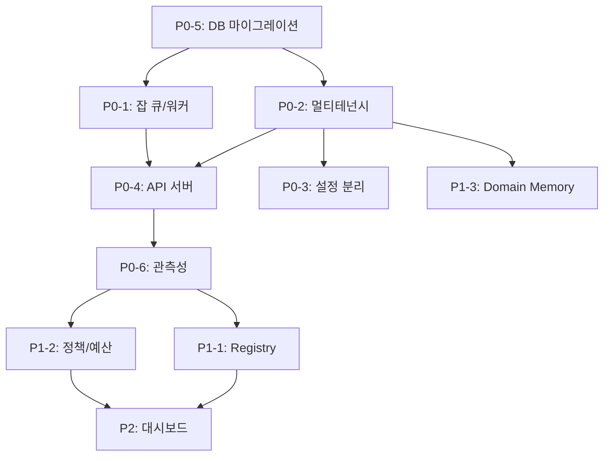

# EvalVault Enterprise Implementation Plan

엔터프라이즈 수준으로 EvalVault를 발전시키기 위한 구체적인 구현 계획입니다.

---

## 0. 목표 아키텍처 한 줄 정의

> **CLI/Web UI는 "요청/조회"만 하고, 실제 평가는 "Queue + Worker"가 수행하며, 모든 데이터는 "Tenant/Project"로 격리되고, 운영은 "Postgres + Migration + DR + OTel(Logs/Metrics/Traces)"로 표준화한다.**

이 방향이 EvalVault에 특히 잘 맞는 이유는, 이미 포트/어댑터로 외부 의존성이 분리되어 있어서 **도메인 로직 변경 없이 어댑터만 추가/교체**하면 되기 때문입니다.

---

## 1. 현재 아키텍처 분석

### 1.1 Hexagonal Architecture 구조

```
src/evalvault/
├── domain/
│   ├── entities/          # 핵심 도메인 엔티티
│   │   ├── dataset.py     # Dataset, TestCase
│   │   ├── result.py      # EvaluationRun, TestCaseResult, MetricScore
│   │   ├── experiment.py  # Experiment, ExperimentGroup
│   │   └── memory.py      # DomainMemory 관련
│   └── services/          # 도메인 서비스
├── ports/
│   ├── inbound/           # 외부 → 도메인
│   │   ├── evaluator_port.py
│   │   ├── analysis_pipeline_port.py
│   │   └── web_port.py
│   └── outbound/          # 도메인 → 외부
│       ├── storage_port.py
│       ├── llm_port.py
│       ├── tracker_port.py
│       └── domain_memory_port.py
├── adapters/
│   ├── inbound/           # CLI, Web UI
│   └── outbound/          # SQLite, Postgres, OpenAI, Langfuse 등
└── config/                # 설정 관리
```

### 1.2 현재 포트 인터페이스

| Port | 역할 | 현재 어댑터 |
|------|------|------------|
| `EvaluatorPort` | 평가 실행 | RagasEvaluator |
| `StoragePort` | 결과 저장 | SQLite, PostgreSQL |
| `LLMPort` | LLM 호출 | OpenAI, Ollama, Anthropic, Azure |
| `TrackerPort` | 추적/로깅 | Langfuse, MLflow, Phoenix |
| `DatasetPort` | 데이터 로드 | CSV, Excel, JSON |
| `DomainMemoryPort` | 도메인 메모리 | SQLite |

### 1.3 핵심 개념: Job vs EvaluationRun 분리

엔터프라이즈에서 가장 중요한 설계 결정 중 하나입니다:

| 개념 | 역할 | 설명 |
|------|------|------|
| **Job** | 실행/운영 단위 | 큐잉, 상태관리, 재시도, 취소 담당 |
| **EvaluationRun** | 결과 | 평가 완료 후 생성되는 불변 결과 데이터 |

```python
# Job: 운영 관점의 실행 단위
@dataclass
class Job:
    job_id: str
    tenant_id: str
    project_id: str
    type: JobType  # EVALUATION, ANALYSIS, PIPELINE, REGRESSION, GATE
    status: JobStatus  # QUEUED, RUNNING, SUCCEEDED, FAILED, CANCELLED
    payload: dict[str, Any]
    idempotency_key: str
    requested_by: str
    requested_at: datetime
    started_at: datetime | None = None
    finished_at: datetime | None = None
    attempt: int = 1
    max_attempts: int = 3
    result_ref: str | None = None  # run_id / report_id 등
    error_code: str | None = None
    error_message: str | None = None

class JobType(str, Enum):
    EVALUATION = "EVALUATION"
    ANALYSIS = "ANALYSIS"
    PIPELINE = "PIPELINE"
    REGRESSION = "REGRESSION"
    GATE = "GATE"

class JobStatus(str, Enum):
    QUEUED = "QUEUED"
    RUNNING = "RUNNING"
    SUCCEEDED = "SUCCEEDED"
    FAILED = "FAILED"
    CANCELLED = "CANCELLED"

# EvaluationRun: 결과 (기존 구조 확장)
@dataclass
class EvaluationRun:
    run_id: str
    dataset_name: str
    dataset_version: str
    model_name: str
    started_at: datetime
    finished_at: datetime | None
    results: list[TestCaseResult]
    metrics_evaluated: list[str]
    thresholds: dict[str, float]
    total_tokens: int
    total_cost_usd: float | None
    langfuse_trace_id: str | None
    tracker_metadata: dict[str, Any]

    # 멀티테넌시 필드 추가
    tenant_id: str | None = None
    project_id: str | None = None
    created_by: str | None = None

    # 재현성을 위한 스냅샷
    config_snapshot_hash: str | None = None  # 설정 스냅샷의 해시
```

**핵심**: API는 "Run을 즉시 만들지 않고 Job을 만들고, Job 완료 시 Run이 생긴다".

---

## 2. 엔터프라이즈 확장 구현 계획

### Phase 0: 필수 기반 (P0)

엔터프라이즈 운영에 **없으면 운영이 깨지는** 핵심 기능입니다.

---

#### P0-1: 비동기 잡 오케스트레이션

**목표**: CLI/Web UI에서 평가를 직접 실행하지 않고, 워커가 비동기로 처리

##### 새로운 Outbound Ports (핵심 3개)

아키텍처 문서의 규칙(도메인→포트에만 의존)을 그대로 따릅니다.

```python
# 1. ports/outbound/job_queue_port.py
# 작업을 큐에 넣고 상태/취소를 지원
class JobQueuePort(Protocol):
    """비동기 잡 큐 인터페이스."""

    def enqueue(
        self,
        job_type: str,
        payload: Mapping[str, Any],
        *,
        job_id: str,
    ) -> None:
        """잡을 큐에 추가."""
        ...

    def cancel(self, job_id: str) -> bool:
        """잡 취소."""
        ...

# 2. ports/outbound/job_store_port.py
# Job 메타데이터 저장 (보통 Postgres)
class JobStorePort(Protocol):
    """Job 메타데이터 저장 인터페이스."""

    def create_job(self, job: Mapping[str, Any]) -> str:
        """Job 생성, job_id 반환."""
        ...

    def set_status(
        self,
        job_id: str,
        status: str,
        *,
        extra: Mapping[str, Any] | None = None,
    ) -> None:
        """Job 상태 업데이트."""
        ...

    def get_job(self, job_id: str) -> Mapping[str, Any]:
        """Job 조회."""
        ...

    def find_by_idempotency_key(
        self,
        tenant_id: str,
        project_id: str,
        key: str,
    ) -> str | None:
        """Idempotency key로 기존 Job 찾기."""
        ...

    def list_jobs(
        self,
        tenant_id: str,
        status: str | None = None,
        limit: int = 100,
    ) -> list[Mapping[str, Any]]:
        """Job 목록 조회."""
        ...

# 3. ports/outbound/idempotency_port.py
# 중복 제출 방지 ("같은 요청이 2번 들어와도 1번만 실행")
class IdempotencyPort(Protocol):
    """Idempotency 관리 인터페이스."""

    def claim(self, scope: str, key: str, *, ttl_seconds: int) -> bool:
        """키에 대한 락 획득 시도. 성공 시 True."""
        ...

    def get_result(self, scope: str, key: str) -> str | None:
        """이미 처리된 결과 ID 조회."""
        ...

    def set_result(
        self,
        scope: str,
        key: str,
        result_id: str,
        *,
        ttl_seconds: int,
    ) -> None:
        """처리 완료 결과 저장."""
        ...
```

##### 새로운 Inbound Ports (Use Case)

```python
# ports/inbound/run_submission_port.py
class RunSubmissionPort(Protocol):
    """평가 실행 제출 유스케이스."""

    def submit_evaluation(
        self,
        *,
        tenant_id: str,
        project_id: str,
        requested_by: str,
        payload: Mapping[str, Any],
        idempotency_key: str,
    ) -> str:
        """평가 제출, job_id 반환."""
        ...

# ports/inbound/job_query_port.py
class JobQueryPort(Protocol):
    """Job 조회 유스케이스."""

    def get_job(self, job_id: str) -> Job:
        """Job 상세 조회."""
        ...

    def list_jobs(
        self,
        tenant_id: str,
        *,
        status: str | None = None,
        limit: int = 100,
        cursor: str | None = None,
    ) -> tuple[list[Job], str | None]:
        """Job 목록 + 다음 커서."""
        ...
```

##### 어댑터 구현 계획

```
adapters/outbound/
├── queue/                # 잡 큐 어댑터
│   ├── __init__.py
│   ├── memory_adapter.py      # 개발/테스트용 인메모리 큐
│   ├── celery_adapter.py      # Celery + Redis/RabbitMQ
│   └── sqs_adapter.py         # AWS SQS (선택)
├── locks/                # Idempotency/Lock 어댑터
│   ├── redis_adapter.py       # Redis 기반 분산 락
│   └── postgres_adapter.py    # Postgres advisory lock
└── artifacts/            # 대형 아티팩트 (선택)
    ├── s3_adapter.py
    └── minio_adapter.py
```

##### 도메인 서비스: RunSubmissionService

기존 evaluator를 "Worker용 payload"로 감싸는 서비스입니다.

```python
# domain/services/run_submission_service.py
@dataclass
class RunSubmissionService:
    """평가 실행 제출 서비스."""

    job_store: JobStorePort
    queue: JobQueuePort
    idem: IdempotencyPort

    def submit_evaluation(
        self,
        *,
        tenant_id: str,
        project_id: str,
        requested_by: str,
        payload: Mapping[str, Any],
        idempotency_key: str,
    ) -> str:
        """평가 제출. 중복 요청 시 기존 job_id 반환."""
        # 1. 이미 처리된 요청인지 확인
        existing = self.job_store.find_by_idempotency_key(
            tenant_id, project_id, idempotency_key
        )
        if existing:
            return existing

        # 2. 새 Job 생성
        job_id = self.job_store.create_job({
            "tenant_id": tenant_id,
            "project_id": project_id,
            "type": "EVALUATION",
            "status": "QUEUED",
            "idempotency_key": idempotency_key,
            "payload": dict(payload),
            "requested_by": requested_by,
        })

        # 3. 큐에 추가
        self.queue.enqueue(
            "evalvault.tasks.run_evaluation",
            payload,
            job_id=job_id,
        )

        return job_id
```

##### 상태 머신과 재시도/취소

엔터프라이즈에서 **"안 깨지는 실행"**의 본질은 상태 전이의 엄격함 + 재시도/취소 모델입니다.

```
상태 전이:

    QUEUED ──────────────> RUNNING ──────────────> SUCCEEDED
       │                      │                         │
       │                      │                         │
       ▼                      ▼                         │
   CANCELLED              FAILED ──> (재시도) ──> QUEUED │
       │                      │                         │
       │                      ▼                         │
       │                    DLQ                         │
       │                  (Dead Letter)                 │
       └──────────────────────┴─────────────────────────┘
```

**재시도 정책**:
- **Transient** (429/timeout)만 재시도
- **Deterministic failure** (잘못된 입력)는 재시도 금지
- `attempt` 증가 + exponential backoff + DLQ로 격리
- 워커가 주기적으로 cancel 플래그 확인 (best-effort 취소)

```python
# workers/evaluation_worker.py
class EvaluationWorker:
    """평가 실행 워커."""

    TRANSIENT_ERRORS = {429, 500, 502, 503, 504}

    def process_job(self, job: Job) -> None:
        """단일 평가 잡 처리."""
        try:
            # 1. 취소 확인
            if self._is_cancelled(job.job_id):
                self.job_store.set_status(job.job_id, "CANCELLED")
                return

            # 2. 상태 → RUNNING
            self.job_store.set_status(job.job_id, "RUNNING")

            # 3. 평가 실행 (기존 도메인 서비스 재사용)
            run = self.evaluator.evaluate(
                dataset=job.payload["dataset_ref"],
                metrics=job.payload["metrics"],
            )

            # 4. 결과 저장 + 상태 → SUCCEEDED
            self.storage.save_run(run)
            self.job_store.set_status(
                job.job_id,
                "SUCCEEDED",
                extra={"result_ref": run.run_id},
            )

        except TransientError as e:
            # 재시도 가능
            if job.attempt < job.max_attempts:
                self._schedule_retry(job)
            else:
                self._move_to_dlq(job, e)

        except DeterministicError as e:
            # 재시도 불가 - 즉시 실패
            self.job_store.set_status(
                job.job_id,
                "FAILED",
                extra={"error_code": e.code, "error_message": str(e)},
            )
```

##### 데이터 흐름

```
[Client] ─── POST /v1/runs:submit ───> [API Server]
                                            │
                  ┌─────────────────────────┤
                  │                         │
                  ▼                         ▼
            [JobStore]                [Job Queue]
            (Postgres)               (Redis/RabbitMQ)
                                            │
                                            ▼
                                    [Worker Pool]
                                            │
            ┌───────────────────────────────┼───────────────────────────────┐
            │                               │                               │
            ▼                               ▼                               ▼
    evaluate()                      save_run()                        track()
    (RagasEvaluator)               (StoragePort)                   (TrackerPort)
            │                               │                               │
            └───────────────────────────────┼───────────────────────────────┘
                                            │
                                            ▼
                                     [Result]
                                            │
[Client] <─── GET /v1/jobs/{id} ─── [API Server] <──────────────────────────┘
```

---

#### P0-2: 멀티테넌시 + RBAC

**목표**: 조직/프로젝트/사용자 단위로 데이터와 실행을 격리

##### 계층 구조

```
Tenant (조직/회사)
  └── Project (프로젝트)
        └── User (사용자) ─── Role (역할)
```

##### 엔티티 정의

```python
# domain/entities/tenant.py
@dataclass
class Tenant:
    """테넌트 (조직/회사)."""
    tenant_id: str
    name: str
    settings: dict[str, Any] = field(default_factory=dict)
    created_at: datetime = field(default_factory=datetime.now)

@dataclass
class Project:
    """프로젝트 (테넌트 하위)."""
    project_id: str
    tenant_id: str
    name: str
    description: str = ""
    settings: dict[str, Any] = field(default_factory=dict)
    created_at: datetime = field(default_factory=datetime.now)

@dataclass
class User:
    """사용자."""
    user_id: str
    tenant_id: str
    email: str
    name: str
    role: UserRole
    scopes: list[str] = field(default_factory=list)
    created_at: datetime = field(default_factory=datetime.now)

class UserRole(str, Enum):
    ADMIN = "admin"      # 모든 권한
    EDITOR = "editor"    # 생성/수정 가능
    VIEWER = "viewer"    # 조회만 가능
```

##### RBAC 스코프 정의

```python
# 스코프 정의 (세밀한 권한 제어)
SCOPES = {
    # Run 관련
    "runs:read": "평가 결과 조회",
    "runs:write": "평가 실행 제출",

    # Job 관련
    "jobs:read": "Job 상태 조회",
    "jobs:cancel": "Job 취소",

    # Registry 관련
    "registry:read": "데이터셋/프롬프트 조회",
    "registry:write": "데이터셋/프롬프트 등록",

    # Admin 관련
    "admin:users": "사용자 관리",
    "admin:settings": "테넌트 설정",
    "admin:*": "모든 관리 권한",
}

# 역할별 기본 스코프
ROLE_SCOPES = {
    "viewer": ["runs:read", "jobs:read", "registry:read"],
    "editor": ["runs:*", "jobs:*", "registry:*"],
    "admin": ["*"],
}
```

##### 인증 포트 정의

```python
# ports/inbound/auth_port.py
class AuthPort(Protocol):
    """인증/인가 인터페이스."""

    def authenticate(self, token: str) -> User:
        """토큰으로 사용자 인증."""
        ...

    def authorize(
        self,
        user: User,
        scope: str,
    ) -> bool:
        """스코프 기반 권한 검사."""
        ...

# adapters/inbound/auth/
├── oidc_adapter.py        # OIDC/OAuth2 (SSO)
├── api_key_adapter.py     # API Key 인증
└── local_adapter.py       # 로컬 개발용
```

##### CLI 인증 옵션 분리

현재 CLI의 `--profile`은 `config/models.yaml`의 **모델 프로필** 의미입니다.
엔터프라이즈 인증 프로필과 혼동되면 운영 사고가 납니다.

```python
# CLI 옵션 분리 (중요!)
@app.command()
def run(
    dataset: str,
    metrics: list[str] = typer.Option(...),

    # 모델 프로필 (기존)
    profile: str = typer.Option("prod", help="LLM/임베딩 모델 프로필"),

    # 엔터프라이즈 인증 (신규)
    endpoint: str = typer.Option(None, help="원격 API 서버 주소"),
    auth_profile: str = typer.Option(None, help="인증 프로필 (OIDC 토큰)"),

    # 로컬 실행 (하위 호환)
    local: bool = typer.Option(False, help="워커 없이 로컬 실행"),
):
    """평가 실행."""
    if local:
        # 기존 방식: 직접 실행
        result = evaluator.evaluate(dataset, metrics)
    else:
        # 새 방식: API 서버에 제출
        client = APIClient(endpoint, auth_profile)
        job_id = client.submit_run(dataset, metrics, profile)
        result = client.wait_for_result(job_id)
```

##### 감사 로그 포트

```python
# ports/outbound/audit_port.py
@dataclass
class AuditEvent:
    event_id: str
    timestamp: datetime
    tenant_id: str
    user_id: str
    action: str          # CREATE_RUN, DELETE_DATASET, UPDATE_CONFIG
    resource_type: str   # run, dataset, experiment, job
    resource_id: str
    details: dict[str, Any]
    ip_address: str | None = None

class AuditPort(Protocol):
    """감사 로그 인터페이스."""

    def log_event(self, event: AuditEvent) -> None:
        """이벤트 기록."""
        ...

    def query_events(
        self,
        tenant_id: str,
        *,
        start_date: datetime | None = None,
        end_date: datetime | None = None,
        user_id: str | None = None,
        action: str | None = None,
        limit: int = 100,
    ) -> list[AuditEvent]:
        """이벤트 조회."""
        ...
```

---

#### P0-3: 설정 체계 분리 (Config vs Secret vs Policy)

현재 `.env` 기반 설정과 프로필 구조는 로컬 개발에 최적화되어 있습니다.
엔터프라이즈에서는 **세 가지 설정을 명확히 분리**해야 합니다.

##### 설정 분류

| 분류 | 예시 | 저장소 | 접근 권한 |
|------|------|--------|----------|
| **Config** | 모델 프로필, 메트릭 설정 | Git/ConfigMap | 개발자 |
| **Secret** | API 키, DB 비밀번호 | Vault/KMS | 운영팀/자동화 |
| **Policy** | 비용 상한, 허용 모델, 로그 정책 | DB/Git | 관리자 |

##### 설정 로드 체인

```python
# config/settings.py
class Settings(BaseSettings):
    """설정 로드 우선순위: env → secret store → config file → default."""

    # Secret (Vault/KMS에서 로드)
    openai_api_key: SecretStr
    langfuse_secret_key: SecretStr

    # Config (YAML/환경변수에서 로드)
    model_profile: str = "prod"
    default_metrics: list[str] = ["faithfulness", "answer_relevancy"]

    class Config:
        env_file = ".env"
        secrets_dir = "/run/secrets"  # Docker/K8s secrets

# config/policy.py
@dataclass
class RuntimePolicy:
    """런타임 정책 (DB에서 로드)."""
    tenant_id: str
    daily_cost_limit_usd: float | None = None
    monthly_cost_limit_usd: float | None = None
    allowed_models: list[str] | None = None
    max_concurrent_runs: int = 10
    max_daily_runs: int = 1000
    data_retention_days: int = 90
```

**운영 정책이 모델 설정 파일에 섞이면, 보안/비용 사고가 납니다.**

---

#### P0-4: API 서버 (FastAPI)

**목표**: REST API를 통한 서비스 모드 제공

##### 프로젝트 구조

```
adapters/inbound/api/
├── __init__.py
├── app.py                 # FastAPI 앱 설정
├── dependencies.py        # 의존성 주입
├── middleware/
│   ├── auth.py           # 인증 미들웨어
│   ├── tenant.py         # 테넌트 컨텍스트
│   ├── logging.py        # 요청/응답 로깅
│   └── rate_limit.py     # Rate limiting
└── routes/
    ├── runs.py           # 평가 실행 API
    ├── jobs.py           # Job 관리 API
    ├── datasets.py       # 데이터셋 API
    ├── registry.py       # Registry API
    └── health.py         # 헬스체크
```

##### API 엔드포인트 설계

```python
# routes/runs.py
router = APIRouter(prefix="/v1/runs", tags=["runs"])

class SubmitRunRequest(BaseModel):
    dataset_ref: str  # dataset_id 또는 업로드 후 ID
    model_profile: str = "prod"
    metrics: list[str]
    options: dict[str, Any] = {}  # parallel, batch_size, tracker flags 등

class SubmitRunResponse(BaseModel):
    job_id: str
    status: str = "QUEUED"

@router.post(":submit", response_model=SubmitRunResponse)
async def submit_run(
    req: SubmitRunRequest,
    idempotency_key: str | None = Header(None, alias="Idempotency-Key"),
    user: User = Depends(get_current_user),
    svc: RunSubmissionService = Depends(get_submission_service),
):
    """평가 실행 제출."""
    # Idempotency key 생성 (없으면 payload 기반)
    key = idempotency_key or f"{req.dataset_ref}:{req.model_profile}:{','.join(req.metrics)}"

    job_id = svc.submit_evaluation(
        tenant_id=user.tenant_id,
        project_id=user.project_id,
        requested_by=user.user_id,
        payload=req.model_dump(),
        idempotency_key=key,
    )

    return SubmitRunResponse(job_id=job_id)

@router.get("/{run_id}")
async def get_run(
    run_id: str,
    user: User = Depends(get_current_user),
    storage: StoragePort = Depends(get_storage),
):
    """평가 결과 조회."""
    run = storage.get_run(run_id)

    # 테넌트 격리 검증
    if run.tenant_id != user.tenant_id:
        raise HTTPException(status_code=403, detail="Access denied")

    return run.to_summary_dict()

@router.get("/")
async def list_runs(
    dataset: str | None = None,
    model: str | None = None,
    limit: int = Query(100, le=1000),
    cursor: str | None = None,
    user: User = Depends(get_current_user),
    storage: StoragePort = Depends(get_storage),
):
    """평가 결과 목록."""
    return storage.list_runs(
        tenant_id=user.tenant_id,
        project_id=user.project_id,
        dataset_name=dataset,
        model_name=model,
        limit=limit,
    )

# routes/jobs.py
router = APIRouter(prefix="/v1/jobs", tags=["jobs"])

@router.get("/{job_id}")
async def get_job(
    job_id: str,
    user: User = Depends(get_current_user),
    job_store: JobStorePort = Depends(get_job_store),
):
    """Job 상태 조회."""
    job = job_store.get_job(job_id)

    if job["tenant_id"] != user.tenant_id:
        raise HTTPException(status_code=403, detail="Access denied")

    return job

@router.post("/{job_id}:cancel")
async def cancel_job(
    job_id: str,
    user: User = Depends(get_current_user),
    queue: JobQueuePort = Depends(get_queue),
):
    """Job 취소."""
    success = queue.cancel(job_id)
    return {"cancelled": success}

# routes/registry.py (엔터프라이즈에서 빠르게 필요)
router = APIRouter(prefix="/v1", tags=["registry"])

@router.post("/datasets")
async def register_dataset(file: UploadFile, ...):
    """데이터셋 등록."""
    ...

@router.get("/datasets/{dataset_id}")
async def get_dataset(dataset_id: str, ...):
    """데이터셋 조회."""
    ...

@router.post("/prompts")
async def register_prompt(manifest: PromptManifest, ...):
    """프롬프트 manifest 등록."""
    ...
```

---

#### P0-5: DB 마이그레이션 체계

**목표**: 안전한 스키마 변경 및 운영 DB 관리

##### Alembic 설정

```
alembic/
├── alembic.ini
├── env.py
├── script.py.mako
└── versions/
    ├── 001_initial_schema.py
    ├── 002_add_tenant_columns.py
    ├── 003_add_job_table.py
    └── 004_add_audit_log_table.py
```

##### 배포 파이프라인

```bash
# 배포 순서 (반드시 준수)
1. migrate       # alembic upgrade head
2. deploy        # 새 버전 배포
3. smoke test    # 기본 동작 확인
```

##### 스토리지 분리 원칙

| 저장소 | 데이터 | 특징 |
|--------|--------|------|
| **Postgres** | run/job 메타데이터, 요약 통계 | 인덱싱, 쿼리 가능 |
| **Object Storage** | 큰 결과물 (리포트, 원본 데이터셋) | 비용 효율적 |
| **Redis** | 캐시, 락, 세션 | 휘발성 |

##### DB 스키마

```sql
-- Job 테이블 (운영 단위)
CREATE TABLE jobs (
    job_id VARCHAR(36) PRIMARY KEY,
    tenant_id VARCHAR(36) NOT NULL,
    project_id VARCHAR(36) NOT NULL,
    type VARCHAR(20) NOT NULL,  -- EVALUATION, ANALYSIS, PIPELINE, etc.
    status VARCHAR(20) NOT NULL DEFAULT 'QUEUED',
    idempotency_key VARCHAR(255),
    payload JSONB NOT NULL,
    requested_by VARCHAR(36),
    requested_at TIMESTAMP DEFAULT CURRENT_TIMESTAMP,
    started_at TIMESTAMP,
    finished_at TIMESTAMP,
    attempt INT DEFAULT 1,
    max_attempts INT DEFAULT 3,
    result_ref VARCHAR(36),  -- run_id 등
    error_code VARCHAR(50),
    error_message TEXT,

    CONSTRAINT uq_idempotency UNIQUE (tenant_id, project_id, idempotency_key)
);

CREATE INDEX ix_jobs_status ON jobs(status, requested_at DESC);
CREATE INDEX ix_jobs_tenant ON jobs(tenant_id, project_id, requested_at DESC);

-- Evaluation Runs (결과, 기존 테이블 확장)
ALTER TABLE evaluation_runs ADD COLUMN tenant_id VARCHAR(36);
ALTER TABLE evaluation_runs ADD COLUMN project_id VARCHAR(36);
ALTER TABLE evaluation_runs ADD COLUMN created_by VARCHAR(36);
ALTER TABLE evaluation_runs ADD COLUMN config_snapshot_hash VARCHAR(64);

CREATE INDEX ix_runs_tenant ON evaluation_runs(tenant_id, project_id, created_at DESC);

-- 아티팩트 (큰 파일 분리)
CREATE TABLE artifacts (
    artifact_id VARCHAR(36) PRIMARY KEY,
    tenant_id VARCHAR(36) NOT NULL,
    project_id VARCHAR(36) NOT NULL,
    kind VARCHAR(50) NOT NULL,  -- report, dataset, embedding
    uri TEXT NOT NULL,  -- s3://bucket/path
    sha256 VARCHAR(64),
    size_bytes BIGINT,
    created_at TIMESTAMP DEFAULT CURRENT_TIMESTAMP,
    created_by VARCHAR(36)
);

CREATE TABLE run_artifacts (
    run_id VARCHAR(36) REFERENCES evaluation_runs(run_id),
    artifact_id VARCHAR(36) REFERENCES artifacts(artifact_id),
    PRIMARY KEY (run_id, artifact_id)
);
```

---

#### P0-6: 관측성 표준화

**목표**: Logs/Metrics/Traces 통합 + SLO/알람

##### Phoenix와 OTel의 역할 분리

| 도구 | 역할 | 사용처 |
|------|------|--------|
| **Phoenix** | LLM/RAG trace 분석 | 평가 품질, 프롬프트 디버깅 |
| **Prometheus/Grafana** | 시스템/서비스 SLO | 완료율, p95, 비용, 알람 |

Phoenix 기반 playbook (Drift watcher → Gate → Release notes)은 그대로 유지하면서,
엔터프라이즈 운영 표준인 **"3종 세트(Logs/Metrics/Traces) + 알람"**을 추가합니다.

##### 표준 계측 포인트

| 위치 | 계측 항목 |
|------|----------|
| API Inbound | request_id/trace_id, latency, error rate |
| Worker | job 처리 시간, 큐 대기 시간, 실패 원인 분류 |
| LLM 호출 | provider별 요청 수, 429 비율, 비용, 토큰 |
| Storage | DB latency, 커넥션 풀 |
| Domain Memory | 검색 latency, hit rate |

##### 구조화 로깅

```python
# config/logging.py
import logging
import json
from opentelemetry.trace import get_current_span

class StructuredFormatter(logging.Formatter):
    """JSON 구조화 로그 포매터."""

    def format(self, record: logging.LogRecord) -> str:
        span = get_current_span()
        ctx = span.get_span_context() if span else None

        log_data = {
            "timestamp": self.formatTime(record),
            "level": record.levelname,
            "logger": record.name,
            "message": record.getMessage(),
            "trace_id": format(ctx.trace_id, "032x") if ctx and ctx.is_valid else None,
            "span_id": format(ctx.span_id, "016x") if ctx and ctx.is_valid else None,
        }

        # 컨텍스트 필드 자동 추가
        for key in ["tenant_id", "user_id", "run_id", "job_id"]:
            if hasattr(record, key):
                log_data[key] = getattr(record, key)

        if record.exc_info:
            log_data["exception"] = self.formatException(record.exc_info)

        return json.dumps(log_data, ensure_ascii=False)
```

##### 메트릭 정의

```python
# config/metrics.py
from prometheus_client import Counter, Histogram, Gauge

# 평가 실행
EVAL_RUNS_TOTAL = Counter(
    "evalvault_runs_total",
    "Total evaluation runs",
    ["tenant_id", "status", "profile"]
)

EVAL_RUN_DURATION = Histogram(
    "evalvault_run_duration_seconds",
    "Evaluation run duration",
    ["tenant_id", "profile"],
    buckets=[1, 5, 10, 30, 60, 120, 300, 600]
)

# Job 큐
JOB_QUEUE_DEPTH = Gauge(
    "evalvault_job_queue_depth",
    "Current job queue depth",
    ["status"]
)

JOB_WAIT_TIME = Histogram(
    "evalvault_job_wait_seconds",
    "Job wait time in queue",
    ["tenant_id", "type"]
)

# LLM
LLM_REQUESTS_TOTAL = Counter(
    "evalvault_llm_requests_total",
    "Total LLM API requests",
    ["provider", "model", "status"]
)

LLM_COST_USD = Counter(
    "evalvault_llm_cost_usd_total",
    "Total LLM cost in USD",
    ["tenant_id", "provider", "model"]
)
```

##### SLO 정의

```yaml
# config/slo.yaml
slos:
  evaluation_success_rate:
    description: "평가 실행 성공률"
    target: 99.5
    window: 7d
    metric: |
      sum(rate(evalvault_runs_total{status="SUCCEEDED"}[7d])) /
      sum(rate(evalvault_runs_total[7d])) * 100

  evaluation_latency_p95:
    description: "평가 실행 P95 레이턴시"
    target: 300  # 5분
    window: 1d

  job_completion_rate:
    description: "Job 완료율 (실패/취소 제외)"
    target: 99.0
    window: 7d

alerts:
  high_error_rate:
    condition: rate(evalvault_runs_total{status="FAILED"}[5m]) > 0.1
    severity: warning

  queue_backlog:
    condition: evalvault_job_queue_depth{status="QUEUED"} > 100
    severity: warning

  cost_spike:
    condition: increase(evalvault_llm_cost_usd_total[1h]) > 100
    severity: critical

  worker_unhealthy:
    condition: up{job="evalvault-worker"} == 0
    severity: critical
```

---

### Phase 1: 비용 최적화 (P1)

#### P1-1: Registry 시스템

데이터셋/프롬프트/모델의 버전 관리 및 재현성 보장

```python
# domain/entities/registry.py
@dataclass
class DatasetVersion:
    dataset_id: str
    version: str
    name: str
    checksum: str  # SHA256
    record_count: int
    storage_path: str  # S3/GCS 경로
    created_by: str
    created_at: datetime
    status: str = "active"  # active, deprecated, archived
    tenant_id: str | None = None

@dataclass
class PromptVersion:
    prompt_id: str
    version: str
    name: str
    checksum: str
    content: str
    variables: list[str]
    created_by: str
    created_at: datetime
    approved_by: str | None = None
    approved_at: datetime | None = None
    status: str = "draft"  # draft, approved, deprecated

# ports/outbound/registry_port.py
class RegistryPort(Protocol):
    def register_dataset(self, dataset: DatasetVersion) -> str: ...
    def get_dataset(self, dataset_id: str, version: str | None = None) -> DatasetVersion: ...
    def register_prompt(self, prompt: PromptVersion) -> str: ...
    def approve_prompt(self, prompt_id: str, version: str, approver_id: str) -> None: ...
```

#### P1-2: 정책/예산 레이어

```python
# domain/entities/policy.py
@dataclass
class UsagePolicy:
    policy_id: str
    tenant_id: str

    # 비용 제한
    daily_cost_limit_usd: float | None = None
    monthly_cost_limit_usd: float | None = None

    # 모델 제한
    allowed_models: list[str] | None = None
    allowed_metrics: list[str] | None = None

    # Rate limiting
    max_concurrent_runs: int = 10
    max_daily_runs: int = 1000

    # 데이터 정책
    data_retention_days: int = 90
```

#### P1-3: Domain Memory 엔터프라이즈화

```python
# domain/entities/memory.py 확장
@dataclass
class DomainFact:
    fact_id: str
    tenant_id: str  # 테넌트 격리
    content: str
    source: str
    confidence: float

    # 승인 워크플로우
    status: str = "pending"  # pending, approved, rejected
    created_by: str | None = None
    approved_by: str | None = None
    approved_at: datetime | None = None

    # 만료/삭제 정책
    expires_at: datetime | None = None
    deleted_at: datetime | None = None  # soft delete
```

---

### Phase 2: 차별화 (P2) - 선택적

- Streamlit → 관리자 전용, 일반 사용자용 별도 Portal
- Airflow/Dagster 연동 (스케줄 평가)
- 멀티리전 DR

---

## 3. 전체 아키텍처 다이어그램

```
┌─────────────────────────────────────────────────────────────────────────┐
│                           CLIENT LAYER                                   │
├─────────────────────────────────────────────────────────────────────────┤
│   CLI (Typer)    │    Web UI (Streamlit)    │    Python SDK    │  API  │
│   --endpoint     │                          │                  │       │
│   --auth-profile │                          │                  │       │
└────────┬─────────┴───────────┬──────────────┴─────────┬────────┴───┬───┘
         │                     │                        │            │
         └─────────────────────┴────────────────────────┴────────────┘
                                       │
                               HTTP/gRPC API
                                       │
┌──────────────────────────────────────┴──────────────────────────────────┐
│                         SERVICE LAYER (FastAPI)                          │
├─────────────────────────────────────────────────────────────────────────┤
│  ┌──────────────┐  ┌──────────────┐  ┌──────────────┐  ┌─────────────┐ │
│  │ Auth (OIDC)  │  │ Rate Limiter │  │ Policy Check │  │ Audit Log   │ │
│  └──────────────┘  └──────────────┘  └──────────────┘  └─────────────┘ │
│                                                                          │
│  ┌─────────────────────────────────────────────────────────────────┐   │
│  │                    API Routes                                     │   │
│  │  /v1/runs:submit │ /v1/jobs │ /v1/datasets │ /v1/prompts        │   │
│  └─────────────────────────────────────────────────────────────────┘   │
└─────────────────────────────────────────┬───────────────────────────────┘
                                          │
                          ┌───────────────┼───────────────┐
                          │               │               │
                          ▼               ▼               ▼
                    [Job Store]     [Job Queue]     [Idempotency]
                    (Postgres)    (Redis/Celery)     (Redis)
                          │               │
                          └───────┬───────┘
                                  │
┌─────────────────────────────────┴───────────────────────────────────────┐
│                           WORKER LAYER                                   │
├─────────────────────────────────────────────────────────────────────────┤
│   Worker 1   │   Worker 2   │   Worker 3   │   ...   │   Worker N       │
│                                                                          │
│   ┌────────────────────────────────────────────────────────────────┐   │
│   │  Domain Services (포트 기반, 기존 로직 100% 재사용)             │   │
│   │  - RagasEvaluator      - AnalysisService                        │   │
│   │  - PipelineOrchestrator - DomainLearningHook                    │   │
│   └────────────────────────────────────────────────────────────────┘   │
└─────────────────────────────────────────┬───────────────────────────────┘
                                          │
┌─────────────────────────────────────────┴───────────────────────────────┐
│                          DATA LAYER                                      │
├──────────────┬───────────────┬───────────────┬──────────────────────────┤
│   Postgres   │     Redis     │  Object Store │  Vector Store            │
│  (metadata,  │  (queue,      │  (datasets,   │  (Domain Memory,         │
│   jobs,      │   cache,      │   artifacts,  │   pgvector)              │
│   runs,      │   locks)      │   reports)    │                          │
│   audit)     │               │               │                          │
└──────────────┴───────────────┴───────────────┴──────────────────────────┘
                                          │
┌─────────────────────────────────────────┴───────────────────────────────┐
│                       OBSERVABILITY LAYER                                │
├─────────────────────────────────────────────────────────────────────────┤
│  ┌──────────────┐  ┌──────────────┐  ┌──────────────┐  ┌─────────────┐ │
│  │   Phoenix    │  │  Prometheus  │  │    Loki      │  │   Grafana   │ │
│  │ (LLM/RAG    │  │  (Metrics,   │  │   (Logs)     │  │ (Dashboard, │ │
│  │  Traces)    │  │   SLO)       │  │              │  │  Alerts)    │ │
│  └──────────────┘  └──────────────┘  └──────────────┘  └─────────────┘ │
└─────────────────────────────────────────────────────────────────────────┘
```

---

## 4. 운영 체크리스트 (Go/No-Go 기준)

실제 운영팀/보안팀/플랫폼팀이 보는 체크리스트입니다.

### 4.1 신뢰성/운영

- [ ] Job 상태 머신 (QUEUED/RUNNING/SUCCEEDED/FAILED/CANCELLED) 구현
- [ ] 재시도 정책 (429/timeout만) + DLQ
- [ ] 취소/중단 (워커가 cancel 플래그 확인)
- [ ] Idempotency (중복 제출 방지)
- [ ] 헬스체크 엔드포인트 (`/health`, `/ready`)

### 4.2 보안/접근 제어

- [ ] SSO/OIDC 연동
- [ ] RBAC 구현 (viewer/editor/admin)
- [ ] 테넌트 격리 (데이터/실행)
- [ ] 감사 로그 (누가/언제/무엇을)
- [ ] 비밀키 관리 (Vault/KMS)

### 4.3 데이터/스토리지

- [ ] DB 마이그레이션 체계 (Alembic)
- [ ] 백업/복구 리허설 (정기)
- [ ] 데이터 보존/삭제 정책
- [ ] 아티팩트 스토리지 분리

### 4.4 Observability

- [ ] Logs/Metrics/Traces 연동 (OTel)
- [ ] Phoenix는 "LLM trace 분석"으로 유지
- [ ] SLO 정의 (완료율, p95, 실패율, 비용 폭주)
- [ ] 알람 설정 (PagerDuty/Slack)

---

## 5. 마이그레이션 전략

### 5.1 점진적 마이그레이션

```
Phase 0 (호환 유지)
├── 기존 CLI/Streamlit 그대로 동작 (--local 옵션)
├── 새 API 서버 병행 운영
└── 테넌트 ID = "default" 로 기존 데이터 처리

Phase 1 (테넌트 분리)
├── 멀티테넌시 마이그레이션 스크립트
├── 기존 데이터에 tenant_id 할당
└── SSO 연동

Phase 2 (워커 분리)
├── 평가 실행을 워커로 전환
├── CLI는 API 클라이언트로 동작
└── 기존 직접 실행 모드도 유지 (--local)
```

### 5.2 하위 호환성

```python
# CLI에서 --local 옵션으로 기존 방식 지원
@app.command()
def run(
    dataset: str,
    metrics: list[str],
    local: bool = typer.Option(False, help="워커 없이 로컬 실행"),
    endpoint: str = typer.Option(None, help="원격 API 서버"),
):
    if local or endpoint is None:
        # 기존 방식: 직접 실행
        result = evaluator.evaluate(dataset, metrics)
    else:
        # 새 방식: API 서버에 제출
        job_id = api_client.submit_run(dataset, metrics)
        result = api_client.wait_for_result(job_id)
```

---

## 6. ROADMAP 연계

현재 ROADMAP/STATUS는 Phase 1-14 완료 후 코드 품질/사용성 개선 중심입니다.
엔터프라이즈 레디는 **별도 트랙**으로 명시하는 게 안전합니다.

### Enterprise Track 섹션 추가

```markdown
## Enterprise Track

| Phase | 항목 | 설명 |
|-------|------|------|
| E1 | API Service Mode | FastAPI 기반 REST API |
| E2 | Queue/Worker 분리 | Celery + Redis, 비동기 실행 |
| E3 | Multi-tenancy + RBAC | SSO, 테넌트 격리, 감사 로그 |
| E4 | DB migration + DR | Alembic, 백업/복구 체계 |
| E5 | OTel standard + SLO | Prometheus, 알람, 런북 |
```

### 즉시 조치 (Quick Wins)

1. **버전 표기 일관성 검증**: OBSERVABILITY_PLAYBOOK의 "EvalVault 3.2" 표기와 STATUS 버전 불일치 수정
2. **단기 작업 범위 재정의**: ROADMAP의 단기 작업과 엔터프라이즈 백로그 분리

---

## 7. 구현 우선순위 및 의존성



### 구현 순서

1. **P0-5: DB 마이그레이션** (1주) - Alembic 설정, 기존 스키마 버전화
2. **P0-2: 멀티테넌시** (2주) - Tenant/Project/User 엔티티, RBAC
3. **P0-1: 잡 큐** (2주) - JobQueuePort/JobStorePort/IdempotencyPort, 워커
4. **P0-3: 설정 분리** (1주) - Config/Secret/Policy 분리
5. **P0-4: API 서버** (2주) - FastAPI, 인증 미들웨어
6. **P0-6: 관측성** (1주) - 구조화 로깅, Prometheus, SLO

---

## 부록: 새로운 파일 구조

```
src/evalvault/
├── domain/
│   ├── entities/
│   │   ├── job.py             # NEW: Job, JobType, JobStatus
│   │   ├── tenant.py          # NEW: Tenant, Project, User, UserRole
│   │   ├── registry.py        # NEW: DatasetVersion, PromptVersion
│   │   └── policy.py          # NEW: UsagePolicy, RuntimePolicy
│   └── services/
│       ├── run_submission_service.py  # NEW
│       └── policy_service.py          # NEW
├── ports/
│   ├── inbound/
│   │   ├── auth_port.py              # NEW
│   │   ├── run_submission_port.py    # NEW
│   │   └── job_query_port.py         # NEW
│   └── outbound/
│       ├── job_queue_port.py         # NEW
│       ├── job_store_port.py         # NEW
│       ├── idempotency_port.py       # NEW
│       ├── audit_port.py             # NEW
│       ├── registry_port.py          # NEW
│       └── object_storage_port.py    # NEW
├── adapters/
│   ├── inbound/
│   │   ├── api/                      # NEW: FastAPI
│   │   │   ├── app.py
│   │   │   ├── dependencies.py
│   │   │   ├── middleware/
│   │   │   └── routes/
│   │   │       ├── runs.py
│   │   │       ├── jobs.py
│   │   │       ├── registry.py
│   │   │       └── health.py
│   │   └── auth/                     # NEW
│   │       ├── oidc_adapter.py
│   │       └── api_key_adapter.py
│   └── outbound/
│       ├── queue/                    # NEW
│       │   ├── celery_adapter.py
│       │   └── memory_adapter.py
│       ├── locks/                    # NEW
│       │   ├── redis_adapter.py
│       │   └── postgres_adapter.py
│       ├── job_store/                # NEW
│       │   └── postgres_adapter.py
│       ├── audit/                    # NEW
│       │   └── postgres_adapter.py
│       └── object_storage/           # NEW
│           ├── s3_adapter.py
│           └── minio_adapter.py
├── workers/                          # NEW
│   ├── __init__.py
│   ├── celery_app.py
│   └── evaluation_worker.py
├── config/
│   ├── logging.py                    # NEW
│   ├── metrics.py                    # NEW
│   └── policy.py                     # NEW
└── alembic/                          # NEW
    ├── alembic.ini
    ├── env.py
    └── versions/
```

---

## 부록: 배포 구성

```yaml
# docker-compose.enterprise.yaml
version: '3.8'

services:
  api:
    build: .
    command: uvicorn evalvault.adapters.inbound.api.app:app --host 0.0.0.0 --port 8000
    environment:
      - POSTGRES_CONNECTION_STRING=postgresql://...
      - BROKER_URL=redis://redis:6379/0
    depends_on:
      - postgres
      - redis
    healthcheck:
      test: ["CMD", "curl", "-f", "http://localhost:8000/health"]
      interval: 30s
      timeout: 10s
      retries: 3

  worker:
    build: .
    command: celery -A evalvault.workers worker --loglevel=info
    environment:
      - POSTGRES_CONNECTION_STRING=postgresql://...
      - BROKER_URL=redis://redis:6379/0
    depends_on:
      - postgres
      - redis
    deploy:
      replicas: 3

  postgres:
    image: postgres:16
    volumes:
      - postgres_data:/var/lib/postgresql/data
    environment:
      - POSTGRES_DB=evalvault
      - POSTGRES_USER=evalvault
      - POSTGRES_PASSWORD_FILE=/run/secrets/db_password

  redis:
    image: redis:7-alpine

  prometheus:
    image: prom/prometheus
    volumes:
      - ./config/prometheus.yml:/etc/prometheus/prometheus.yml

  grafana:
    image: grafana/grafana
    depends_on:
      - prometheus

volumes:
  postgres_data:
```
