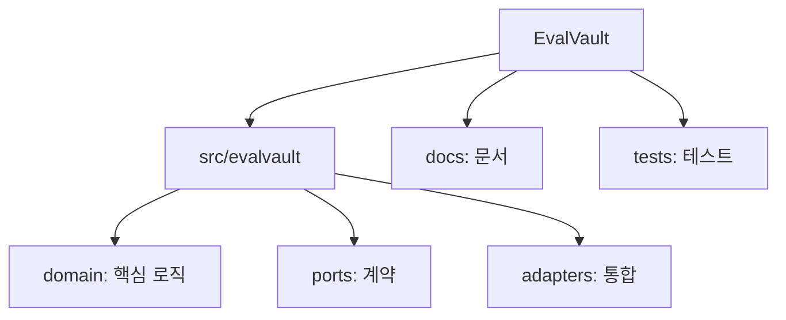
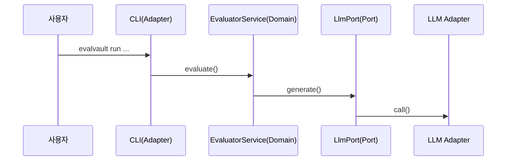
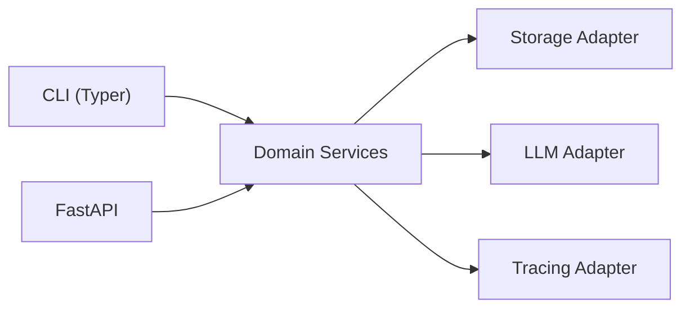
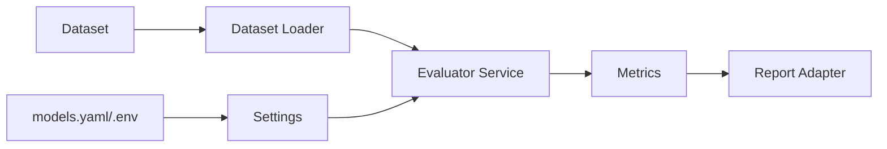

# 프로젝트 구조 파악 방법론 가이드

> Audience: 개발자/기여자/아키텍트
> Purpose: EvalVault 구조를 빠르게 이해하기 위한 복수 방법론과 시각화 접근을 정리
> Last Updated: 2026-01-06

---

## 요약

프로젝트 구조 파악은 보통 다음 축으로 나뉩니다: **폴더/레이어**, **엔트리포인트 흐름**,
**의존성**, **데이터 흐름**, **테스트 단서**. 아래 방법론은 서로 보완적이며, 시간과 목적에 따라
조합하면 가장 빠르게 전체 맥락을 잡을 수 있습니다.

---

## 방법론 빠른 선택표

| 방법론 | 핵심 질문 | 산출물 | 권장 도구 |
|---|---|---|---|
| 폴더 지형도 + 책임 태깅 | “폴더가 무엇을 책임지나?” | 디렉터리 맵 | `rg --files`, `tree`, Mermaid |
| 헥사고날 레이어 맵 | “도메인/포트/어댑터 관계는?” | 레이어 다이어그램 | Mermaid, draw.io |
| 엔트리포인트 흐름 추적 | “실행 시 어디를 거치나?” | 시퀀스/플로우 | Mermaid, Sequence Diagram |
| C4/컴포넌트 관점 | “큰 덩어리와 경계는?” | 컨테이너/컴포넌트 맵 | PlantUML(C4), Mermaid |
| 모듈 의존성 그래프 | “결합이 어디에 몰려 있나?” | 의존성 그래프 | `pydeps`, Graphviz |
| 데이터/설정 플로우 | “입력/설정이 어떻게 흘러가나?” | 데이터 플로우 | Mermaid |
| 테스트 기반 기능 지도 | “테스트가 말하는 핵심 기능은?” | 테스트-모듈 매핑 | `pytest --collect-only`, `rg` |

---

## 상세 문서

- [방법론 1: 폴더 지형도 + 책임 태깅](structure-methods/01-folder-topology.md)
- [방법론 2: 헥사고날 레이어 맵](structure-methods/02-hexagonal-layer-map.md)
- [방법론 3: 엔트리포인트 → 유스케이스 흐름 추적](structure-methods/03-entrypoint-flow.md)
- [방법론 4: C4/컴포넌트 관점](structure-methods/04-c4-component-view.md)
- [방법론 5: 모듈 의존성 그래프](structure-methods/05-dependency-graph.md)
- [방법론 6: 데이터/설정 플로우 지도](structure-methods/06-data-config-flow.md)
- [방법론 7: 테스트 기반 기능 지도](structure-methods/07-test-driven-map.md)

---

## 1) 폴더 지형도 + 책임 태깅

- 사용 목적: 가장 빠르게 전체 구조를 스캔하고 책임 범위를 감으로 잡는다.
- 짧은 예시:
```text
src/evalvault/
  domain/    # 핵심 도메인 로직 (평가/분석/메모리)
  ports/     # 계약(인터페이스)
  adapters/  # 외부 통합 (CLI/LLM/스토리지/트레이싱)
  config/    # 런타임 설정
```
- 장점: 다른 방법론보다 빠르고, 온보딩 초기에 부담이 적다.
- 단점: 런타임 흐름이나 의존성 문제를 드러내기 어렵다.
- 시각화/도구:


---

## 2) 헥사고날 레이어 맵 (Domain/Ports/Adapters)

- 사용 목적: 레이어 경계와 의존 방향(도메인 중심)을 명확히 한다.
- 짧은 예시:

- 장점: 다른 방법론 대비 아키텍처 원칙(의존성 방향)을 한눈에 확인할 수 있다.
- 단점: 세부 기능/구현 차이는 드러나지 않는다.
- 시각화/도구: Mermaid, draw.io, `docs/architecture/ARCHITECTURE.md`와 병행.

---

## 3) 엔트리포인트 → 유스케이스 흐름 추적

- 사용 목적: 실제 실행 흐름(예: CLI 명령)이 어떻게 도메인 서비스를 거치는지 파악한다.
- 짧은 예시:

- 장점: “어디서 시작되고 어디로 가는지”가 즉시 보인다.
- 단점: 여러 플로우가 섞이면 다이어그램이 커져 유지 비용이 생긴다.
- 시각화/도구: Mermaid sequenceDiagram, `rg`로 엔트리포인트 추적.

---

## 4) C4/컴포넌트 관점 (큰 덩어리와 경계)

- 사용 목적: 컨텍스트/컨테이너/컴포넌트 수준으로 시스템 경계를 잡는다.
- 짧은 예시:

- 장점: 다른 방법론 대비 “외부 시스템과의 경계”를 명확히 보여준다.
- 단점: 내부 모듈 상세는 생략되므로 세부 이해에는 부족하다.
- 시각화/도구: PlantUML(C4) 또는 Mermaid로 경량화된 C4 스타일.

---

## 5) 모듈 의존성 그래프

- 사용 목적: 결합도/순환 의존을 찾아 리팩터링 우선순위를 정한다.
- 짧은 예시:
```bash
uv run pydeps src/evalvault --max-bacon=2 --noshow --output=deps.svg
```
- 장점: 다른 방법론 대비 “의존성 문제”를 가장 직접적으로 드러낸다.
- 단점: 그래프가 커지면 해석이 어려워, 범위를 줄여야 한다.
- 시각화/도구: `pydeps` + Graphviz, 또는 `import-linter`.

---

## 6) 데이터/설정 플로우 지도

- 사용 목적: 입력 데이터와 설정이 어떻게 결합되어 결과를 만드는지 이해한다.
- 짧은 예시:

- 장점: 런타임 동작과 결과의 원인을 빠르게 추적할 수 있다.
- 단점: 코드 구조(레이어/의존성) 자체를 설명하진 않는다.
- 시각화/도구: Mermaid flowchart, 데이터 플로우 다이어그램(DFD).

---

## 7) 테스트 기반 기능 지도

- 사용 목적: “프로젝트가 실제로 중요하게 여기는 기능”을 테스트에서 역추적한다.
- 짧은 예시:
```text
tests/integration/test_data_flow.py  -> dataset loader + evaluator
tests/unit/test_cli_init.py          -> CLI 옵션/엔트리포인트
```
- 장점: 다른 방법론 대비 실제 동작 보증 범위를 확인할 수 있다.
- 단점: 테스트가 없는 영역은 구조 파악이 불완전할 수 있다.
- 시각화/도구: `pytest --collect-only`, `rg "Evaluator" tests/`.

---

## 목적별 추천 조합

- 30분 빠른 스캔: 1) 폴더 지형도 + 2) 헥사고날 레이어 맵 + 3) 엔트리포인트 흐름
- 설계/리팩터링 검토: 2) 헥사고날 + 5) 의존성 그래프 + 6) 데이터 플로우
- 신규 기능 영향 분석: 3) 엔트리포인트 + 6) 데이터 플로우 + 7) 테스트 지도
- 온보딩 자료화: 1) 지형도 + 4) C4/컴포넌트 + 3) 흐름 추적

---

## 참고 문서

- docs/architecture/ARCHITECTURE.md
- docs/PROJECT_SOURCE_GUIDE.md
- docs/internal/reference/CLASS_CATALOG.md
