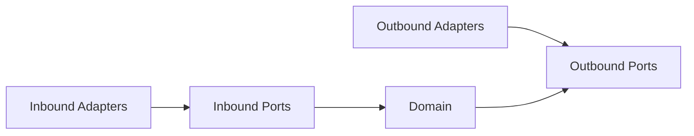

# 방법론 2: 헥사고날 레이어 맵

> Audience: 개발자/기여자/아키텍트
> Purpose: Domain/Ports/Adapters 경계와 의존성 방향을 시각화
> Last Updated: 2026-01-06

---

## 핵심 질문

- “도메인 중심의 의존 방향이 유지되는가?”

---

## 사용 목적

- 헥사고날 아키텍처의 핵심 규칙(도메인 중심)을 확인
- 어댑터가 포트를 통해서만 도메인과 연결되는지 점검
- 신규 통합이 어디에 배치되어야 하는지 빠르게 결정

---

## 빠른 절차

1. 도메인, 포트, 어댑터 디렉터리를 분리해 나열한다.
2. 인바운드/아웃바운드 포트를 구분한다.
3. 어댑터 → 포트 → 도메인 흐름을 다이어그램으로 그린다.
4. 도메인이 어댑터에 직접 의존하지 않는지 확인한다.

---

## 짧은 예시 (개념 파악용)

---

## 다른 방법론 대비 장점/단점

| 구분 | 내용 |
|---|---|
| 장점 | 폴더 지형도보다 아키텍처 원칙과 경계를 명확히 보여준다. |
| 단점 | 엔트리포인트 흐름처럼 실행 경로를 세밀하게 설명하진 않는다. |

---

## 시각화/도구

- Mermaid flowchart 또는 draw.io 레이어 맵
- `docs/architecture/ARCHITECTURE.md`와 함께 보며 갭을 체크

---

## EvalVault 적용 포인트

- `src/evalvault/domain`
- `src/evalvault/ports/inbound`
- `src/evalvault/ports/outbound`
- `src/evalvault/adapters/inbound`
- `src/evalvault/adapters/outbound`
