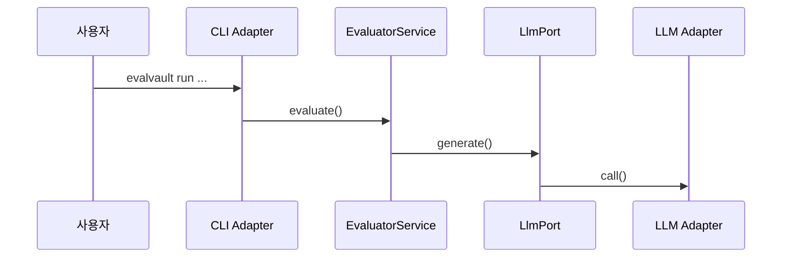

# 방법론 3: 엔트리포인트 → 유스케이스 흐름 추적

> Audience: 개발자/기여자
> Purpose: 실행 흐름(예: CLI/API)이 도메인 서비스를 어떻게 통과하는지 추적
> Last Updated: 2026-01-06

---

## 핵심 질문

- “사용자 입력이 어떤 서비스/포트를 거쳐 결과를 만드는가?”

---

## 사용 목적

- 실제 실행 경로와 호출 순서를 이해
- 특정 기능이 어디에서 시작되고 어디서 끝나는지 파악
- 장애/성능 이슈 발생 지점을 좁히는 데 활용

---

## 빠른 절차

1. 엔트리포인트를 하나 선택한다(예: `evalvault run`).
2. CLI 또는 API 어댑터에서 호출되는 서비스를 추적한다.
3. 도메인 서비스가 참조하는 포트를 찾는다.
4. 해당 포트를 구현하는 어댑터로 이어서 확인한다.

---

## 짧은 예시 (개념 파악용)

---

## 다른 방법론 대비 장점/단점

| 구분 | 내용 |
|---|---|
| 장점 | 폴더 지형도보다 실제 실행 흐름을 명확하게 보여준다. |
| 단점 | 전체 구조 요약이나 의존성 전반을 한눈에 보기 어렵다. |

---

## 시각화/도구

- Mermaid sequenceDiagram
- `rg "evalvault" src/evalvault/adapters/inbound`로 엔트리포인트 탐색
- `rg "class .*Service" src/evalvault/domain/services`로 서비스 추적

---

## EvalVault 적용 포인트

- `src/evalvault/adapters/inbound/cli`
- `src/evalvault/adapters/inbound/api`
- `src/evalvault/domain/services`
- `src/evalvault/ports/outbound`
