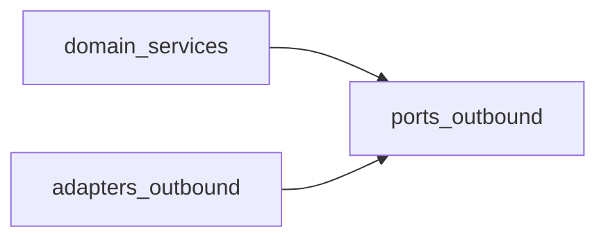

# 방법론 5: 모듈 의존성 그래프

> Audience: 개발자/기여자
> Purpose: 결합도와 순환 의존을 발견해 리팩터링 우선순위를 정리
> Last Updated: 2026-01-06

---

## 핵심 질문

- “의존성이 어디에 몰려 있고, 순환이 생겼나?”

---

## 사용 목적

- 리팩터링 대상 모듈을 객관적으로 식별
- 레이어 경계 위반(도메인 → 어댑터 의존 등) 탐지
- 큰 패키지를 서브모듈로 나눌 근거 마련

---

## 빠른 절차

1. 대상 범위를 좁힌다(예: `src/evalvault/domain`).
2. 의존성 그래프를 생성한다.
3. 고리/허브 모듈을 표시한다.
4. 원인과 개선안을 간단히 기록한다.

---

## 짧은 예시 (개념 파악용)

```bash
uv run pydeps src/evalvault/domain --max-bacon=2 --noshow --output=domain_deps.svg
```



---

## 다른 방법론 대비 장점/단점

| 구분 | 내용 |
|---|---|
| 장점 | 폴더 지형도/엔트리포인트보다 결합도 문제를 직접 보여준다. |
| 단점 | 그래프가 커지면 해석이 어렵고, 범위 조절이 필요하다. |

---

## 시각화/도구

- `pydeps` + Graphviz(dot)
- `import-linter`로 금지 규칙을 추가해 자동 검증
- Mermaid로 축약 그래프를 문서에 남기기

---

## EvalVault 실제 그래프 (예시)

아래 이미지는 `EvaluatorPort` 중심의 실제 의존성 그래프를 `pydeps`로 생성한 결과입니다.
전체 패키지 그래프는 시간이 오래 걸릴 수 있어, 단일 파일 스코프를 예시로 포함했습니다.

```bash
uv run pydeps src/evalvault/ports/inbound/evaluator_port.py \
  --no-config \
  --only src/evalvault \
  --max-bacon=1 \
  --max-module-depth=1 \
  --rankdir LR \
  --noshow \
  -T svg \
  -o docs/assets/structure-methods/evaluator-port-deps.svg
```


---

## 도구 설치 (선택)

- pydeps
  - `uv pip install pydeps`
- Graphviz (dot 실행 파일 필요)
  - macOS: `brew install graphviz`
  - Ubuntu: `sudo apt-get install graphviz`
  - Windows: `choco install graphviz`
- 설치 후 `dot -V`로 PATH 등록을 확인한다.

---

## EvalVault 적용 포인트

- `src/evalvault/domain`
- `src/evalvault/ports`
- `src/evalvault/adapters`
