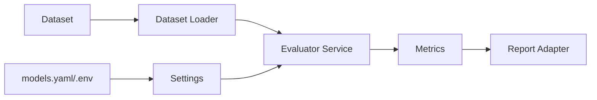

# 방법론 6: 데이터/설정 플로우 지도

> Audience: 개발자/기여자
> Purpose: 입력 데이터와 설정이 평가 결과로 이어지는 경로를 정리
> Last Updated: 2026-01-06

---

## 핵심 질문

- “데이터와 설정은 어디서 들어와 어떤 결과를 만든다?”

---

## 사용 목적

- 평가 결과의 원인을 추적(데이터 vs 설정 영향)
- 설정 변경이 런타임에 반영되는 지점 파악
- 신규 데이터 소스 추가 시 연결 위치 결정

---

## 빠른 절차

1. 데이터 소스(파일/DB/API)를 나열한다.
2. 로더/전처리/평가/리포트 흐름을 연결한다.
3. 설정 파일과 환경 변수가 주입되는 지점을 표시한다.
4. 입력 → 결과까지 한 장의 플로우로 요약한다.

---

## 짧은 예시 (개념 파악용)

---

## 다른 방법론 대비 장점/단점

| 구분 | 내용 |
|---|---|
| 장점 | 엔트리포인트 흐름보다 데이터/설정 영향 관계를 쉽게 설명한다. |
| 단점 | 레이어 경계나 의존성 구조는 상대적으로 덜 드러난다. |

---

## 시각화/도구

- Mermaid flowchart
- DFD(Data Flow Diagram) 스타일로 단계 간 책임을 표기

---

## EvalVault 적용 포인트

- `src/evalvault/adapters/outbound/dataset`
- `src/evalvault/domain/services/evaluator.py`
- `src/evalvault/config/settings.py`
- `config/models.yaml`
