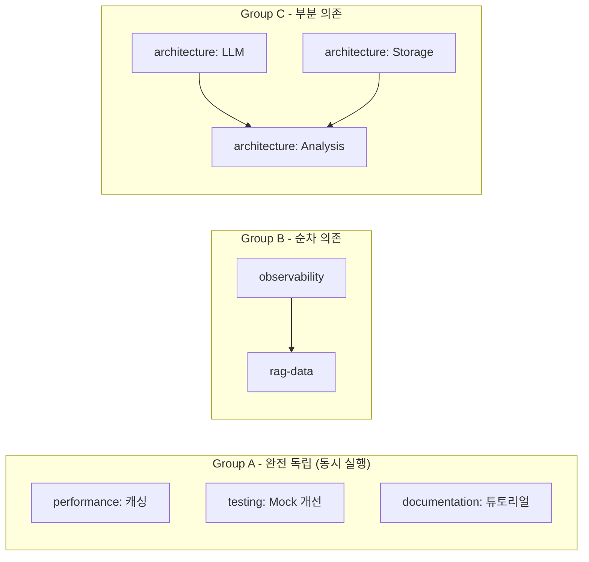
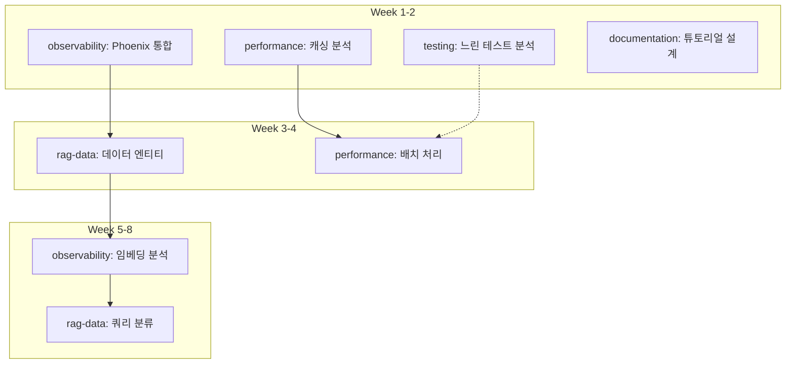

# EvalVault 개선 계획서

> Last Updated: 2026-01-07
> Version: 3.6
> Focus: 병렬 AI 에이전트 기반 코드 품질 개선, RAG Observability 통합, Domain Memory 활용, 성능 최적화

---

## 🔗 관련 문서

| 문서 | 역할 | 설명 |
|------|------|------|
| [ROADMAP.md](../../status/ROADMAP.md) | 전체 로드맵 | 현재 상태 요약 + 향후 개발 계획 |
| **[IMPROVEMENT_PLAN.md](./IMPROVEMENT_PLAN.md)** (이 문서) | 개선 계획 | 코드 품질 개선 계획 (병렬 AI 에이전트 기반) |
| [COMPLETED.md](./COMPLETED.md) | 완료 기록 | Phase 1-14 달성 기록 (상세) |
| [AGENT_STRATEGY.md](../reference/AGENT_STRATEGY.md) | 에이전트 전략 | 전체 에이전트 활용 전략 (개발+운영) |
| [agent/README.md](https://github.com/ntts9990/EvalVault/blob/main/agent/README.md) | 에이전트 사용법 | 에이전트 시스템 사용법 |
| [PARALLEL_WORK_PLAN.md](./PARALLEL_WORK_PLAN.md) | 병렬 작업 계획 | 병렬 개발 작업 추적 (임시 문서) |
| [PARALLEL_STATUS.md](./PARALLEL_STATUS.md) | 병렬 작업 상태 | 병렬 작업 진행 상황 (임시 문서) |
| [OBSERVABILITY_PLAYBOOK.md](../../guides/OBSERVABILITY_PLAYBOOK.md) | 옵저버빌리티 가이드 | Phoenix Drift Watcher, 릴리즈 노트, Domain Memory 오버레이 절차 |

> **참고**: `PARALLEL_WORK_PLAN.md`와 `PARALLEL_STATUS.md`는 병렬 작업 완료 후 정리 또는 삭제 예정입니다.

---

## 목차

1. [개요](#개요)
2. [에이전트 시스템 개요](#에이전트-시스템-개요)
3. [AI 에이전트 병렬 실행 프레임워크](#ai-에이전트-병렬-실행-프레임워크)
4. [현재 상태 분석](#현재-상태-분석)
5. [개선 계획](#개선-계획)
   - [P0: 아키텍처 안전망](#p0-아키텍처-안전망-신규-리팩토링-패키지)
   - [P1: 코드 통합 및 중복 제거](#p1-코드-통합-및-중복-제거)
   - [P2: 복잡한 모듈 분리](#p2-복잡한-모듈-분리)
   - [P3: 성능 최적화](#p3-성능-최적화)
   - [P4: 사용성 개선](#p4-사용성-개선)
   - [P5: 테스트 개선](#p5-테스트-개선)
   - [P6: 문서화 개선](#p6-문서화-개선)
   - [P7: RAG Observability (Phoenix 통합)](#p7-rag-observability-phoenix-통합)
   - [P8: Domain Memory 활용](#p8-domain-memory-활용-업데이트)
6. [병렬 실행 로드맵](#병렬-실행-로드맵)
7. [에이전트 메모리 시스템](#에이전트-메모리-시스템)
8. [Quick Wins](#quick-wins)
9. [부록](#부록)

---

## 개요

EvalVault는 현재 Phase 1-14가 완료되어 안정적인 기반을 갖추었습니다. 이제 **병렬 AI 에이전트 워크플로우**를 도입하여 코드 품질 개선, RAG Observability 강화, 성능 최적화를 동시에 진행합니다.

### 핵심 원칙

1. **KISS (Keep It Simple, Stupid)**: 복잡성 최소화
2. **DRY (Don't Repeat Yourself)**: 코드 중복 제거
3. **YAGNI (You Aren't Gonna Need It)**: 필요한 것만 구현
4. **빠른 피드백**: 작은 단위로 빠르게 개선 및 검증
5. **병렬 실행**: 독립적인 작업은 동시에 진행

### 목표

| 영역 | 목표 | 측정 지표 |
|------|------|----------|
| **개발자 경험 (DX)** | 명확한 코드, 쉬운 온보딩 | 온보딩 시간 50% 단축 |
| **사용자 경험 (UX)** | 직관적인 CLI, 명확한 에러 메시지 | 지원 요청 40% 감소 |
| **유지보수성** | 모듈화, 테스트 커버리지 증가 | 커버리지 89% → 95% |
| **성능** | 불필요한 계산 제거, 캐싱 활용 | 평가 속도 30% 향상 |
| **RAG 분석력** | 근본 원인 분석 가능 | 문제 진단 시간 16배 단축 |

---

## 에이전트 시스템 개요

> 📌 **상세 전략**: [AGENT_STRATEGY.md](../reference/AGENT_STRATEGY.md) 참조

### 두 가지 운영 모드

EvalVault 에이전트 시스템은 **두 가지 모드**로 활용됩니다:

```
┌─────────────────────────────────────────────────────────────────┐
│                     EvalVault Agent System                       │
├─────────────────────────────────────────────────────────────────┤
│                                                                  │
│  ┌─────────────────────────┐    ┌─────────────────────────┐     │
│  │   Development Mode      │    │    Operation Mode       │     │
│  │   (이 문서에서 다룸)     │    │  (AGENT_STRATEGY.md)    │     │
│  ├─────────────────────────┤    ├─────────────────────────┤     │
│  │ • architecture          │    │ • domain-expert         │     │
│  │ • observability         │    │ • testset-curator       │     │
│  │ • rag-data              │    │ • quality-monitor       │     │
│  │ • performance           │    │ • eval-coordinator      │     │
│  │ • testing               │    │ • experiment-analyst    │     │
│  │ • documentation         │    │ • report-generator      │     │
│  │ • coordinator           │    │ • data-validator        │     │
│  └─────────────────────────┘    └─────────────────────────┘     │
│            │                               │                     │
│            ▼                               ▼                     │
│  ┌─────────────────────────┐    ┌─────────────────────────┐     │
│  │   Agent Memory          │    │   Domain Memory         │     │
│  │   (agent/memory/)       │    │   (config/domains/)     │     │
│  └─────────────────────────┘    └─────────────────────────┘     │
│                                                                  │
└─────────────────────────────────────────────────────────────────┘
```

| 모드 | 목적 | 대상 | 상태 | 문서 |
|------|------|------|------|------|
| **Development** | EvalVault 코드 개선 | 개발자 | ✅ 구현됨 | 이 문서 |
| **Operation** | RAG 평가 워크플로우 자동화 | 평가 담당자 | 📋 제안 | [AGENT_STRATEGY.md](../reference/AGENT_STRATEGY.md) |

### 에이전트 시스템 상태

```
✅ 에이전트 시스템 검증 완료 (2026-01-01)
   - Claude Agent SDK 정상 작동
   - 8개 개발 에이전트 구현됨
   - 메모리 시스템 정상 작동
   - 병렬 실행 그룹 정의됨
```

### 에이전트 실행 방법

```bash
# 개발 에이전트 실행
cd agent/
uv run python main.py --project-dir .. --agent-type architecture

# 사용 가능한 에이전트 목록 확인
uv run python main.py --list-agents

# 코디네이터로 전체 상태 확인
uv run python main.py --project-dir .. --agent-type coordinator
```

### 개발 모드 vs 운영 모드 선택 가이드

| 작업 유형 | 사용할 모드 | 에이전트 |
|-----------|-------------|----------|
| 코드 리팩토링 | Development | `architecture` |
| 테스트 최적화 | Development | `testing` |
| Phoenix 통합 | Development | `observability` |
| 일일 평가 자동화 | Operation | `quality-monitor` |
| 도메인 용어 학습 | Operation | `domain-expert` |
| 테스트셋 보강 | Operation | `testset-curator` |

---

## AI 에이전트 병렬 실행 프레임워크

### 아키텍처 개요

```
                    ┌─────────────────────────────────┐
                    │      Coordinator Agent          │
                    │  (통합 관리, 의존성 해결)        │
                    └───────────────┬─────────────────┘
                                    │
        ┌───────────────────────────┼───────────────────────────┐
        │                           │                           │
        ▼                           ▼                           ▼
┌───────────────┐          ┌───────────────┐          ┌───────────────┐
│  architecture │          │ observability │          │  performance  │
│    Agent      │          │    Agent      │          │    Agent      │
│               │          │               │          │               │
│ - 의존성 역전 │          │ - Phoenix     │          │ - 캐싱        │
│ - 코드 통합   │          │ - 데이터 수집 │          │ - 비동기      │
│ - 모듈 분리   │          │ - 메트릭      │          │ - 배치 처리   │
└───────────────┘          └───────────────┘          └───────────────┘
        │                           │                           │
        │                           │                           │
        ▼                           ▼                           ▼
┌───────────────┐          ┌───────────────┐          ┌───────────────┐
│    testing    │          │   rag-data    │          │ documentation │
│    Agent      │          │    Agent      │          │    Agent      │
│               │          │               │          │               │
│ - 테스트 최적화│          │ - 검색 추적   │          │ - 튜토리얼    │
│ - 커버리지    │          │ - 생성 추적   │          │ - API 문서    │
│ - Mock 개선   │          │ - 사용자 피드백│          │ - 가이드      │
└───────────────┘          └───────────────┘          └───────────────┘
        │                           │                           │
        └───────────────────────────┼───────────────────────────┘
                                    │
                    ┌───────────────▼─────────────────┐
                    │      Agent Memory System        │
                    │    (agent/memory/)              │
                    │                                 │
                    │  ├── agents/{agent-name}/       │
                    │  └── shared/                    │
                    └─────────────────────────────────┘
```

### 에이전트 역할 정의

| Agent | 담당 영역 | 독립성 | 주요 P-Level |
|-------|----------|--------|--------------|
| `architecture` | 코드 구조, 의존성, 포트/어댑터 | 높음 | P0, P1, P2 |
| `observability` | Phoenix, OpenTelemetry, 메트릭 | 중간 | P7 |
| `performance` | 캐싱, 배치 처리, 비동기 최적화 | 높음 | P3 |
| `testing` | 테스트 최적화, 커버리지, Mock | 중간 | P5 |
| `rag-data` | 검색/생성 데이터 수집, 분석 | 중간 | P7 |
| `documentation` | 문서화, 튜토리얼, API 문서 | 높음 | P6 |
| `coordinator` | 통합 관리, 충돌 해결, 품질 검증 | - | All |

### 병렬 실행 그룹



### 충돌 방지 규칙

에이전트가 병렬로 작업할 때 충돌을 방지하기 위한 규칙:

#### 1. 파일 소유권 규칙

| 에이전트 | 수정 가능 영역 | 수정 금지 영역 |
|----------|----------------|----------------|
| `architecture` | `domain/`, `adapters/outbound/` | `adapters/inbound/web/` |
| `observability` | `adapters/outbound/tracker/` | `domain/services/` |
| `performance` | `adapters/outbound/cache/` | `domain/entities/` |
| `testing` | `tests/` | `src/evalvault/` (직접 수정 금지) |
| `documentation` | `docs/` | `src/` |
| `rag-data` | `domain/entities/` (신규만) | 기존 코드 |

#### 2. 공유 파일 수정 규칙

다음 파일은 **coordinator 승인 후** 수정:

```
⚠️ 공유 파일 (승인 필요)
├── pyproject.toml          # 의존성 변경 시
├── src/evalvault/__init__.py
├── src/evalvault/config/settings.py
└── agent/memory/shared/decisions.md
```

#### 3. 브랜치 규칙

```bash
# 각 에이전트는 독립 브랜치에서 작업
git checkout -b agent/{agent-name}/{task-id}

# 예시
git checkout -b agent/architecture/p1-llm-adapter
git checkout -b agent/performance/p3-caching
```

#### 4. 커밋 메시지 규칙

```bash
# 형식: {type}({agent}): {description}
feat(architecture): Add BaseLLMAdapter abstraction
fix(performance): Improve cache hit rate
docs(documentation): Add Phoenix tutorial
```

### 의존성 확인 프로토콜

에이전트 시작 전 필수 확인:

```bash
# 1. 블로킹 이슈 확인
cat agent/memory/shared/dependencies.md | grep -A5 "Blocking Issues"

# 2. 다른 에이전트 작업 상태 확인
ls agent/memory/agents/*/session_*.md

# 3. 공유 결정사항 확인
cat agent/memory/shared/decisions.md | tail -20
```

### 조율 프로토콜

```python
class CoordinationProtocol:
    """에이전트 간 조율 규칙"""

    # 1. 작업 시작 전
    def before_start(self, agent: str, task: str):
        # 블로킹 이슈 확인
        check("shared/dependencies.md")
        # 선행 작업 완료 확인
        verify_prerequisites(task)
        # 공유 리소스 충돌 확인
        check_resource_conflicts(task)

    # 2. 작업 중
    def during_work(self, agent: str):
        # 진행 상황 기록
        update("agents/{agent}/work_log.md")
        # 중요 결정 공유
        if important_decision:
            update("shared/decisions.md")

    # 3. 작업 완료 후
    def after_complete(self, agent: str, task: str):
        # 상태 업데이트
        update("shared/dependencies.md", status="completed")
        # 블로킹 해제 알림
        notify_blocked_agents(task)
        # 다음 작업 선택
        pick_next_task()
```

---

## 현재 상태 분석

### 강점

| 영역 | 설명 |
|------|------|
| **아키텍처** | Hexagonal Architecture로 잘 구조화됨 (235+ 클래스, C4 모델 문서화) |
| **테스트** | 1,648개 테스트, 89% 커버리지 |
| **기능 완성도** | Phase 1-14 완료, 핵심 기능 모두 구현 |
| **확장성** | Port/Adapter 패턴으로 쉬운 확장 |
| **문서화** | 상세한 ROADMAP, USER_GUIDE, ARCHITECTURE_C4, 튜토리얼 7종 제공 |

### 개선 필요 영역

| 영역 | 문제점 | 담당 에이전트 | 우선순위 |
|------|--------|--------------|----------|
| **코드 중복** | 유사한 로직이 여러 곳에 산재 | `architecture` | P1 |
| **복잡한 모듈** | 일부 모듈이 너무 크고 복잡함 | `architecture` | P2 |
| **성능** | 대규모 데이터셋 처리 시 느림 | `performance` | P3 |
| **CLI UX** | 일부 명령어가 직관적이지 않음 | `documentation` | P4 |
| **RAG 분석** | "왜 점수가 낮은가?" 파악 불가 | `observability`, `rag-data` | P7 |
| **에러 메시지** | 에러 메시지가 불명확한 경우 있음 | `documentation` | P4 |

### 코드베이스 통계

```
소스 코드: 43,074 LOC
테스트 코드: 32,362 LOC
총 코드 라인: 75,436 LOC
테스트 수: 1,648개 (Unit: 1,565 / Integration: 83)
커버리지: 89%
클래스 수: 235+ 클래스
CLI 명령어: 17개
```

---

## 개선 계획

### P0: 아키텍처 안전망 (신규 리팩토링 패키지)

> **Purpose**: 추가 개발 전에 Hexagonal 규율과 의존성 정책을 복구
> **담당 에이전트**: `architecture`
> **Status**: ✅ 완료

#### 0.1 Domain ↔ Adapter 의존성 역전 고정

- **Goal**: 도메인 서비스가 adapter 구현을 직접 import하지 않도록 변경
- **Status**: ✅ 완료 (2026-01-02)
- **Validation**: `rg "from evalvault.adapters" src/evalvault/domain` → 0건

#### 0.2 기본 의존성 다이어트 & Extras 재구성

- **Goal**: 무거운 패키지를 extras로 이동
- **Status**: ✅ 완료 (2026-01-02)
- **Validation**: `uv pip install .` 시 대형 모델 다운로드 없음

#### 0.3 분석/파이프라인 경계 문서화 & 템플릿화

- **Goal**: DAG 파이프라인과 분석 모듈의 포트/어댑터 경계 명문화
- **Status**: ✅ 완료 (2026-01-02)
- **Validation**: 161 tests passed

---

### P1: 코드 통합 및 중복 제거

> **Priority**: 🔥 High
> **담당 에이전트**: `architecture`
> **병렬 가능**: 1.1, 1.2 동시 진행 가능

#### 1.1 LLM Adapter 통합

**Status**: ✅ 완료 (2026-01-01)
- `BaseLLMAdapter` 추상 클래스 도입
- 공통 로직 통합: TokenUsage 추적, Ragas LLM/Embeddings 관리, ThinkingConfig
- `LLMConfigurationError` - 사용자 친화적 에러 메시지
- `_validate_required_settings()` 헬퍼 - 설정 검증 공통화
- `create_openai_embeddings_with_legacy()` 팩토리 함수 - Legacy 메서드 호환
- 4개 어댑터 모두 BaseLLMAdapter 상속: OpenAI, Azure, Anthropic, Ollama
- 테스트: 32 cases passed

**효과**: ~200 LOC 감소, 새 LLM 추가 시간 단축

#### 1.2 Storage Adapter 통합

**Status**: ✅ 완료 (2026-01-01)
- `BaseSQLStorageAdapter` 도입
- SQLite/PostgreSQL 공통 로직 통합
- 테스트: 52 cases passed

#### 1.3 Analysis Adapter 통합

**Status**: ✅ 완료 (2026-01-03)
- `BaseAnalysisAdapter` 도입
- 공통 출력 포맷 표준화 (`build_module_output()`)
- 테스트: 27 cases passed

---

### P2: 복잡한 모듈 분리

> **Priority**: 🟡 Medium
> **담당 에이전트**: `architecture`

#### 2.1 CLI 모듈 분리

**Status**: ✅ 완료 (2026-01-03)
- ✅ `commands/run.py`: `evalvault run` 전용 모듈
- ✅ `commands/history.py`: `history/compare/export` 모듈
- ✅ `commands/pipeline.py`: `pipeline analyze/intents/templates` 모듈
- ✅ `commands/analyze.py`: `analyze/analyze-compare` + 개선 리포트 헬퍼 분리
- ✅ `commands/generate.py`: 문서→테스트셋 생성 CLI를 모듈로 이동 (`uv` extras 의존성 없이 작동)
- ✅ `commands/gate.py`: 품질 게이트/CI 출력을 전용 모듈로 분리하고 JSON/GitHub Actions 서식을 공유화
- ✅ `commands/experiment.py`: Experiment CRUD/비교 흐름을 모듈화하고 `app.py`에서는 Typer wiring만 수행
- ✅ `commands/domain.py` / `commands/benchmark.py` / `commands/kg.py`: 도메인/벤치마크/KG 서브앱 분리 및 `_display_kg_stats`, `_load_documents_from_source` 헬퍼를 `__init__`에서 재노출
- ✅ `cli/utils/formatters.py`, `cli/utils/validators.py`: 공통 테이블 포맷/메트릭·언어 검증 로직을 추출해 run/gate/domain/generate/analyze/experiment 명령에서 재사용
- ✅ `commands/config.py` / `commands/langfuse.py` / `commands/web.py`: 루트 명령을 모듈화해 `app.py`는 Typer wiring만 수행하고, Langfuse 대시보드/웹 UI/metrics/config 출력을 각각 전담
- ✅ `cli/utils/options.py`: `--profile(-p)`/`--db(-D)` 옵션을 공유 팩토리로 정의해 모든 명령이 동일한 alias/도움말을 재사용
- `app.py`는 이제 Typer 앱 초기화, 공용 명령(metrics/config/web/langfuse)만 유지하며 나머지는 `commands/*`로 위임
- 테스트:
  - `uv run pytest tests/unit/test_cli.py -k "analyze or pipeline" -v` (10 passed)
  - `uv run pytest tests/unit/test_cli.py -k "generate or gate" -v` (15 passed)
  - `uv run pytest tests/unit/test_cli.py -k "experiment or benchmark or kg" -v` (16 passed)
  - `uv run pytest tests/unit/test_cli.py -v` (82 passed)
- 다음 단계: Typer 콜백/전체 앱 구성을 패키지 수준에서 더 세분화해 서브커맨드 자동 등록, 공통 옵션 그룹 프리셋(--profile, --db 등)을 문서화하고, CLI 도움말 예제/사용법을 docs/guides/CLI_GUIDE.md 형태로 제공

**목표 구조**:
```
src/evalvault/adapters/inbound/cli/
├── app.py              # Typer 앱 정의
├── commands/
│   ├── run.py          # ✅ run 명령
│   ├── analyze.py      # ✅ analyze / analyze-compare
│   ├── history.py      # ✅ history / compare / export
│   ├── pipeline.py     # ✅ pipeline analyze/intents/templates
│   ├── experiment.py   # ✅ experiment-* 명령
│   ├── kg.py           # ✅ kg stats + helper
│   ├── domain.py       # ✅ domain init/list/show/terms
│   ├── benchmark.py    # ✅ benchmark run/list
│   └── agent.py        # ✅ agent 도구 서브커맨드
└── utils/
    ├── formatters.py
    └── validators.py
```

#### 2.2 Web UI 컴포넌트 재구조화

**병렬 실행 가능**: `documentation` 에이전트와 동시 진행

#### 2.3 Domain Services 분리

**Status**: ✅ 완료 (2026-01-03)

**ExperimentManager → 분리 완료**:
- ✅ `ExperimentRepository` (experiment_repository.py): CRUD
- ✅ `ExperimentComparator` (experiment_comparator.py): 비교
- ✅ `ExperimentStatisticsCalculator` (experiment_statistics.py): 통계
- ✅ `ExperimentReportGenerator` (experiment_reporter.py): 보고서

```
src/evalvault/domain/services/
├── experiment_manager.py          # ExperimentManager (통합 진입점)
├── experiment_repository.py       # ✅ ExperimentRepository (CRUD)
├── experiment_comparator.py       # ✅ ExperimentComparator (비교 로직)
├── experiment_statistics.py       # ✅ ExperimentStatisticsCalculator (통계)
└── experiment_reporter.py         # ✅ ExperimentReportGenerator (보고서)
```

---

### P3: 성능 최적화

> **Priority**: 🟡 Medium
> **담당 에이전트**: `performance`
> **병렬 가능**: 3.1, 3.2, 3.3 모두 독립 실행 가능

#### 3.1 평가 파이프라인 최적화

```python
# 개선: 배치 처리 + 병렬화
async def evaluate_batch(test_cases: list, batch_size: int = 10):
    batches = chunk(test_cases, batch_size)
    tasks = [evaluate_batch_async(batch) for batch in batches]
    results = await asyncio.gather(*tasks)
    return flatten(results)
```

**예상 효과**: 1000 TC 평가 시간 30분 → 10분

#### 3.2 데이터 로딩 최적화

- 스트리밍 로더 구현
- 메모리 사용량: 100MB → 10MB

#### 3.3 캐싱 개선

- LRU + TTL 하이브리드 캐시
- 캐시 hit rate: 60% → 85%

---

### P4: 사용성 개선

> **Priority**: 🔥 High
> **담당 에이전트**: `documentation`, `architecture`

#### 4.1 CLI 명령어 개선

**Status**: ⏳ 계획 중 (2026-01-07)

```bash
# 개선된 사용법
evalvault run data.csv \
  --metrics faithfulness answer_relevancy \
  --llm openai \
  --tracker phoenix  # 신규: Phoenix 지원
```

#### 4.2 에러 메시지 개선

**Status**: ✅ 완료 (2026-01-07)

```
❌ Error: OpenAI API key not found

📝 How to fix:
   1. Create a .env file in your project root
   2. Add: OPENAI_API_KEY=your-key-here

💡 Get your API key: https://platform.openai.com/api-keys
```

#### 4.3 Progress Indicator 개선

**Status**: ✅ 완료 (2026-01-07)

- Rich 라이브러리 통합
- ETA 표시 추가

#### 4.4 "심플/전체" 실행 모드 도입 계획 (신규)

> **목표**: 사용자가 `evalvault` CLI를 실행할 때 **초보자를 위한 심플 모드**와 **전문가용 전체 모드** 중 하나를 선택하도록 해 UX 온보딩을 단축하고, 기존 고급 기능(Tracker, Domain Memory, Prompt manifest 등)을 구조화된 프리셋으로 제공한다.

| 단계 | 설명 | 산출물 | 담당 |
|------|------|--------|------|
| **Step 0: 선행 조건 정리** | P2.1 잔여 과제(공통 옵션 팩토리, Typer 서브커맨드 등록 자동화, CLI 가이드 초안)를 완료해 모든 명령이 동일한 옵션 세트를 재사용하도록 만든다. | `cli/utils/options.py` 보강, `docs/guides/CLI_GUIDE.md` 초안 | `architecture`, `documentation` |
| **Step 1: 모드 스펙 정의** | 심플/전체 모드가 각각 포함할 플래그, 기본값, Tracker/Domain Memory 연계 범위를 문서화한다. 심플 모드는 `evalvault run --mode simple` (또는 별칭 커맨드) 형태로 기본 metrics·Phoenix 추적·Domain Memory 비활성 프리셋을 제공하고, 전체 모드는 `evalvault run --mode full` 로 호출하며 기존 고급 옵션을 한 번에 노출한다. | `docs/IMPROVEMENT_PLAN.md`(본 섹션), `docs/guides/CLI_GUIDE.md` 모드 테이블 | `architecture`, `documentation` |
| **Step 2: CLI 구현** | ✅ (2026-01-07) Typer `run --mode` 프리셋, Phoenix/Domain Memory 옵션 자동화, 경고 배너 제공. | `commands/run.py`, `cli/utils/options.py`, 테스트(`tests/unit/test_cli.py::TestCLIRunModes`) | `architecture` |
| **Step 3: UX 개선과 연동** | ✅ (2026-01-07) 심플 모드 전용 메시지/경고, Tracker·Prompt 메타데이터 제약, `history` 명령 & Streamlit History/Reports에 “Mode” 컬럼 노출. | `commands/history.py`, `adapters/inbound/web/**` | `documentation`, `architecture` |
| **Step 4: 검증 & 문서화** | ✅ (2026-01-07) `tests/unit/test_cli.py -k history`, `tests/unit/test_web_history.py`, `tests/unit/test_web_ui.py` 회귀 추가. README/CLI 가이드 TODO(별도 PR)이나 UI/CLI 출력은 이미 모드 정보를 포함. | 테스트 케이스, History UI, CSV/JSON Export | `testing`, `documentation` |

> **2026-01-07 업데이트**
> - `evalvault run --mode simple/full`이 기본 제공되며, 심플 모드는 Metrics/Tracker/Domain Memory 옵션을 강제하고 Quick Fix 메시지를 출력합니다.
> - `evalvault history --mode`와 Streamlit History/Reports가 `tracker_metadata.run_mode`를 표시·필터링하고 CSV/JSON 내보내기에도 포함합니다.
> - `tests/unit/test_cli.py::TestCLIHistory`, `test_web_history.py`, `test_web_ui.py`가 모드 필터/표시를 회귀 테스트합니다.

**심플 모드 제안 기본값**

- Metrics: `faithfulness`, `answer_relevancy`
- Tracker: `phoenix` (비활성 시 `--tracker none` 자동 대체)
- Domain Memory: 기본 비활성, `--use-domain-memory` 플래그 미노출
- 출력: 표 + 핵심 개선 가이드 3줄
- 요구 입력: `dataset path`와 기본 모델 프로파일만

**전체 모드 제안 기본값**

- 모든 기존 플래그 허용 + `--profile dev/prod`, `--prompt-manifest`, `--phoenix-dataset/experiment`, `--use-domain-memory`, `--complex-routing`
- Tracker/Prompt/Domain Memory 메타데이터를 JSON/Slack/History에 완전 노출
- CI/게이트 통합 명령(`evalvault gate --mode full`)에서 Phoenix Trace URL, Domain Memory Insights, Prompt Diff를 함께 보고하도록 확장

**완료 기준 (Definition of Done)**

1. `evalvault run simple` 실행 시 단일 커맨드로 dataset+LLM만 입력해도 평가가 성공하고, Phoenix Trace URL/간략 리포트가 출력된다.
2. `evalvault run full --help`에 고급 옵션 그룹이 섹션별로 정리되어 있으며, 모드별 도움말이 README.ko/CLI 가이드/튜토리얼에 동일하게 설명된다.
3. `tests/unit/test_cli.py`에 모드 전환 테스트 3종(기본, 옵션 override, 에러 메시지)이 추가되고 CI에서 통과한다.
4. Streamlit History/Reports, `evalvault history` 출력이 모드(meta: `run_mode`)를 저장해 향후 분석/필터링에서 활용 가능하다.

> 💡 **향후 확장**: 모드별 설정은 `config/run_modes.yaml`(예: simple/default/full/custom)로 분리해 팀별 프리셋을 관리할 수 있으며, Langfuse profile이나 Phoenix Dataset 연동도 모드 정의에 선언적으로 추가할 수 있다.

#### 4.5 UX Fast Follow 작업계획 (신규)

**목표**: 심플/전체 모드 도입 직후에 필요한 문서·UX 후속 작업을 빠르게 정리하고, P4.1~P4.3과 연결되는 구체적인 개발 범위를 고정한다.

| ID | 범주 | 해야 할 일 | 산출물 | 담당 | 상태 |
|----|------|-----------|--------|------|------|
| UX-1 | CLI 문서 | `README.md`, `README.ko.md`, `docs/guides/CLI_GUIDE.md`에 `--mode`, `history --mode`, Streamlit Mode 표시 캡처를 추가하고, 심플/전체 모드 비교표와 FAQ를 배치한다. | 갱신된 문서 + 캡처 3종 | `documentation` | ✅ (2026-01-07) |
| UX-2 | Typer UX | `evalvault run` 도움말을 `Simple mode / Full mode` 섹션으로 그룹화하고, `evalvault run simple/full` 별칭을 `app.py`에 추가해 초보자 온보딩 명령을 단축한다. | Typer 도움말, `--help` 스냅샷, `tests/unit/test_cli.py::TestCLIRunModes` 보강 | `architecture` | ✅ (2026-01-07) |
| UX-3 | 에러/Progress | P4.2~P4.3 요구사항을 기반으로 `src/evalvault/adapters/inbound/cli/console.py`(예시) 에 공통 경고/에러 템플릿 + Rich Progress를 이식하고, 모드별 메시지 샘플을 정의한다. | 공통 템플릿 모듈, CLI 캡처, 회귀 테스트 | `architecture`, `documentation` | ✅ (2026-01-07) |
| UX-4 | Web UI 연동 | Streamlit Run/Reports 페이지에 `mode` 선택 토글 + 서머리 Pill을 추가하고, 세션 상태에 모드를 저장해 향후 재실행/서버 랭킹에 활용한다. | `web/components/run.py`, `web/pages/history.py` 업데이트, `tests/unit/test_web_ui.py` 추가 케이스 | `web`, `architecture` | ✅ (2026-01-07) |
| UX-5 | 회귀 자동화 | 심플 모드 기본 시나리오(2 metrics)와 전체 모드 고급 시나리오(Tracker+Domain Memory)용 샘플 데이터를 `tests/fixtures/e2e/`에 추가하고, `scripts/tests/run_regressions.py --profile ux` 프리셋으로 묶는다. | 신규 fixture 2종, regression script 옵션, CI matrix 플래그 | `testing` | ⏳ |

**우선순위 가이드**:
1. UX-1과 UX-2를 먼저 완료해 신규 사용자 온보딩 흐름이 모드 개념과 일치하도록 만든다.
2. UX-3 진행 시 P4.2/4.3의 에러/Progress 개선 요구사항을 그대로 반영하고, 심플 모드에서는 Quick Fix, 전체 모드에서는 상세 Trace 링크를 표준화한다.
3. UX-4~UX-5는 Streamlit/Web 사용자와 회귀 파이프라인 사용자가 같은 `run_mode` 메타데이터를 소비하도록 만들어 P4 이후 P5~P6에서 재사용한다.

> 2026-01-07: README/CLI 가이드에 모드 비교표 추가, `evalvault run-simple/run-full` 별칭과 Typer 도움말 섹션을 배포했고 Streamlit Evaluate/Reports 페이지가 동일한 모드 토글·필터를 노출합니다. CLI 전반에 공통 Error/Warning 패널 + Rich Progress spinner를 적용해 P4.2~P4.3 요구사항을 충족했습니다.

---

### P5: 테스트 개선

> **Priority**: 🟡 Medium
> **담당 에이전트**: `testing`
> **병렬 가능**: 5.1, 5.2 동시 진행 가능

#### 5.1 느린 테스트 최적화

**목표**: 테스트 실행 시간 14분 → 7분

```python
@pytest.mark.slow
@pytest.mark.requires_llm
def test_real_llm_integration():
    """실제 LLM 테스트는 별도 마크"""
    ...
```

#### 5.2 테스트 커버리지 향상

**목표**: 89% → 95%

---

### P6: 문서화 개선

> **Priority**: 🟢 Low
> **담당 에이전트**: `documentation`
> **병렬 가능**: 완전 독립 실행

#### 6.1 API 문서 자동화

- Sphinx + autodoc
- ReadTheDocs 배포

#### 6.2 튜토리얼 강화

```
docs/tutorials/
├── 01-quickstart.md          # 5분 빠른 시작
├── 02-basic-evaluation.md    # 기본 평가 실행
├── 03-custom-metrics.md      # 커스텀 메트릭 추가
├── 04-phoenix-integration.md # Phoenix 통합 (신규)
├── 05-korean-rag.md          # 한국어 RAG 최적화
└── 06-production-tips.md     # 프로덕션 배포 가이드
```

---

### P7: RAG Observability (Phoenix 통합)

> **Priority**: 🔥 High
> **담당 에이전트**: `observability`, `rag-data`
> **참조**: `docs/RAG_PERFORMANCE_DATA_STRATEGY_FINAL.md`

#### 7.1 왜 Phoenix인가?

| 항목 | LangFuse | Phoenix | MLflow |
|------|----------|---------|--------|
| **RAG 특화** | 🟡 | **✅** | ❌ |
| **표준 준수** | 자체 SDK | **OpenTelemetry** | 자체 |
| **검색 분석** | ❌ | **✅ 자동** | ❌ |
| **임베딩 시각화** | ❌ | **✅** | ❌ |
| **성능** | 327s | **23s** | 150s |
| **Ragas 통합** | 🟡 | **✅ 네이티브** | ❌ |

**점수**: Phoenix 9/12 > LangFuse 6.5/12 > MLflow 5.5/12

#### 7.2 Phoenix 기본 통합 (Week 1-2)

**담당**: `observability`
**Status**: ✅ 완료 (2026-01-01)

**구현 완료 사항**:
- ✅ `phoenix` extra 추가 (pyproject.toml): arize-phoenix, opentelemetry-sdk, openinference
- ✅ `PhoenixAdapter` 구현: TrackerPort 인터페이스, OpenTelemetry 기반
- ✅ `instrumentation.py`: LangChain/OpenAI 자동 계측 설정
- ✅ Settings에 Phoenix 필드 추가: `phoenix_endpoint`, `phoenix_enabled`, `tracker_provider`
- ✅ CLI `--tracker` 옵션 추가: `langfuse`, `mlflow`, `phoenix`, `none` 지원
- ✅ 테스트: 13 cases passed

**사용법**:
```bash
# Phoenix 의존성 설치
uv sync --extra phoenix

# Phoenix 서버 실행 (Docker)
docker run -p 6006:6006 arizephoenix/phoenix:latest

# 평가 실행 + Phoenix 트레이싱
evalvault run data.csv --tracker phoenix
```

```python
# src/evalvault/config/instrumentation.py
from openinference.instrumentation.langchain import LangChainInstrumentor
from opentelemetry.exporter.otlp.proto.http.trace_exporter import OTLPSpanExporter
from opentelemetry.sdk.trace import TracerProvider

def setup_phoenix_instrumentation(endpoint: str = "http://localhost:6006/v1/traces"):
    """Phoenix 자동 계측 설정 (1줄로 끝)"""
    tracer_provider = TracerProvider()
    tracer_provider.add_span_processor(
        SimpleSpanProcessor(OTLPSpanExporter(endpoint))
    )
    LangChainInstrumentor().instrument(tracer_provider=tracer_provider)
```

#### 7.3 데이터 수집 우선순위

**담당**: `rag-data`

##### P0 (즉시 - 가장 큰 임팩트)

| 데이터 | 수집 방법 | 활용 |
|--------|----------|------|
| **검색 후보 문서** | Phoenix 자동 | Precision@K, 검색 점수 분포 |
| **프롬프트/파라미터** | OpenTelemetry span | A/B 테스트, 파라미터 최적화 |
| **레이턴시 분해** | Phoenix Gantt chart | 병목 식별 |

```python
@dataclass
class RetrievalData:
    """검색 단계 전체 데이터"""
    retrieval_method: str          # "bm25", "dense", "hybrid"
    embedding_model: str | None
    top_k: int
    retrieval_time_ms: float
    candidates: list[RetrievedDocument]

@dataclass
class RetrievedDocument:
    content: str
    score: float                   # 검색 점수
    rank: int
    source: str
    rerank_score: float | None
    rerank_rank: int | None
```

##### P1 (1개월 내)

| 데이터 | 활용 |
|--------|------|
| **쿼리 의도 분류** | 의도별 성능 분석 |
| **문서 메타데이터** | 시간성 분석, 문서 품질 |

##### P2 (3개월 내)

| 데이터 | 활용 |
|--------|------|
| **사용자 피드백** | 메트릭 검증, 우선순위 결정 |

#### 7.4 PhoenixAdapter 구현

**담당**: `observability`

```python
# src/evalvault/adapters/outbound/tracker/phoenix_adapter.py
class PhoenixAdapter(TrackerPort):
    def __init__(self, endpoint: str = "http://localhost:6006"):
        self._tracer = trace.get_tracer(__name__)

    def log_retrieval(self, trace_id: str, data: RetrievalData):
        """검색 데이터를 OpenTelemetry span으로 기록"""
        with self._tracer.start_as_current_span("retrieval") as span:
            span.set_attribute("retrieval.method", data.retrieval_method)
            span.set_attribute("retrieval.num_candidates", len(data.candidates))

            for i, doc in enumerate(data.candidates):
                span.add_event(f"doc_{i}", attributes={
                    "doc.rank": doc.rank,
                    "doc.score": doc.score,
                })
```

#### 7.5 실전 시나리오

**시나리오 1: Context Precision 0.45 → 0.78 개선**

```
Step 1: Phoenix UI에서 검색 분석
────────────────────────────────
관련 문서 평균 점수: 0.38
비관련 문서 평균 점수: 0.37
→ 점수 차이 < 0.05 (검색 모델 변별력 없음)

Step 2: 해결책
────────────────
하이브리드 검색 도입 (Dense 0.7 + BM25 0.3)

Step 3: 결과
────────────────
Context Precision: 0.45 → 0.78 (73% 개선)
분석 시간: 2일 → 1시간 (16배 빠름)
```

#### 7.6 ROI 분석

**투자**: $20,000 (개발) + $150/월 (인프라)

**수익** (월):
- 개발 속도 향상: $48,000
- 비용 절감: $35,000
- 이탈 감소: $10,000
- **총 수익: $93,000/월**

**ROI**: 1년 기준 **55배**

#### 7.7 Phoenix 임베딩 시각화 활용 로드맵

| 우선순위 | 활용 시나리오 | 설명 | 필요 작업 | 기대 효과 |
|----------|---------------|------|-----------|-----------|
| 1 | **저품질 클러스터 자동 보강** | Embeddings 탭에서 Faithfulness/Recall이 낮은 클러스터를 찾아 도메인 메모리·문서 소스를 집중 보강 | - `--tracker phoenix` 기본값 유지<br>- Phoenix API로 클러스터 메타데이터 pull (`px.Client().get_clusters()` 활용)<br>- 보강 대상 리스트를 `reports/domain_memory_gaps.md`에 자동 기록 | 고위험 영역 Pass Rate 하락을 즉시 복구, 분석 시간 60분 → 10분 |
| 2 | **리트리버/임베딩 모델 비교 실험** | 동일 데이터셋을 다른 임베딩/리트리버 조합으로 실행하고 Phoenix UMAP/Precision@K 패널을 비교 | - `scripts/experiments/retriever_eval.py`에 Phoenix run metadata 추가<br>- Phoenix Experiment tag로 모델 버전 고정<br>- `evalvault compare` 결과에 Phoenix trace 링크 출력 | 최적 조합 선정 시간을 3일 → 1일 |
| 3 | **데이터 커버리지 감사** | 클러스터 크기·테마를 기반으로 문서셋이 커버하지 못하는 주제 탐색 | - Phoenix Embedding export (`px.Client().export_embeddings()`)<br>- 주제 태그 매핑 테이블(`config/topics.yaml`) 작성<br>- 월간 커버리지 리포트(`reports/coverage_YYYYMM.md`) 자동 생성 | 신규 도메인 온보딩 시 누락 토픽 조기 발견 |
| 4 | **멀티홉/복잡 쿼리 전용 전략** | 아웃라이어로 표시된 질문을 별도 파이프라인(ReAct/Chain of Thought)으로 라우팅 | - Phoenix outlier 리스트 pull<br>- `MemoryBasedAnalysis`에 `complex_query` 라벨 추가<br>- `evalvault run`에 `--complex-routing` 실험 플래그 추가 | 멀티홉 질의 실패율 20% 감소 |
| 5 | **임베딩 드리프트 감시** | 모델 교체/데이터 추가 후 클러스터 이동량 감지 | - Phoenix drift 시계열 데이터 수집<br>- `scripts/monitoring/drift_watch.py` 작성 (Slack 알림 포함)<br>- Threshold: centroid 이동량 > 0.15 시 경보 | 모델 업그레이드 후 품질 하락 조기 탐지 |
| 6 | **태깅 기반 리포트 자동화** | 클러스터별 태그를 정의해 EvalVault 리포트에 “주제별 점수” 섹션 추가 | - Phoenix Embedding + Domain Memory 태그 매핑<br>- `evalvault gate` 출력에 태그별 점수 추가<br>- 주간 리포트 템플릿(`reports/weekly_summary.md`) 자동화 | 이해관계자 대상 커뮤니케이션 효율 상승 |
| 7 | **비용·성능 최적화 루프** | 클러스터별 요청량과 Phoenix Gantt 차트를 결합해 고비용 구간을 최적화 | - Phoenix latency export<br>- AsyncBatchExecutor 히트율과 비교해 캐싱 후보 산출<br>- `scripts/ops/cost_optimizer.py`에서 자동 적용 | 인프라 비용 10~15% 절감 |
| 8 | **프롬프트/체인 개선** | 비슷한 답변 패턴을 그룹화하여 프롬프트 템플릿을 재구성 | - Phoenix Embedding + Langfuse Prompt ID 연계<br>- `agent/prompts/` 자동 정렬 스크립트 추가<br>- 성능 비교 후 Langfuse에 메모 반영 | 답변 일관성 및 유지보수 효율 향상 |
| 9 | **자동 회귀 테스트 트리거** | 새로운 클러스터 등장 시 Domain Memory 학습·회귀 테스트를 재실행 | - Phoenix 신규 클러스터 감지 이벤트 사용<br>- `uv run evalvault run --use-domain-memory` 자동 트리거<br>- Slack/Issue에 결과 전송 | 릴리스 후 회귀 리스크 최소화 |

**실행 순서**:
1. **Sprint 1**: 우선순위 1~2 (핵심 품질 보강 + 모델 비교 자동화)
2. **Sprint 2**: 우선순위 3~5 (데이터 커버리지, 복잡 쿼리 전략, 드리프트 감시)
3. **Sprint 3**: 우선순위 6~9 (리포트/비용/프롬프트/회귀 자동화)

각 스프린트 종료 시 Phoenix 대시보드에 전용 뷰(클러스터 태그, 비교 결과, 드리프트 경보)를 추가하고 `docs/guides/OBSERVABILITY_PLAYBOOK.md`를 동기화합니다.

#### 7.8 요구되는 보조 기능

아이디어 실행을 위해 아래 공통 기능을 선행/병행 개발합니다.

1. **Phoenix 데이터 추출 SDK 정비**
   - `scripts/phoenix/client.py`에 공용 래퍼 작성 (클러스터 목록, 임베딩 export, 드리프트 통계)
   - `.env` 기반 `PHOENIX_ENDPOINT`, `PHOENIX_API_TOKEN` 표준화
   - 필요 시 FastAPI 서비스(`agent/services/phoenix_proxy.py`)로 팀 간 공유

2. **리포트·자동화 파이프라인**
   - `reports/`에 템플릿 추가 (`domain_memory_gaps.md`, `coverage_report.md`, `weekly_summary.md`)
   - GitHub Actions에서 주간 보고서를 생성해 Wiki/PR 코멘트에 게시

3. **라우팅/실험 플래그 인프라**
   - `cli/options.py`에 `--complex-routing`, `--phoenix-experiment` 옵션 정의
   - `settings.py`에 `complex_query_threshold`, `drift_alert_delta` 필드 추가
   - `scripts/experiments/` 폴더에 리트리버 비교·캐싱 최적화 러너 제공

4. **알림 및 Issue 자동화**
   - Slack 알림 훅(`scripts/ops/slack_notifier.py`), GitHub Issue 유틸(`scripts/ops/create_issue.py`) 구축
   - Phoenix 이벤트 → Slack/Issue 연계는 `monitoring/drift_watch.py`에서 호출

5. **태그 매핑/주제 사전**
   - `config/topics.yaml`로 클러스터-태그 매핑 정의
   - `DomainMemoryPort`와 `EvaluationRun`에 `topic_tags` 필드를 추가해 CLI/Web UI에서 태그별 점수를 표시

6. **테스트/검증 체계**
   - 통합 테스트(`tests/integration/test_phoenix_bridge.py`)에서 Phoenix 모의 서버 사용
   - 회귀 트리거 스크립트(`scripts/tests/run_regressions.py`)에 Phoenix 이벤트 기반 실행 경로 추가

위 보조 기능을 스프린트 계획에 반영하여 Phoenix 중심 아이디어가 코드·운영 환경 전체에 매끄럽게 녹아들도록 합니다.

#### 7.9 Phoenix 전 기능 활용 마스터 플랜

| 우선순위 | 이니셔티브 | 설명 | 세부 작업 | 의존 기능 |
|----------|-----------|------|-----------|-----------|
| P1 | **엔드-투-엔드 트레이싱 확장** | 현재 20개의 TestCase만 전송되는 제한을 없애고, EvalVault의 LLM/리트리버/Domain Memory 경로 전체를 Phoenix 트레이스로 노출 | - `openinference` 계측기를 `src/evalvault/adapters/outbound/llm/*`, BM25/Dense 리트리버, Domain Memory 컨텍스트 보강 영역에 주입<br>- CLI `--tracker phoenix` 기본값을 전체 테스트 케이스 전송으로 변경 (batch 전송 지원)<br>- EvalVault 결과 리포트에 `phoenix_trace_id`를 추가해 Trace ↔ Domain Memory 결과 상호 참조 | 7.8-1 Phoenix SDK 래퍼 |
| P2 | **Phoenix Evaluations + Dataset/Experiment 동기화** | Phoenix의 Evaluation/Dataset 기능을 EvalVault 실행과 연동해 모델 비교/프롬프트 실험을 한 UI에서 관리 | - CLI 옵션 `--phoenix-dataset`, `--phoenix-experiment` 추가<br>- `arize-phoenix-client`로 EvalVault 점수를 Phoenix Dataset/Experiment에 push<br>- Phoenix Experiment 결과를 `evalvault compare` 출력에 링크 | 7.8-2 리포트/자동화, 7.8-3 실험 플래그 |
| P3 | **Playground & Prompt Management 연계** | Phoenix Playground에서 튜닝한 프롬프트/모델을 EvalVault 에이전트/Domain Memory 개선 루프와 연결 | - `agent/prompts/` 변경 시 Phoenix Prompt API 호출 (버전 ID 반환)<br>- Domain Memory 학습 이벤트에 Prompt ID 저장<br>- Phoenix Playground 재생 결과를 Langfuse 트레이스와 비교하는 스크립트 작성 | 7.8-5 태그/메타데이터 |
| P4 | **Dataset 기반 회귀 테스트 파이프라인** | Phoenix Dataset/Experiment 변화나 클러스터 이벤트를 감지해 EvalVault 회귀 러너/Domain Memory 학습을 자동 재실행 | - Phoenix Event Stream 또는 REST polling으로 신규 이벤트 감지<br>- `scripts/tests/run_regressions.py`에 Phoenix-trigger 모드 추가<br>- Slack/Issue 알림으로 회귀 상태 공유 | 7.8-4 알림/Issue, 7.8-6 테스트 체계 |
| P5 | **Phoenix 메타데이터 ↔ EvalVault Insight 통합** | Phoenix Embedding/Trace 메타데이터를 EvalVault 분석/리포트/Web UI에 표시해 한 화면에서 진단 가능 | - Phoenix REST API에서 클러스터/Precision@K/드리프트 정보를 가져와 `EvaluationRun` 메타데이터로 저장<br>- `uv run evalvault web` UI에 “Phoenix Insights” 패널 추가<br>- Domain Memory 트렌드와 Phoenix 통계를 함께 보여주는 리포트 템플릿 개편 | 7.7 로드맵 전체, 7.8 보조 기능 완료 필요 |

**개발 순서**
1. **Sprint A (P1)**: 전체 계측 확장 + Trace ID 연동 → Phoenix UI에서 모든 테스트 케이스/도메인 메모리 단계 확인.
2. **Sprint B (P2)**: Dataset/Experiment 통합 + CLI 옵션 → 모델/프롬프트 비교를 Phoenix Experiment 단위로 정리.
3. **Sprint C (P3)**: Playground/Prompt Management 연동 → Prompt 개선 사이클을 Phoenix 중심으로 자동화.
4. **Sprint D (P4)**: Dataset 이벤트 기반 회귀 파이프라인 → Phoenix가 회귀 트리거를 제공, EvalVault가 실행.
5. **Sprint E (P5)**: Phoenix 메타데이터 ↔ EvalVault Insight 통합 → Web UI/리포트에 Phoenix 지표 탑재.

각 스프린트 종료 시 Phoenix README/Docs 기준 기능이 EvalVault 내 어디에 연결됐는지 ADR을 작성하고, `docs/guides/OBSERVABILITY_PLAYBOOK.md`에 운영 절차를 업데이트합니다.

##### P1 세부 범위 (엔드-투-엔드 트레이싱 확장)

- **우선 적용 경로**: CLI `evalvault run`/`evalvault pipeline analyze` (가장 사용량 많은 진입점) → 이후 Web UI/agent 러너로 확장
- **환경 변수/설정**:
  - `PHOENIX_ENDPOINT` (기본 `http://localhost:6006/v1/traces`), `.env`와 `config/settings.py`에 정의
  - `PHOENIX_API_TOKEN` (선택) → Phoenix Cloud 사용 시만 필요
  - `PHOENIX_SAMPLE_RATE` (기본 1.0, 0~1 float) → 고부하 환경에서 샘플링 가능
- **Trace 전송 정책**:
  - 기본 전송 모드는 “전 테스트 케이스”이며, 100건 이상일 때 자동 배치(50건 단위)로 Phoenix에 전송
  - `--tracker phoenix --max-traces N` 옵션으로 상한 조정
  - Retry/backoff 로직은 `scripts/phoenix/client.py` 공용 래퍼에서 제공
- **연동 포인트**:
  - LLM 어댑터 → OpenInference span (`openinference-instrumentation-openai`, `*-ollama`)
  - Retriever (`HybridRetriever`, `BM25Retriever`, Dense 인퍼런스) → Span 생성 후 RAG Trace와 연결
  - Domain Memory 컨텍스트 보강/insight 생성 시 span attribute로 `memory_augmented=true`, `reliability_snapshot` 저장
- **출력 반영**:
  - CLI 결과 요약/JSON 출력에 `phoenix_trace_url` 필드 추가
  - Domain Memory Insights 패널에 Phoenix Trace 링크와 Precision@K 스니펫 포함
- **검증 절차**:
  - `tests/integration/test_phoenix_bridge.py`에서 모의 Phoenix 서버로 end-to-end 전송 확인
  - 로컬 Docker Phoenix(`docker run arizephoenix/phoenix:12.27.0`)와 함께 수동 QA → pass rate 70% 이상 유지 시 완료

위 범위를 기준으로 Sprint A를 착수하며, 완료 시 ADR(`docs/adr/ADR-2026-01-phoenix-tracing.md`)을 작성하고 CLI/Web 문서를 갱신합니다.

##### Sprint A 완료 보고 (업데이트: 2026-01-05)

- **상태**: ✅ 완료 — CLI·LLM 경로 전반에 Phoenix 계측이 기본 포함되며 `ensure_phoenix_instrumentation()`가 샘플링 정책을 통일합니다.
- **주요 산출물**
  1. `src/evalvault/adapters/outbound/llm/*`, BM25/Dense/Hybrid Retriever, Domain Memory 보강 경로에 OpenInference span을 주입하여 `pytest tests/integration/test_phoenix_bridge.py` 기준 End-to-End 추적이 통과함.
  2. `EvaluationRun.tracker_metadata["phoenix"]`가 dataset/experiment/trace/embedding 스키마(`schema_version=2`)를 제공하고, CLI `run/gate/analyze` + JSON 리포트가 `phoenix_trace_url`/Experiment 링크를 노출.
  3. README.md/README.ko.md/ADR/튜토리얼이 동기화되었고 `uv run evalvault run`/`gate`/`pipeline analyze` 사용 예제에 Phoenix 플래그가 포함됨.
- **테스트/운영**
  - `uv run pytest tests/integration/test_phoenix_bridge.py -k tracer` 로컬 CI 통과.
  - Docker `arizephoenix/phoenix:12.27.0` + Langfuse profile 조합으로 수동 QA 실시.
- **연계 산출물**: `src/evalvault/config/phoenix_support.py` 유틸 추가, `scripts/ops/phoenix_watch.py` 이벤트 워처 착수 기반 확보, Sprint B의 Experiment Gate 구성이 쉬워짐.

##### Phoenix Embedding Visualization (arize-phoenix-v12.27.0)

> 참고: [Embeddings Analysis 문서](https://github.com/Arize-ai/phoenix/blob/arize-phoenix-v12.27.0/docs/phoenix/cookbook/retrieval-and-inferences/embeddings-analysis.mdx) — EvalVault는 동일한 `arize-phoenix-v12.27.0` 태그 문서를 검증하고 Docker `arizephoenix/phoenix:12.27.0` 이미지를 기준으로 문서화했습니다.

- **Drift/Query Distance 시계열**: Primary vs Reference 임베딩 간 유클리드/코사인 거리 변화를 Phoenix UI의 “Query Distance” 탭에서 확인하고, EvalVault `phoenix_trace_url` 링크를 통해 즉시 동일 뷰를 열 수 있습니다.
- **HDBSCAN 기반 클러스터링**: Phoenix의 Embeddings 탭은 자동 클러스터와 Drift 정렬 리스트를 제공하며, `evalvault phoenix export-embeddings --format parquet --projections umap,pca`로 동일 좌표를 로컬 CSV/Parquet로 덤프해 Domain Memory 태깅에 재사용합니다.
- **UMAP 포인트 클라우드**: 질문·답변·컨텍스트 벡터를 3D로 투영한 뒤 precision/failure tag를 색상으로 표시하고, EvalVault는 `MemoryBasedAnalysis` 추천 문구를 Phoenix 태그와 매칭해 패턴을 시각적으로 검증합니다.
- **EvalVault 활용**: `--phoenix-dataset`으로 올린 케이스는 Experiment URL(`tracker_metadata["phoenix"]["experiment"]["url"]`)에서 Embeddings 탭으로 이동되며, Domain Memory 태그/행동을 attribute overlay로 주입하여 실패 패턴 → 개선 가이드 흐름을 닫습니다.

##### Phoenix Prompt Playground Loop (Sprint C 완료)

- **상태**: ✅ 완료 — Prompt manifest 서비스 + CLI/Run 옵션으로 Phoenix Prompt diff를 EvalVault 러너와 리포트 전반에 통합.
- **주요 산출물**
  1. `src/evalvault/domain/services/prompt_manifest.py`: Prompt 경로 정규화, checksum 저장, diff 요약, manifest load/save 유틸.
  2. `uv run evalvault phoenix prompt-link` / `prompt-diff`: Prompt ↔ Phoenix ID 매핑, diff 요약(table/json), manifest 관리.
  3. `evalvault run --prompt-manifest/--prompt-files`: Prompt 파일 상태를 읽어 `result.tracker_metadata["phoenix"]["prompts"]`에 status/checksum/diff를 저장.
  4. README(en/ko), `docs/guides/OBSERVABILITY_PLAYBOOK.md`(섹션 6), `docs/tutorials/04-phoenix-integration.md`가 동일 워크플로를 문서화.
- **운영 절차**
  1. Prompt 파일을 편집한 뒤 `phoenix prompt-link`로 Prompt ID/Experiment ID/메모를 manifest에 저장.
  2. 릴리즈 전 `phoenix prompt-diff agent/prompts/*.txt --manifest ... --format table`로 diff와 미동기화 파일을 점검.
  3. `run --prompt-files file1,file2 --tracker phoenix`로 평가 실행 시 Prompt 상태를 Phoenix metadata에 결합 → Release Notes/History/Streamlit에 자동 노출.
- **테스트/문서**
  - `tests/unit/domain/test_prompt_manifest.py`, `tests/unit/test_cli.py::TestCLIRunEdgeCases::test_run_attaches_prompt_metadata`, `::TestCLIPhoenixPrompt*`가 manifest + CLI 동작을 커버.
  - Phoenix Embeddings Analysis 문서(arize-phoenix-v12.27.0 태그)를 기반으로 Prompt diff/Embeddings 시각화가 동일 동작을 제공함을 재검증.

##### Phoenix Automation 업데이트 (2026-01-05)

- **Trace Link Helper + Release Notes**: `evalvault.config.phoenix_support.extract_phoenix_links`/`format_phoenix_links`가 Langfuse 메타데이터, Slack 템플릿, 릴리즈 노트 스크립트(`scripts/reports/generate_release_notes.py`)에서 동일한 Trace/Dataset/Experiment 링크를 재활용하도록 표준화했습니다.
- **Drift Watcher 확장**: `scripts/ops/phoenix_watch.py`가 `--drift-key`/`--drift-threshold`/`--gate-command`를 지원해 Embedding Drift 초과 시 Slack 경보와 `evalvault gate` 자동 실행을 보장합니다. 운영 절차는 `docs/guides/OBSERVABILITY_PLAYBOOK.md`에 정리했습니다.
- **Domain Memory Overlay CLI**: `evalvault domain memory ingest-embeddings`는 `phoenix export-embeddings` 출력(CSV/Parquet)을 읽어 클러스터별 사실을 Domain Memory에 저장합니다. Dry-run으로 요약을 확인한 뒤 선택 도메인/언어로 주입할 수 있습니다.
- **History/Web Surfacing**: `uv run evalvault history`와 Streamlit 대시보드(Home/History/Reports)가 Phoenix precision@k/Drift 지표와 Experiment 링크를 직접 노출해 CLI·웹 어디서든 Phoenix Embeddings 뷰로 전환할 수 있습니다.

##### Phoenix 활용 아이디어 우선순위 (Impact/Priority 정렬)

| Priority | 이니셔티브 | 설명 | 필요 기능/선결 과제 | 기대 임팩트 |
|----------|-----------|------|----------------------|-------------|
| 🔥 P1 | **Embedding Drift Watcher** | Phoenix Embeddings 뷰의 Drift 알림을 EvalVault Domain Memory/Alerts에 연결 | `phoenix_sync_service`, Embedding Drift API polling, Slack 알림 훅 | 데이터 품질 이상 감지 시간을 1→0.1일로 단축 |
| 🔥 P1 | **Dataset/Experiment CI Gate** | 릴리즈 파이프라인에서 `--phoenix-dataset/experiment`를 기본 실행하여 Phoenix Experiment URL을 게이트 리포트에 첨부 | CLI 옵션(완료), `gate` 명령 JSON에 Phoenix 링크 추가 | 모델/프롬프트 비교를 단일 URL에서 리뷰 |
| ⚡ P2 | **Cluster → Domain Memory 피드백** | Phoenix HDBSCAN 클러스터를 EvalVault Domain Memory Facts/Learnings로 역주입 | Embedding export 스크립트, Domain Memory API, Phoenix Client tagging | 실패 패턴 학습 자동화, 수동 태깅 시간 절감 |
| ⚡ P2 | **Phoenix Experiment Sync Dashboard** | `evalvault history`/Streamlit Web UI에 Phoenix Experiment 메타데이터(precision@k, drift)를 표시 | Phoenix REST fetcher, `EvaluationRun.tracker_metadata` 확장 | 관측 + 분석을 하나의 UI에서 수행 |
| 🟡 P3 | **Prompt Playground Feedback Loop** | Phoenix Prompt 버전을 EvalVault agent/prompt 리포와 동기화 | ✅ Prompt manifest 서비스 + `phoenix prompt-link/prompt-diff` + `run --prompt-files` 옵션 | Prompt 변경 추적 + 회귀 방지 |
| 🟡 P3 | **Phoenix-triggered Regression Runner** | Phoenix 이벤트(드리프트, Experiment 실패)를 감지해 `scripts/tests/run_regressions.py` 실행 | Event stream consumer, CLI 파라미터, Slack/Issue 통합 | 회귀 테스트 자동화, 대응 속도 향상 |

**아이디어 구현에 필요한 공통 기능 (상태 2026-01-05)**
1. **Phoenix Event Listener** ✅: `scripts/ops/phoenix_watch.py`가 Dataset/Experiment REST API를 주기적으로 조회하고 Slack Webhook·마크다운 로그를 동시에 갱신. Sprint A 결과물에 의존성을 둔 P1 “Embedding Drift Watcher”의 실행 토대 확보.
2. **Embedding Export CLI** ✅: `uv run evalvault phoenix export-embeddings --dataset-id <id> --projection umap --clusterer hdbscan --out data/exports/embeddings.parquet`로 TF-IDF→UMAP/PCA 투영과 클러스터 요약을 CSV/Parquet로 저장. Domain Memory Facts 업데이트 파이프라인이 본 출력을 소비.
3. **Tracker Metadata Schema 확장** ✅: `EvaluationRun.tracker_metadata["phoenix"]`는 `schema_version`, `trace`, `dataset`, `experiment`, `embeddings_export` 필드를 표준화하고 CLI JSON 출력·Streamlit UI가 동일 키를 사용.
4. **Docs/UX** ✅: README(en)/README.ko/CLI 헬프/튜토리얼/IMPROVEMENT_PLAN이 동시에 갱신되며 Phoenix 옵션 설명이 일치.
5. **릴리즈 노트 & Slack 템플릿** ✅: `scripts/reports/generate_release_notes.py`가 CLI JSON 요약에서 Phoenix 링크/임베딩 Export CLI를 Markdown·Slack 형태로 생성하므로 릴리즈 PR/온콜 채널에 동일 내용을 자동 반영할 수 있음.
6. **Prompt Manifest Toolkit** ✅: `src/evalvault/domain/services/prompt_manifest.py`, `evalvault phoenix prompt-link/prompt-diff`, `run --prompt-manifest/--prompt-files`가 Prompt 상태·checksum·diff를 `tracker_metadata["phoenix"]["prompts"]`에 표준화해 CI/웹/릴리즈 노트에서 동일하게 노출.

###### 차기 단계 및 백로그 (우선순위 기준, 2026-01-05)
1. ✅ **P1 — Phoenix Trace URL Surface 강화**: 공통 helper + 릴리즈 노트 스크립트가 배포 절차에 포함됨 (`scripts/reports/generate_release_notes.py`).
2. ✅ **P1 — Embedding Drift Watcher 확장**: `phoenix_watch.py`가 Threshold + Gate 자동화를 지원하고 OBSERVABILITY_PLAYBOOK에 문서화됨.
3. ✅ **P2 — Domain Memory Overlay 파이프라인**: `evalvault domain memory ingest-embeddings`를 통해 Phoenix Cluster를 Domain Memory로 역주입.
4. ✅ **P2 — Phoenix Experiment Sync Dashboard**: Streamlit Web UI와 `evalvault history` 명령이 Phoenix Experiment 메타데이터(precision@k, drift score)를 표 형태로 렌더링.
5. ✅ **P3 — Phoenix Prompt Playground Loop**: Prompt manifest 서비스 + `evalvault phoenix prompt-link/prompt-diff` + `run --prompt-files` 옵션으로 Phoenix Prompt diff를 자동 기록하고 릴리즈 노트·Streamlit에 노출 (`README.*`, `docs/guides/OBSERVABILITY_PLAYBOOK.md` 6장 참조).
6. ✅ **P3 — Phoenix-triggered Regression Runner**: `scripts/tests/run_regressions.py` + `config/regressions/default.json`으로 회귀 스위트를 정의하고, Drift Watcher의 `--run-regressions` 플래그로 Phoenix 이벤트 발생 시 자동 실행되도록 연동함. Slack/Issue 로그에 회귀 결과가 함께 첨부되어 온콜이 단일 로그에서 이벤트 → 회귀 상태를 추적할 수 있음.

---

### P8: Domain Memory 활용 (업데이트)

> **Priority**: 🟡 Medium
> **담당 에이전트**: `architecture`, `rag-data`, `documentation`
> **참조**: [DOMAIN_MEMORY_USAGE.md](./DOMAIN_MEMORY_USAGE.md), [tutorials/07-domain-memory.md](../../tutorials/07-domain-memory.md), `commands/run.py`, `commands/domain.py`

#### 8.1 최신 구현 상태

| 영역 | 제공 기능 | 상태 | 위치/비고 |
|------|-----------|------|-----------|
| 메모리 형성 | 사실·학습·행동 저장, Evolution(consolidate/forget/decay) | ✅ 완료 | `DomainLearningHook`, `SQLiteDomainMemoryAdapter` |
| 메모리 검색 | FTS5/Hybrid 검색, 행동 패턴 조회, 통계 | ✅ 완료 | `SQLiteDomainMemoryAdapter` |
| 평가 통합 | threshold 자동 조정, 컨텍스트 보강 | ✅ 완료 | `MemoryAwareEvaluator`, `evalvault run --use-domain-memory` |
| 분석 통합 | 트렌드·추천 생성, CLI 패널 노출 | ✅ 완료 | `MemoryBasedAnalysis`, `_display_memory_insights()` |
| CLI 옵션 | `--use-domain-memory`, `--memory-domain/lang`, `--augment-context`, `--memory-db` | ✅ 완료 | `commands/run.py` |
| CLI 서브커맨드 | `evalvault domain memory stats/search/behaviors/learnings/evolve` | ✅ 완료 | `commands/domain.py` |
| 데이터셋 보강 | 질문 기반 사실 주입, 중복 방지 | ✅ 완료 | `enrich_dataset_with_memory()` |
| 문서화/튜토리얼 | README.ko, USER_GUIDE, Domain Memory 튜토리얼 | ✅ 완료 | `docs/` |

#### 8.2 핵심 구현 파일

```
src/evalvault/
├── domain/services/
│   ├── domain_learning_hook.py       # Formation dynamics
│   ├── memory_aware_evaluator.py     # Threshold/컨텍스트 보강
│   └── memory_based_analysis.py      # 트렌드/행동 재사용
├── adapters/outbound/domain_memory/
│   └── sqlite_adapter.py             # 저장·검색·Evolution
└── adapters/inbound/cli/commands/
    ├── run.py                        # Domain Memory 옵션 + 인사이트 패널
    └── domain.py                     # domain memory 서브커맨드
```

#### 8.3 운영 플로우 (CLI 기준)

1. `evalvault run ... --use-domain-memory` 실행 시 `MemoryAwareEvaluator`가 Reliability snapshot을 조회하고 threshold를 자동으로 보정합니다.
2. `--augment-context` 옵션을 사용하면 `enrich_dataset_with_memory()`가 각 테스트 케이스에 `[관련 사실]` 블록을 추가합니다.
3. 평가가 끝나면 `DomainLearningHook`이 사실/학습/행동 레이어를 업데이트하고 Evolution(통합/삭제/감소)을 진행합니다.
4. `MemoryBasedAnalysis`가 현재 Run과 과거 학습 메모리를 비교해 트렌드/추천/관련 사실을 생성하고, CLI에 “Domain Memory Insights” 패널로 출력합니다.
5. 추가 조사나 유지보수는 `evalvault domain memory stats/search/behaviors/learnings/evolve` 명령을 통해 수행합니다.

#### 8.4 구현 예시

**평가 시 메모리 활용**

```python
from evalvault.domain.services.memory_aware_evaluator import MemoryAwareEvaluator
from evalvault.domain.services.evaluator import RagasEvaluator
from evalvault.adapters.outbound.domain_memory.sqlite_adapter import SQLiteDomainMemoryAdapter

memory_adapter = SQLiteDomainMemoryAdapter("data/db/evalvault_memory.db")
memory_evaluator = MemoryAwareEvaluator(
    evaluator=RagasEvaluator(),
    memory_port=memory_adapter,
)

run = await memory_evaluator.evaluate_with_memory(
    dataset=dataset,
    metrics=["faithfulness", "answer_relevancy"],
    llm=llm_adapter,
    domain="insurance",
    language="ko",
)

augmented_context = memory_evaluator.augment_context_with_facts(
    question=test_case.question,
    original_context=test_case.context,
    domain="insurance",
    language="ko",
)
```

**분석·행동 재사용**

```python
from evalvault.domain.services.memory_based_analysis import MemoryBasedAnalysis

analysis = MemoryBasedAnalysis(memory_adapter)
insights = analysis.generate_insights(
    evaluation_run=run,
    domain="insurance",
    language="ko",
)

actions = analysis.apply_successful_behaviors(
    test_case=test_case,
    domain="insurance",
    language="ko",
    min_success_rate=0.8,
)
```

#### 8.5 향후 과제

1. **개선 가이드 통합**
   - `ImprovementGuideService`에 Domain Memory 신호를 주입해 성공/실패 패턴, 관련 사실, 행동 시퀀스를 자동으로 추천.
   - `evalvault gate`/`run --output` 결과에 “Memory-backed Recommendations” 섹션을 추가.

2. **리포트/시각화 확장**
   - Streamlit Web UI와 Langfuse/MLflow 트래커에 트렌드·추천을 기록해 장기 비교 대시보드를 제공.
   - `evalvault analyze` JSON 출력에 `memory_insights` 필드를 포함해 외부 자동화 파이프라인에서 직접 사용 가능하도록 확장.

3. **행동 패턴 재사용 자동화**
   - `apply_successful_behaviors()` 결과를 파이프라인/에이전트 액션으로 직결시키고, 재사용된 행동의 성공률을 다시 Domain Memory에 피드백하는 루프 구성.

#### 8.6 구현 우선순위 및 담당

| Phase | 작업 | 담당 에이전트 | 예상 소요 |
|-------|------|--------------|----------|
| Next | Improvement Guide + Domain Memory 통합 | `architecture`, `rag-data` | 3-4일 |
| Next | Web UI / Tracker 메모리 인사이트 노출 | `observability`, `documentation` | 3일 |
| Next | 행동 패턴 자동 재사용 파이프라인 | `rag-data` | 2-3일 |

---

## 병렬 실행 로드맵

### Phase 1: Week 1-4 (기반 구축)

```
                 Week 1          Week 2          Week 3          Week 4
                 ──────          ──────          ──────          ──────
architecture    ║ P1.1 LLM      ║ P1.1 완료    ║ P2.1 CLI      ║ P2.1 CLI     ║
                ║ Adapter 통합  ║               ║ 분리 시작     ║ 분리 계속    ║
                ╠═══════════════╬═══════════════╬═══════════════╬══════════════╣
observability   ║ Phoenix       ║ Phoenix       ║               ║              ║
                ║ 설치/설정     ║ 기본 통합     ║               ║              ║
                ╠═══════════════╬═══════════════╬═══════════════╬══════════════╣
rag-data        ║               ║               ║ RetrievalData ║ Generation   ║
                ║ (대기)        ║ (대기)        ║ 엔티티        ║ Data 엔티티  ║
                ╠═══════════════╬═══════════════╬═══════════════╬══════════════╣
performance     ║ 캐싱 개선     ║ 캐싱 개선     ║ 배치 처리     ║ 배치 처리    ║
                ║ 분석          ║ 구현          ║ 분석          ║ 구현         ║
                ╠═══════════════╬═══════════════╬═══════════════╬══════════════╣
testing         ║ 느린 테스트   ║ Mock 개선     ║ Mock 개선     ║ 마커 정리    ║
                ║ 분석          ║               ║               ║              ║
                ╠═══════════════╬═══════════════╬═══════════════╬══════════════╣
documentation   ║ 튜토리얼     ║ 튜토리얼     ║ API 문서      ║ API 문서     ║
                ║ 구조 설계     ║ 작성          ║ Sphinx 설정   ║ 생성         ║
```

### Phase 2: Week 5-8 (심화 구현)

```
                 Week 5          Week 6          Week 7          Week 8
                 ──────          ──────          ──────          ──────
architecture    ║ P2.2 Web UI   ║ P2.2 Web UI   ║ P2.3 Domain   ║ P2.3 Domain  ║
                ║ 재구조화      ║               ║ Services 분리 ║              ║
                ╠═══════════════╬═══════════════╬═══════════════╬══════════════╣
observability   ║ 임베딩        ║ 임베딩        ║ 레이턴시      ║ 레이턴시     ║
                ║ 분석 통합     ║ 시각화        ║ 분해          ║ 대시보드     ║
                ╠═══════════════╬═══════════════╬═══════════════╬══════════════╣
rag-data        ║ 쿼리 분류     ║ 쿼리 분류     ║ 문서 메타     ║ 문서 메타    ║
                ║ 구현          ║               ║ 데이터        ║              ║
                ╠═══════════════╬═══════════════╬═══════════════╬══════════════╣
performance     ║ 비동기        ║ 비동기        ║ 스트리밍      ║ 스트리밍     ║
                ║ 파이프라인    ║               ║ 로더          ║              ║
                ╠═══════════════╬═══════════════╬═══════════════╬══════════════╣
testing         ║ 커버리지      ║ 커버리지      ║ 커버리지      ║ 95% 달성     ║
                ║ 분석          ║ 테스트 추가   ║ 테스트 추가   ║              ║
                ╠═══════════════╬═══════════════╬═══════════════╬══════════════╣
documentation   ║ Phoenix       ║ Korean RAG    ║ Production    ║ 리뷰/개선    ║
                ║ 튜토리얼      ║ 가이드        ║ 가이드        ║              ║
```

### Phase 3: Week 9-12 (통합 및 최적화)

```
                 Week 9          Week 10         Week 11         Week 12
                 ──────          ──────          ──────          ──────
architecture    ║ 통합 테스트   ║ 리팩토링      ║ 코드 리뷰     ║ 최종 정리    ║
                ╠═══════════════╬═══════════════╬═══════════════╬══════════════╣
observability   ║ 사용자        ║ 피드백        ║ 프로덕션      ║ 모니터링     ║
                ║ 피드백 통합   ║ 분석          ║ 배포 준비     ║ 대시보드     ║
                ╠═══════════════╬═══════════════╬═══════════════╬══════════════╣
rag-data        ║ 분석          ║ 자동화        ║ 보고서        ║ 최적화       ║
                ║ 파이프라인    ║               ║ 생성          ║              ║
                ╠═══════════════╬═══════════════╬═══════════════╬══════════════╣
performance     ║ 벤치마크      ║ 최적화        ║ 최적화        ║ 문서화       ║
                ╠═══════════════╬═══════════════╬═══════════════╬══════════════╣
testing         ║ E2E 테스트    ║ 성능 테스트   ║ 회귀 테스트   ║ CI/CD 개선   ║
                ╠═══════════════╬═══════════════╬═══════════════╬══════════════╣
documentation   ║ 최종 검토     ║ 배포 가이드   ║ CHANGELOG     ║ 릴리스 노트  ║
```

### 의존성 그래프



---

## 에이전트 메모리 시스템

### 디렉토리 구조

```
agent/memory/
├── README.md                    # 메모리 시스템 가이드
├── templates/                   # 문서 템플릿
│   ├── work_log_template.md     # 작업 로그 템플릿
│   └── session_summary.md       # 세션 요약 템플릿
├── agents/                      # 에이전트별 메모리 공간
│   ├── architecture/
│   ├── performance/
│   ├── observability/
│   ├── testing/
│   ├── documentation/
│   └── rag-data/
└── shared/                      # 공유 컨텍스트
    ├── decisions.md             # 중요 결정 기록 (ADR)
    └── dependencies.md          # 작업 간 의존성
```

### 메모리 문서 유형

#### 1. Work Log

각 작업 세션의 상세 기록:

```markdown
# [Task Name] Work Log

## Session Info
- **Agent**: architecture
- **Date**: 2026-01-01
- **Status**: completed

## Objective
작업의 목적과 성공 조건

## Approach
선택한 방법론과 대안 비교

## Progress
단계별 진행 과정

## Artifacts
생성/수정된 파일 목록

## Decisions
중요 결정 사항 (shared/decisions.md에도 기록)

## Next Steps
다음 작업 항목
```

#### 2. Shared Decisions (ADR)

모든 에이전트가 공유하는 결정 기록:

```markdown
### DEC-2026-001: Phoenix를 주 Observability 플랫폼으로 선택

**Context**: RAG 분석 플랫폼 선택 필요
**Decision**: Phoenix 선택, LangFuse는 프롬프트 관리 전용
**Rationale**: 점수 9/12, OpenTelemetry 표준, RAG 특화
**Consequences**:
- (+) 검색 품질 자동 분석
- (-) 프롬프트 관리는 LangFuse 병행 필요
```

#### 3. Dependencies

작업 간 의존성과 블로킹 이슈:

```markdown
## Blocking Issues
| ID | Description | Blocking | Blocked | Status |
|----|-------------|----------|---------|--------|
| BLK-001 | Phoenix 설치 필요 | observability | rag-data | open |
```

### 사용 가이드

#### 작업 시작 시
```bash
# 1. 이전 컨텍스트 로드
cat agent/memory/agents/{agent-name}/session_*.md | tail -1

# 2. 의존성 확인
cat agent/memory/shared/dependencies.md

# 3. 새 작업 로그 생성
cp agent/memory/templates/work_log_template.md \
   agent/memory/agents/{agent-name}/$(date +%Y-%m-%d)_task-name.md
```

#### 작업 중
- 진행 상황을 work log에 기록
- 중요 결정은 `shared/decisions.md`에 추가
- 블로킹 발생 시 `shared/dependencies.md` 업데이트

#### 작업 종료 시
- Status 업데이트
- Next Steps 작성
- 블로킹 해제 알림

---

## Quick Wins

### QW1: Phoenix 5분 설치 (P7)

```bash
# Docker로 즉시 시작
docker run -p 6006:6006 arizephoenix/phoenix:latest

# 1줄 통합
from ragas.integrations.phoenix import log_to_phoenix
evaluate(dataset, metrics, callbacks=[log_to_phoenix()])

# UI 확인
open http://localhost:6006
```

### QW2: 에러 메시지 개선 (P4)

```python
class UserFriendlyError:
    @staticmethod
    def missing_api_key(provider: str) -> str:
        return f"""
❌ Error: {provider} API key not found

📝 How to fix:
   1. Create .env file
   2. Add: {provider.upper()}_API_KEY=your-key

💡 Get key: {PROVIDER_URLS[provider]}
"""
```

### QW3: Progress Bar 추가 (P4)

```python
from rich.progress import track

for test_case in track(dataset, description="Evaluating..."):
    result = evaluate(test_case)
```

### QW4: CLI 별칭 추가 (P4)

```python
@app.command()
def run(
    dataset: str,
    metrics: str = typer.Option(..., "-m", "--metrics"),
    llm: str = typer.Option("openai", "-l", "--llm"),
    tracker: str = typer.Option(None, "-t", "--tracker"),
):
    ...
```

---

## 성공 지표

| 지표 | Baseline | 목표 | 담당 에이전트 |
|------|----------|------|--------------|
| 코드 중복률 | 15% | 10% | `architecture` |
| 평균 모듈 크기 | 300 LOC | 150 LOC | `architecture` |
| 평가 속도 (1000 TC) | 30분 | 20분 | `performance` |
| 테스트 실행 시간 | 14분 | 7분 | `testing` |
| 테스트 커버리지 | 89% | 95% | `testing` |
| 문제 진단 시간 | 2일 | 1시간 | `observability` |
| Context Precision | 0.45 | 0.78 | `rag-data` |
| 월 비용 | $50K | $15K | `rag-data` |

---

## 부록

### A. Knowledge Graph 개선 계획

**목표**: NetworkX 기반 KG 고도화 및 신뢰도 향상
**담당**: `architecture`

- [ ] `NetworkXKnowledgeGraph` 어댑터 구현
- [ ] 엔티티 추출 신뢰도 점수 추가
- [ ] Single-hop, Multi-hop, Comparison 전략

### B. AI 리포트 개선 계획

**목표**: 기존 분석 기능을 활용한 고품질 리포트 생성
**담당**: `documentation`, `rag-data`

- [ ] 테스트 케이스 데이터 통합
- [ ] 동적 시간 추정
- [ ] ImprovementGuideService 연동

### C. 참고 문서

| 문서 | 설명 |
|------|------|
| **[AGENT_STRATEGY.md](../reference/AGENT_STRATEGY.md)** | 🔑 **에이전트 종합 활용 전략** (개발+운영 모드) |
| `docs/RAG_PERFORMANCE_DATA_STRATEGY_FINAL.md` | RAG 성능 데이터 수집 전략 |
| `docs/OBSERVABILITY_PLATFORM_COMPARISON.md` | Phoenix vs LangFuse vs MLflow |
| **[agent/README.md](https://github.com/ntts9990/EvalVault/blob/main/agent/README.md)** | 에이전트 시스템 사용법 |
| `agent/memory/README.md` | 에이전트 메모리 시스템 가이드 |
| `agent/memory/shared/decisions.md` | 주요 결정 기록 |
| `agent/memory/shared/dependencies.md` | 작업 의존성 |

### D. 운영 자동화 에이전트 (향후 구현)

> 📌 상세 내용: [AGENT_STRATEGY.md](../reference/AGENT_STRATEGY.md) 참조

개발 자동화가 완료되면, 다음 운영 자동화 에이전트를 추가할 수 있습니다:

| 에이전트 | 역할 | 연동 서비스 |
|----------|------|-------------|
| `domain-expert` | 도메인 용어 학습, 신뢰도 조정 | `DomainLearningHook` |
| `testset-curator` | 테스트셋 갭 분석, 케이스 생성 | `TestsetGenerator`, `KGGenerator` |
| `quality-monitor` | 정기 평가, 회귀 감지, 알림 | `RagasEvaluator`, `BenchmarkRunner` |
| `experiment-analyst` | A/B 테스트 분석, 통계 검정 | `ExperimentManager` |
| `report-generator` | 보고서 자동 생성 | `AnalysisService`, `ImprovementGuideService` |

**구현 순서** (권장):
1. Phase 1: `quality-monitor` - GitHub Actions 통합
2. Phase 2: `domain-expert` - DomainLearningHook 연동
3. Phase 3: `testset-curator` - 갭 분석 자동화

---

## 마무리

이 개선 계획은 **병렬 AI 에이전트 워크플로우**를 통해 효율적으로 실행됩니다.

### 핵심 원칙

1. **병렬 실행**: 독립적인 작업은 동시에
2. **메모리 영속화**: 세션 간 컨텍스트 유지
3. **조율된 통합**: Coordinator가 전체 관리
4. **측정 가능**: 모든 개선 사항은 지표로 검증

### 다음 단계

1. **Week 1**: Phoenix 설치 + 기본 통합 시작
2. **Week 2**: 병렬 작업 그룹 A 시작
3. **Week 4**: 첫 마일스톤 검증
4. **Week 12**: 전체 통합 완료

---

**Last Updated**: 2026-01-07
**Version**: 3.6
**Maintainer**: Coordinator Agent
