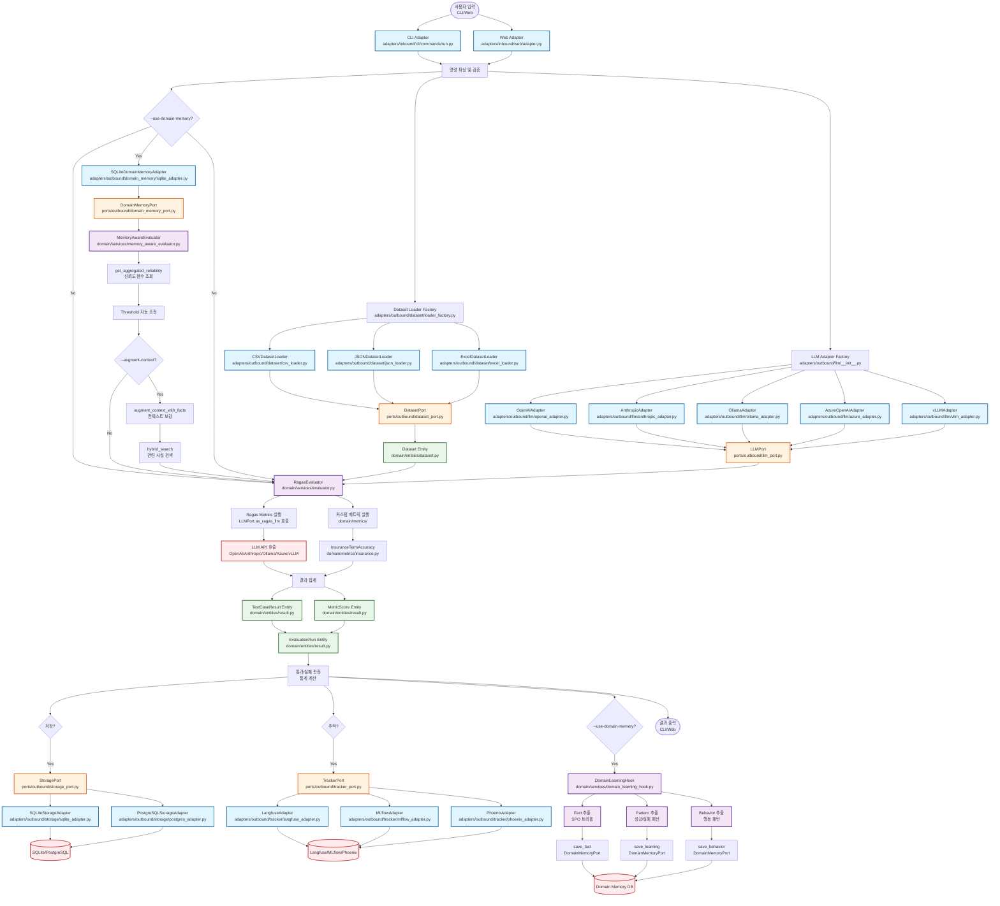
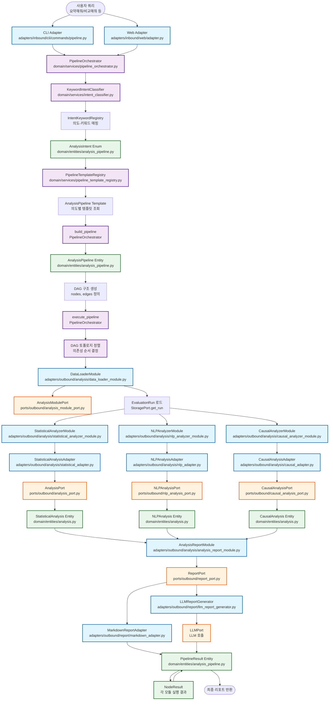
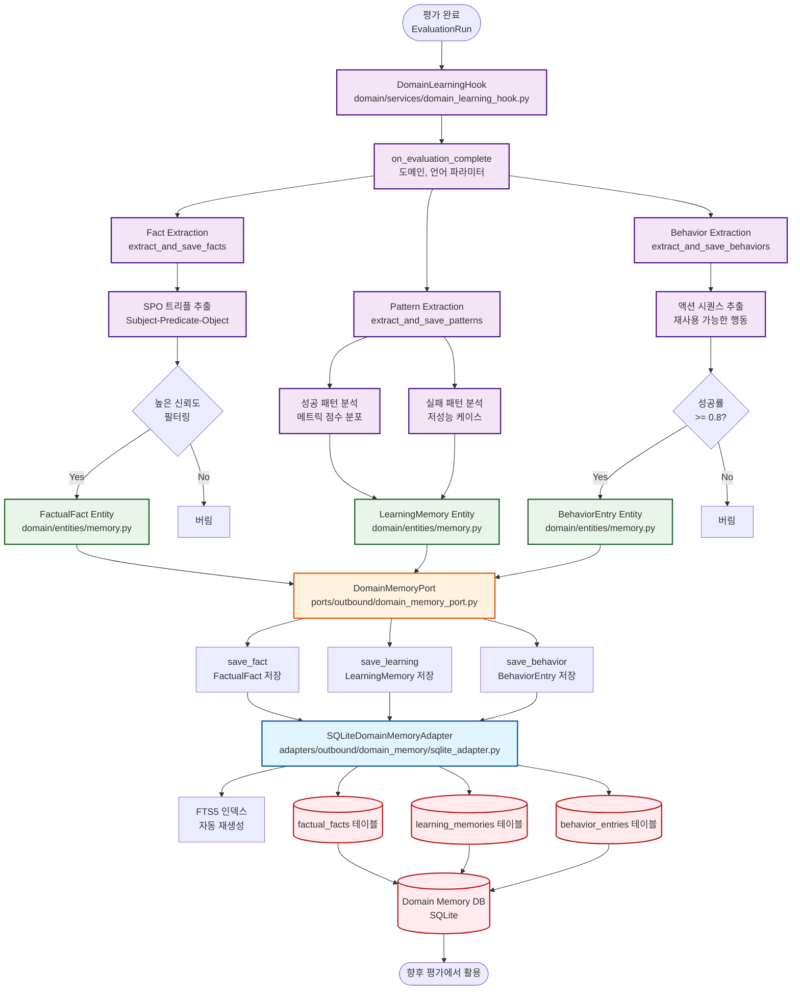
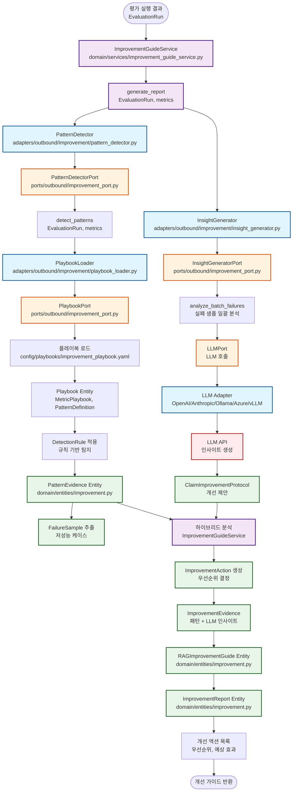
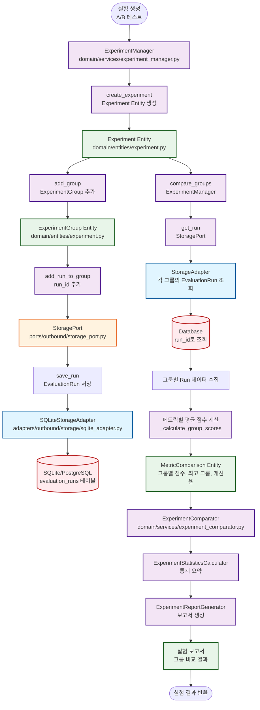

# EvalVault 프로젝트 상세 지도

> **프로젝트의 모든 것을 한눈에 보는 종합 가이드**
>
> 작성일: 2026-01-07
> 목적: 프로젝트의 구조, 아키텍처, 컴포넌트 간 관계, 데이터 흐름을 시각적으로 정리

---

## 목차

1. [프로젝트 개요](#1-프로젝트-개요)
2. [전체 아키텍처 맵](#2-전체-아키텍처-맵)
3. [계층별 상세 구조](#3-계층별-상세-구조)
4. [주요 컴포넌트 관계도](#4-주요-컴포넌트-관계도)
5. [데이터 흐름도 (Mermaid 다이어그램)](#5-데이터-흐름도-mermaid-다이어그램)
   - 5.1 [평가 실행 데이터 흐름](#51-평가-실행-데이터-흐름)
   - 5.2 [분석 파이프라인 데이터 흐름](#52-분석-파이프라인-데이터-흐름)
   - 5.3 [도메인 메모리 형성 데이터 흐름](#53-도메인-메모리-형성-데이터-흐름)
   - 5.4 [도메인 메모리 활용 데이터 흐름](#54-도메인-메모리-활용-데이터-흐름)
   - 5.5 [개선 가이드 생성 데이터 흐름](#55-개선-가이드-생성-데이터-흐름)
   - 5.6 [실험 관리 데이터 흐름](#56-실험-관리-데이터-흐름)
6. [기능별 모듈 맵](#6-기능별-모듈-맵)
7. [확장 포인트](#7-확장-포인트)
8. [의존성 관계](#8-의존성-관계)

---

## 1. 프로젝트 개요

### 1.1 프로젝트 미션

**EvalVault**는 RAG(Retrieval-Augmented Generation) 시스템의 품질을 일관되게 평가하고 비교할 수 있는 표준 워크플로를 제공하는 평가 프레임워크입니다.

**핵심 가치:**
- ✅ **표준화된 평가**: Ragas 기반 메트릭으로 일관된 평가
- ✅ **다양한 인터페이스**: CLI, Web UI(React + FastAPI), Streamlit
- ✅ **확장 가능한 아키텍처**: Hexagonal Architecture 기반
- ✅ **지속적 학습**: Domain Memory를 통한 평가 결과 축적 및 활용
- ✅ **한국어 최적화**: 한국어 RAG 평가 특화 기능

### 1.2 기술 스택

| 계층 | 기술 |
|------|------|
| **언어** | Python 3.12+ |
| **CLI** | Typer |
| **Web UI** | React (Vite) + FastAPI |
| **Streamlit UI** | Streamlit (옵션) |
| **평가 프레임워크** | Ragas 0.4.x |
| **데이터베이스** | SQLite (기본), PostgreSQL (선택) |
| **추적 시스템** | Langfuse, Phoenix, MLflow |
| **LLM API** | OpenAI, Anthropic, Azure OpenAI, Ollama, vLLM |
| **한국어 NLP** | Kiwi, BM25, Sentence Transformers |

### 1.3 프로젝트 구조

```
EvalVault/
├── src/evalvault/          # 핵심 소스 코드
│   ├── domain/             # 도메인 계층 (비즈니스 로직)
│   ├── ports/              # 포트 계층 (인터페이스)
│   ├── adapters/           # 어댑터 계층 (구현체)
│   ├── config/             # 설정 관리
│   └── reports/             # 리포트 생성
├── frontend/               # React Web UI
├── agent/                  # 자동화 에이전트
├── tests/                  # 테스트 코드
├── config/                 # 설정 파일
├── data/                   # 데이터셋 및 결과
└── docs/                   # 문서

```

---

## 2. 전체 아키텍처 맵

### 2.1 Hexagonal Architecture 개요

```
┌─────────────────────────────────────────────────────────────────────────┐
│                         EVALVAULT ARCHITECTURE                           │
│                    (Hexagonal Architecture / Ports & Adapters)          │
└─────────────────────────────────────────────────────────────────────────┘

                    ┌─────────────────────────────┐
                    │   External World             │
                    │   (Users, APIs, Databases)   │
                    └──────────────┬──────────────┘
                                   │
                    ┌──────────────▼──────────────┐
                    │      ADAPTERS LAYER          │
                    │   (외부 세계와의 인터페이스)   │
                    │                              │
                    │  ┌──────────┐  ┌──────────┐│
                    │  │  Inbound │  │ Outbound ││
                    │  │ Adapters │  │ Adapters ││
                    │  └────┬─────┘  └────┬─────┘│
                    └───────┼─────────────┼───────┘
                            │             │
                    ┌───────▼─────────────▼───────┐
                    │      PORTS LAYER             │
                    │   (인터페이스 정의 - 계약)     │
                    │                              │
                    │  ┌──────────┐  ┌──────────┐│
                    │  │  Inbound │  │ Outbound ││
                    │  │  Ports   │  │  Ports   ││
                    │  └────┬─────┘  └────┬─────┘│
                    └───────┼─────────────┼───────┘
                            │             │
                    ┌───────▼─────────────▼───────┐
                    │      DOMAIN LAYER            │
                    │   (핵심 비즈니스 로직)        │
                    │                              │
                    │  ┌──────────┐  ┌──────────┐│
                    │  │ Entities │  │ Services ││
                    │  │ Metrics  │  │          ││
                    │  └──────────┘  └──────────┘│
                    └──────────────────────────────┘

의존성 방향: Adapters → Ports → Domain
```

### 2.2 계층별 역할

| 계층 | 역할 | 주요 구성요소 |
|------|------|--------------|
| **Domain** | 핵심 비즈니스 로직 | Entities, Services, Metrics |
| **Ports** | 인터페이스 정의 | Inbound/Outbound Ports |
| **Adapters** | 외부 시스템 연동 | CLI, Web, LLM, Storage, Tracker |

---

## 3. 계층별 상세 구조

### 3.1 Domain Layer (도메인 계층)

#### 3.1.1 Entities (엔티티)

**핵심 엔티티:**

```
domain/entities/
├── dataset.py           # Dataset, TestCase
├── result.py            # EvaluationRun, TestCaseResult, MetricScore
├── analysis.py          # AnalysisBundle, StatisticalAnalysis, NLPAnalysis, CausalAnalysis
├── analysis_pipeline.py # AnalysisPipeline, AnalysisNode, AnalysisContext
├── experiment.py        # Experiment, ExperimentGroup
├── improvement.py       # ImprovementReport, ImprovementAction
├── memory.py            # FactualFact, LearningMemory, BehaviorEntry
├── kg.py                # EntityModel, RelationModel
├── benchmark.py         # BenchmarkSuite, BenchmarkResult
├── debug.py             # DebugReport
├── method.py            # MethodInput, MethodOutput, MethodInputDataset
├── rag_trace.py         # RAGTraceData, RetrievalData, GenerationData
└── stage.py             # StageEvent, StageMetric, StageSummary
```

**주요 엔티티 관계:**

```
Dataset (Aggregate Root)
  └── TestCase[]

EvaluationRun (Aggregate Root)
  ├── TestCaseResult[]
  │   └── MetricScore[]
  └── thresholds: dict[str, float]

AnalysisBundle
  ├── StatisticalAnalysis
  ├── NLPAnalysis
  └── CausalAnalysis

AnalysisPipeline (DAG)
  └── AnalysisNode[]
      └── dependencies: AnalysisNode[]
```

#### 3.1.2 Services (도메인 서비스)

**핵심 서비스:**

```
domain/services/
├── evaluator.py                     # RagasEvaluator
├── memory_aware_evaluator.py        # MemoryAwareEvaluator
├── memory_based_analysis.py         # MemoryBasedAnalysis
├── analysis_service.py              # AnalysisService
├── pipeline_orchestrator.py         # PipelineOrchestrator
├── pipeline_template_registry.py    # PipelineTemplateRegistry
├── intent_classifier.py             # KeywordIntentClassifier
├── improvement_guide_service.py     # ImprovementGuideService
├── domain_learning_hook.py          # DomainLearningHook
├── experiment_manager.py            # ExperimentManager
├── experiment_comparator.py         # ExperimentComparator
├── experiment_statistics.py         # ExperimentStatisticsCalculator
├── experiment_reporter.py           # ExperimentReportGenerator
├── experiment_repository.py         # ExperimentRepository
├── benchmark_runner.py              # BenchmarkRunner
├── async_batch_executor.py          # AsyncBatchExecutor
├── batch_executor.py                # BatchExecutor
├── testset_generator.py             # TestsetGenerator
├── method_runner.py                 # MethodRunner
├── stage_metric_service.py          # StageMetricService
├── stage_summary_service.py         # StageSummaryService
├── stage_event_builder.py           # StageEventBuilder
├── stage_metric_guide_service.py    # StageMetricGuideService
├── kg_generator.py                  # KGGenerator
├── entity_extractor.py              # EntityExtractor
├── document_chunker.py              # DocumentChunker
├── embedding_overlay.py             # EmbeddingOverlay
├── cache_metrics.py                 # CacheMetrics
├── dataset_preprocessor.py          # DatasetPreprocessor
├── debug_report_service.py          # DebugReportService
├── prompt_manifest.py               # PromptManifest
├── prompt_status.py                 # PromptStatus
├── retrieval_metrics.py             # RetrievalMetrics
├── retriever_context.py             # RetrieverContext
└── threshold_profiles.py            # ThresholdProfiles
```

**서비스 책임:**

| 서비스 | 책임 |
|--------|------|
| `RagasEvaluator` | Ragas 메트릭 기반 평가 실행 |
| `MemoryAwareEvaluator` | Domain Memory 신뢰도로 threshold 조정, 컨텍스트 보강 |
| `MemoryBasedAnalysis` | 과거 학습과 현재 결과 비교, 트렌드 분석 |
| `AnalysisService` | 통계/NLP/인과 분석 오케스트레이션 |
| `PipelineOrchestrator` | DAG 기반 분석 파이프라인 실행 |
| `ImprovementGuideService` | 규칙/LLM 결합 개선 리포트 생성 |
| `DomainLearningHook` | 평가 결과에서 Fact/Learning/Behavior 추출 |
| `StageMetricService` | 단계별 메트릭 수집 및 관리 |
| `StageMetricGuideService` | 단계별 메트릭 가이드 생성 |
| `StageEventBuilder` | Stage 이벤트 빌드 |
| `ExperimentRepository` | 실험 데이터 영속화 |
| `EntityExtractor` | 텍스트에서 엔티티 추출 |
| `DocumentChunker` | 문서 청킹 처리 |
| `EmbeddingOverlay` | 임베딩 오버레이 관리 |
| `CacheMetrics` | 캐시 메트릭 관리 |
| `DatasetPreprocessor` | 데이터셋 전처리 |
| `DebugReportService` | 디버그 리포트 생성 |
| `RetrievalMetrics` | 검색 품질 메트릭 계산 |
| `RetrieverContext` | 검색 컨텍스트 관리 |
| `ThresholdProfiles` | 임계값 프로파일 관리 |

#### 3.1.3 Metrics (메트릭)

```
domain/metrics/
├── insurance.py          # InsuranceTermAccuracy
└── entity_preservation.py # EntityPreservation
```

### 3.2 Ports Layer (포트 계층)

#### 3.2.1 Inbound Ports (입력 포트)

```
ports/inbound/
├── evaluator_port.py           # EvaluatorPort
├── analysis_pipeline_port.py   # AnalysisPipelinePort
├── learning_hook_port.py       # DomainLearningHookPort
└── web_port.py                 # WebUIPort
```

**역할:** 도메인이 제공하는 기능을 외부에 노출

#### 3.2.2 Outbound Ports (출력 포트)

```
ports/outbound/
├── dataset_port.py              # DatasetPort
├── llm_port.py                  # LLMPort
├── storage_port.py              # StoragePort
├── tracker_port.py              # TrackerPort
├── tracer_port.py               # TracerPort
├── analysis_port.py             # AnalysisPort
├── analysis_module_port.py      # AnalysisModulePort
├── analysis_cache_port.py       # AnalysisCachePort
├── nlp_analysis_port.py         # NLPAnalysisPort
├── causal_analysis_port.py      # CausalAnalysisPort
├── domain_memory_port.py        # DomainMemoryPort
├── improvement_port.py          # PatternDetectorPort, InsightGeneratorPort
├── korean_nlp_port.py           # KoreanNLPToolkitPort
├── embedding_port.py            # EmbeddingPort
├── report_port.py               # ReportPort
├── intent_classifier_port.py    # IntentClassifierPort
├── method_port.py               # MethodPort
├── stage_storage_port.py        # StageStoragePort
└── relation_augmenter_port.py   # RelationAugmenterPort
```

**역할:** 도메인이 필요로 하는 외부 서비스를 정의

### 3.3 Adapters Layer (어댑터 계층)

#### 3.3.1 Inbound Adapters (입력 어댑터)

**CLI Adapter:**

```
adapters/inbound/cli/
├── app.py                       # Typer 앱 진입점
└── commands/
    ├── run.py                   # 평가 실행
    ├── generate.py              # 테스트셋 생성
    ├── compare.py               # 결과 비교
    ├── history.py               # 히스토리 조회
    ├── experiment.py            # 실험 관리
    ├── pipeline.py              # 분석 파이프라인
    ├── analyze.py               # 분석 실행
    ├── benchmark.py              # 벤치마크 실행
    ├── domain.py                # 도메인 메모리 관리
    ├── gate.py                  # 품질 게이트
    ├── agent.py                 # 에이전트 실행
    └── ...
```

**Web Adapter:**

```
adapters/inbound/
├── api/                         # FastAPI
│   ├── main.py                 # FastAPI 앱
│   └── routers/                # API 라우터
└── web/                         # Streamlit
    ├── adapter.py              # WebUIAdapter
    ├── app.py                  # Streamlit 앱
    └── components/             # UI 컴포넌트
```

#### 3.3.2 Outbound Adapters (출력 어댑터)

**LLM Adapters:**

```
adapters/outbound/llm/
├── base.py                      # BaseLLMAdapter
├── openai_adapter.py            # OpenAIAdapter
├── anthropic_adapter.py         # AnthropicAdapter
├── azure_adapter.py             # AzureOpenAIAdapter
├── ollama_adapter.py            # OllamaAdapter
├── vllm_adapter.py              # vLLMAdapter
├── token_aware_chat.py          # TokenTracking
├── instructor_factory.py        # InstructorFactory
└── llm_relation_augmenter.py    # LLMRelationAugmenter
```

**Storage Adapters:**

```
adapters/outbound/storage/
├── base_sql.py                  # BaseSQLStorageAdapter
├── sqlite_adapter.py             # SQLiteStorageAdapter
└── postgres_adapter.py           # PostgreSQLStorageAdapter
```

**Tracker Adapters:**

```
adapters/outbound/tracker/
├── langfuse_adapter.py           # LangfuseAdapter
├── mlflow_adapter.py             # MLflowAdapter
└── phoenix_adapter.py            # PhoenixAdapter
```

**Analysis Adapters:**

```
adapters/outbound/analysis/
├── statistical_adapter.py       # StatisticalAnalysisAdapter
├── nlp_adapter.py                # NLPAnalysisAdapter
├── causal_adapter.py             # CausalAnalysisAdapter
└── *_module.py                   # Analysis Modules
```

**Korean NLP Adapters:**

```
adapters/outbound/nlp/korean/
├── toolkit.py                    # KoreanNLPToolkit
├── kiwi_tokenizer.py             # KiwiTokenizer
├── bm25_retriever.py             # KoreanBM25Retriever
├── dense_retriever.py            # KoreanDenseRetriever
├── hybrid_retriever.py           # KoreanHybridRetriever
├── korean_evaluation.py          # KoreanFaithfulnessChecker
├── document_chunker.py           # KoreanDocumentChunker
└── korean_stopwords.py           # 불용어 사전
```

**Knowledge Graph Adapters:**

```
adapters/outbound/kg/
├── networkx_adapter.py           # NetworkXKGAdapter
├── graph_rag_retriever.py        # GraphRAGRetriever
├── parallel_kg_builder.py        # ParallelKGBuilder
└── query_strategies.py           # KG 쿼리 전략
```

**Domain Memory Adapter:**

```
adapters/outbound/domain_memory/
├── sqlite_adapter.py             # SQLiteDomainMemoryAdapter
└── domain_memory_schema.sql      # 스키마 정의
```

---

## 4. 주요 컴포넌트 관계도

### 4.1 평가 실행 흐름

```
┌─────────────────────────────────────────────────────────────┐
│                    평가 실행 컴포넌트 관계                     │
└─────────────────────────────────────────────────────────────┘

[CLI/Web Adapter]
        │
        ▼
[Dataset Loader] ──→ [Dataset Entity]
        │
        ▼
[LLM Adapter Factory] ──→ [LLM Adapter] ──→ [LLMPort]
        │
        ▼
[MemoryAwareEvaluator] ──→ [DomainMemoryPort] ──→ [DomainMemoryAdapter]
        │
        ▼
[RagasEvaluator] ──→ [Ragas Metrics]
        │
        ▼
[EvaluationRun Entity]
        │
        ├─→ [Storage Adapter] ──→ [Database]
        └─→ [Tracker Adapter] ──→ [Langfuse/Phoenix/MLflow]
```

### 4.2 분석 파이프라인 흐름

```
┌─────────────────────────────────────────────────────────────┐
│                  분석 파이프라인 컴포넌트 관계                 │
└─────────────────────────────────────────────────────────────┘

[User Query]
        │
        ▼
[IntentClassifier] ──→ [AnalysisIntent]
        │
        ▼
[TemplateRegistry] ──→ [AnalysisPipeline Template]
        │
        ▼
[PipelineOrchestrator] ──→ [AnalysisPipeline (DAG)]
        │
        ├─→ [StatisticalAnalysisModule]
        ├─→ [NLPAnalysisModule]
        ├─→ [CausalAnalysisModule]
        └─→ [ReportModule]
        │
        ▼
[PipelineResult]
```

### 4.3 도메인 메모리 형성 흐름

```
┌─────────────────────────────────────────────────────────────┐
│                도메인 메모리 형성 컴포넌트 관계                │
└─────────────────────────────────────────────────────────────┘

[EvaluationRun]
        │
        ▼
[DomainLearningHook]
        │
        ├─→ [Fact Extraction] ──→ [FactualFact] ──→ [DomainMemoryPort]
        ├─→ [Pattern Extraction] ──→ [LearningMemory] ──→ [DomainMemoryPort]
        └─→ [Behavior Extraction] ──→ [BehaviorEntry] ──→ [DomainMemoryPort]
        │
        ▼
[DomainMemoryAdapter] ──→ [SQLite Database]
```

### 4.4 개선 가이드 생성 흐름

```
┌─────────────────────────────────────────────────────────────┐
│                 개선 가이드 생성 컴포넌트 관계                 │
└─────────────────────────────────────────────────────────────┘

[EvaluationRun]
        │
        ▼
[ImprovementGuideService]
        │
        ├─→ [PatternDetector] ──→ [PlaybookLoader] ──→ [PatternEvidence]
        └─→ [InsightGenerator] ──→ [LLM Adapter] ──→ [ClaimImprovementProtocol]
        │
        ▼
[ImprovementReport]
```

---

## 5. 데이터 흐름도 (Mermaid 다이어그램)

> **참고**: 이 섹션은 Mermaid 다이어그램으로 작성되었습니다. GitHub, GitLab, 또는 Mermaid를 지원하는 마크다운 뷰어에서 시각적으로 확인할 수 있습니다.

### 5.1 평가 실행 데이터 흐름



### 5.2 분석 파이프라인 데이터 흐름



### 5.3 도메인 메모리 형성 데이터 흐름



### 5.4 도메인 메모리 활용 데이터 흐름

```mermaid
flowchart TD
    Start([평가 시작<br/>--use-domain-memory 옵션]) --> MemoryAware[MemoryAwareEvaluator<br/>domain/services/memory_aware_evaluator.py]

    MemoryAware --> Init[초기화<br/>RagasEvaluator 래핑]

    Init --> GetReliability[get_aggregated_reliability<br/>DomainMemoryPort]

    GetReliability --> DomainMemoryPort[DomainMemoryPort<br/>ports/outbound/domain_memory_port.py]

    DomainMemoryPort --> MemoryAdapter[SQLiteDomainMemoryAdapter<br/>adapters/outbound/domain_memory/sqlite_adapter.py]

    MemoryAdapter --> QueryReliability[과거 평가 신뢰도 조회<br/>메트릭별 집계]

    QueryReliability --> ReliabilityData[신뢰도 데이터<br/>예: faithfulness: 0.85]

    ReliabilityData --> AdjustThreshold[Threshold 자동 조정<br/>_adjust_by_reliability]

    AdjustThreshold --> LowReliability{신뢰도<br/>< 0.6?}
    AdjustThreshold --> HighReliability{신뢰도<br/>> 0.85?}

    LowReliability -->|Yes| DecreaseThreshold[threshold - 0.1<br/>최소 0.5]
    HighReliability -->|Yes| IncreaseThreshold[threshold + 0.05<br/>최대 0.95]
    LowReliability -->|No| AugmentOpt
    HighReliability -->|No| AugmentOpt

    DecreaseThreshold --> AugmentOpt{--augment-context?}
    IncreaseThreshold --> AugmentOpt

    AugmentOpt -->|Yes| AugmentContext[augment_context_with_facts<br/>MemoryAwareEvaluator]

    AugmentContext --> HybridSearch[hybrid_search<br/>DomainMemoryPort]

    HybridSearch --> SearchFacts["관련 사실 검색 - 질문 기반"]

    SearchFacts --> MemoryAdapter2[SQLiteDomainMemoryAdapter<br/>FTS5 검색]

    MemoryAdapter2 --> FactualFacts[FactualFact 검색 결과]

    FactualFacts --> AddToContext[컨텍스트에 사실 추가<br/>관련 사실 태그 형식]

    AddToContext --> RagasEval
    AugmentOpt -->|No| RagasEval[RagasEvaluator.evaluate<br/>domain/services/evaluator.py]

    RagasEval --> AdjustedThreshold[조정된 threshold 사용]
    RagasEval --> AugmentedContext[보강된 컨텍스트 사용]

    AdjustedThreshold --> EvaluationRun[EvaluationRun 생성]
    AugmentedContext --> EvaluationRun

    EvaluationRun --> AnalysisOpt{분석 실행?}

    AnalysisOpt -->|Yes| MemoryAnalysis[MemoryBasedAnalysis<br/>domain/services/memory_based_analysis.py]

    MemoryAnalysis --> ListLearnings[list_learnings<br/>DomainMemoryPort]

    ListLearnings --> HistoricalData[과거 LearningMemory 조회]

    HistoricalData --> CompareTrends[트렌드 분석<br/>baseline vs current]

    CompareTrends --> Delta[Delta 계산<br/>메트릭별 변화]

    Delta --> RelatedFacts[관련 사실 검색<br/>hybrid_search]

    RelatedFacts --> Recommendations[추천 사항 생성<br/>재사용 가능한 행동]

    Recommendations --> Insights[Insights 딕셔너리<br/>trends, related_facts, recommendations]

    Insights --> Output([분석 결과 반환])
    EvaluationRun --> Output

    classDef domain fill:#f3e5f5,stroke:#4a148c,stroke-width:2px
    classDef port fill:#fff3e0,stroke:#e65100,stroke-width:2px
    classDef adapter fill:#e1f5ff,stroke:#01579b,stroke-width:2px
    classDef entity fill:#e8f5e9,stroke:#1b5e20,stroke-width:2px

    class MemoryAware,Init,GetReliability,AdjustThreshold,AugmentContext,HybridSearch,SearchFacts,AddToContext,RagasEval,MemoryAnalysis,ListLearnings,CompareTrends,Delta,RelatedFacts,Recommendations domain
    class DomainMemoryPort port
    class MemoryAdapter,MemoryAdapter2 adapter
    class EvaluationRun,ReliabilityData,FactualFacts,HistoricalData,Insights entity
```



### 5.5 개선 가이드 생성 데이터 흐름



### 5.6 실험 관리 데이터 흐름



---

## 6. 기능별 모듈 맵

### 6.1 평가 실행 기능

**모듈:** `domain/services/evaluator.py`, `domain/services/memory_aware_evaluator.py`

**주요 클래스:**
- `RagasEvaluator`: Ragas 메트릭 기반 평가
- `MemoryAwareEvaluator`: Domain Memory 활용 평가

**포트:**
- `EvaluatorPort` (Inbound)
- `LLMPort` (Outbound)
- `DomainMemoryPort` (Outbound)

**어댑터:**
- `OpenAIAdapter`, `AnthropicAdapter`, `OllamaAdapter`, `AzureOpenAIAdapter`, `vLLMAdapter`
- `SQLiteDomainMemoryAdapter`

### 6.2 분석 기능

**모듈:** `domain/services/analysis_service.py`, `domain/services/pipeline_orchestrator.py`

**주요 클래스:**
- `AnalysisService`: 통계/NLP/인과 분석 통합
- `PipelineOrchestrator`: DAG 기반 파이프라인 실행
- `MemoryBasedAnalysis`: 메모리 기반 트렌드 분석

**포트:**
- `AnalysisPipelinePort` (Inbound)
- `AnalysisPort`, `NLPAnalysisPort`, `CausalAnalysisPort` (Outbound)
- `AnalysisModulePort` (Outbound)

**어댑터:**
- `StatisticalAnalysisAdapter`
- `NLPAnalysisAdapter`
- `CausalAnalysisAdapter`
- Analysis Modules (`StatisticalAnalyzerModule`, `NLPAnalyzerModule` 등)

### 6.3 개선 가이드 기능

**모듈:** `domain/services/improvement_guide_service.py`

**주요 클래스:**
- `ImprovementGuideService`: 규칙/LLM 결합 개선 리포트 생성

**포트:**
- `PatternDetectorPort` (Outbound)
- `InsightGeneratorPort` (Outbound)
- `PlaybookPort` (Outbound)

**어댑터:**
- `PatternDetector`: 규칙 기반 패턴 탐지
- `InsightGenerator`: LLM 기반 인사이트 생성
- `PlaybookLoader`: 플레이북 로드

### 6.4 도메인 메모리 기능

**모듈:** `domain/services/domain_learning_hook.py`, `domain/services/memory_aware_evaluator.py`

**주요 클래스:**
- `DomainLearningHook`: 평가 결과에서 메모리 형성
- `MemoryAwareEvaluator`: 메모리 활용 평가
- `MemoryBasedAnalysis`: 메모리 기반 분석

**포트:**
- `DomainMemoryPort` (Outbound)

**어댑터:**
- `SQLiteDomainMemoryAdapter`

### 6.5 한국어 NLP 기능

**모듈:** `adapters/outbound/nlp/korean/`

**주요 클래스:**
- `KoreanNLPToolkit`: 한국어 NLP 툴킷
- `KoreanBM25Retriever`: BM25 검색기
- `KoreanDenseRetriever`: Dense 검색기
- `KoreanHybridRetriever`: 하이브리드 검색기
- `KoreanFaithfulnessChecker`: 한국어 충실도 검사기

**포트:**
- `KoreanNLPToolkitPort` (Outbound)

### 6.6 실험 관리 기능

**모듈:** `domain/services/experiment_manager.py`

**주요 클래스:**
- `ExperimentManager`: A/B 테스트 실험 관리
- `ExperimentComparator`: 그룹 간 메트릭 비교

**포트:**
- `StoragePort` (Outbound)

**어댑터:**
- `SQLiteStorageAdapter`, `PostgreSQLStorageAdapter`

---

## 7. 확장 포인트

### 7.1 새로운 LLM 제공자 추가

**단계:**
1. `LLMPort` 인터페이스 구현
2. `BaseLLMAdapter` 상속
3. `adapters/outbound/llm/`에 어댑터 추가
4. Factory에 등록

**예시:**
```python
# 1. LLMPort 구현
class NewLLMAdapter(BaseLLMAdapter):
    def get_model_name(self) -> str:
        return "new-model"

    def as_ragas_llm(self):
        return llm_factory(model="new-model", provider="new-provider")

# 2. Factory에 등록
def get_llm_adapter(settings: Settings) -> LLMPort:
    if settings.llm_provider == "new-provider":
        return NewLLMAdapter(settings)
    # ...
```

### 7.2 새로운 메트릭 추가

**단계:**
1. 메트릭 클래스 생성
2. `RagasEvaluator.CUSTOM_METRIC_MAP`에 등록

**예시:**
```python
# 1. 메트릭 클래스
class NewMetric:
    def score(self, answer: str, contexts: list[str]) -> float:
        # 평가 로직
        return 0.9

# 2. 등록
class RagasEvaluator:
    CUSTOM_METRIC_MAP = {
        "insurance_term_accuracy": InsuranceTermAccuracy,
        "new_metric": NewMetric,  # 새 메트릭 추가
    }
```

### 7.3 새로운 분석 모듈 추가

**단계:**
1. `AnalysisModulePort` 구현
2. `BaseAnalysisModule` 상속
3. `adapters/outbound/analysis/`에 모듈 추가
4. `ModuleCatalog`에 등록

**예시:**
```python
# 1. 분석 모듈 구현
class CustomAnalysisModule(BaseAnalysisModule):
    module_id = "custom_analysis"
    name = "Custom Analysis"

    def execute(
        self,
        context: AnalysisContext,
        inputs: dict[str, Any],
    ) -> NodeResult:
        # 분석 로직
        ...

# 2. 오케스트레이터에 등록
orchestrator = PipelineOrchestrator()
orchestrator.register_module(CustomAnalysisModule())
```

### 7.4 새로운 저장소 추가

**단계:**
1. `StoragePort` 또는 `DomainMemoryPort` 구현
2. 어댑터 클래스 생성
3. Factory에 등록

**예시:**
```python
# 1. 저장소 어댑터 구현
class MongoDBStorageAdapter(StoragePort):
    def save_run(self, run: EvaluationRun) -> str:
        # MongoDB 저장 로직
        ...

# 2. Factory에 등록
def get_storage_adapter(settings: Settings) -> StoragePort:
    if settings.storage_type == "mongodb":
        return MongoDBStorageAdapter(settings)
    # ...
```

---

## 8. 의존성 관계

### 8.1 의존성 방향 규칙

```
의존성 방향: 외부 → 내부
Adapters → Ports ← Domain
```

**규칙:**
- 어댑터는 포트에 의존
- 포트는 도메인에 속하지만 도메인 서비스에 의존하지 않음
- 도메인은 포트에만 의존 (어댑터에 직접 의존하지 않음)

### 8.2 주요 의존성 체인

#### 평가 파이프라인

```
CLI/Web Adapter
    ↓
EvaluatorPort (인터페이스)
    ↓
RagasEvaluator (서비스)
    ↓
LLMPort, EmbeddingPort (인터페이스)
    ↓
LLM Adapters (구현체)
```

#### 분석 파이프라인

```
CLI/Web Adapter
    ↓
AnalysisPipelinePort (인터페이스)
    ↓
PipelineOrchestrator (서비스)
    ↓
AnalysisModulePort (인터페이스)
    ↓
Analysis Modules (구현체)
```

#### 저장 파이프라인

```
Domain Services
    ↓
StoragePort, TrackerPort (인터페이스)
    ↓
Storage/Tracker Adapters (구현체)
```

### 8.3 의존성 주입 패턴

**생성자 주입:**
```python
class ExperimentManager:
    def __init__(self, storage: StoragePort):  # 의존성 주입
        self._storage = storage
```

**메서드 주입:**
```python
class RagasEvaluator:
    async def evaluate(
        self,
        dataset: Dataset,
        metrics: list[str],
        llm: LLMPort,  # 메서드 파라미터로 주입
    ) -> EvaluationRun:
        ...
```

---

## 9. 주요 시나리오 맵

### 9.1 평가 실행 시나리오

```
1. 사용자 입력 (CLI/Web)
   ↓
2. Dataset Loader
   ↓
3. LLM Adapter 생성
   ↓
4. MemoryAwareEvaluator (옵션)
   ↓
5. RagasEvaluator
   ↓
6. EvaluationRun 생성
   ↓
7. 결과 저장 (옵션)
   ↓
8. DomainLearningHook (옵션)
```

### 9.2 분석 파이프라인 시나리오

```
1. 사용자 쿼리
   ↓
2. IntentClassifier
   ↓
3. TemplateRegistry
   ↓
4. PipelineOrchestrator.build_pipeline()
   ↓
5. PipelineOrchestrator.execute_pipeline()
   ↓
6. PipelineResult 반환
```

### 9.3 도메인 메모리 형성 시나리오

```
1. 평가 완료
   ↓
2. DomainLearningHook.on_evaluation_complete()
   ↓
3. Fact/Pattern/Behavior 추출
   ↓
4. DomainMemoryPort 저장
   ↓
5. 향후 평가에서 활용
```

---

## 10. 참고 문서

### 아키텍처 문서
- [ARCHITECTURE.md](../architecture/ARCHITECTURE.md): 상세 아키텍처 가이드
- [ARCHITECTURE_C4.md](./ARCHITECTURE_C4.md): C4 Model 기반 다이어그램
- [CLASS_CATALOG.md](./CLASS_CATALOG.md): 클래스 카탈로그

### 가이드 문서
- [USER_GUIDE.md](../../guides/USER_GUIDE.md): 사용자 가이드
- [CLI_GUIDE.md](../../guides/CLI_GUIDE.md): CLI 가이드
- [DEV_GUIDE.md](../../guides/DEV_GUIDE.md): 개발자 가이드

### 상태 문서
- [STATUS.md](../../status/STATUS.md): 프로젝트 상태
- [ROADMAP.md](../../status/ROADMAP.md): 로드맵

---

## 11. Mermaid 다이어그램 사용법

이 문서의 데이터 흐름도는 Mermaid 다이어그램으로 작성되었습니다. 다음 환경에서 시각적으로 확인할 수 있습니다:

- **GitHub/GitLab**: 마크다운 파일을 직접 뷰어에서 확인
- **VS Code**: Mermaid 확장 프로그램 설치 후 미리보기
- **Mermaid Live Editor**: https://mermaid.live/ 에 코드 복사 후 확인
- **MkDocs**: `mkdocs-material` 플러그인으로 자동 렌더링

### 다이어그램 색상 코드

- 🔵 **파란색 (Adapter)**: 외부 시스템과의 인터페이스 구현체
- 🟠 **주황색 (Port)**: 도메인과 외부 세계 사이의 계약 인터페이스
- 🟣 **보라색 (Domain Service)**: 핵심 비즈니스 로직
- 🟢 **초록색 (Entity)**: 도메인 엔티티 및 데이터 모델
- 🔴 **빨간색 (External)**: 외부 시스템 (DB, API 등)

---

**문서 버전**: 1.5
**최종 업데이트**: 2026-01-07
**작성 기준**: EvalVault 프로젝트 전체 코드베이스
**주요 변경**: 서비스 14개 추가 (Stage*, Debug, Cache, Retrieval 등), KG 어댑터 섹션 추가
