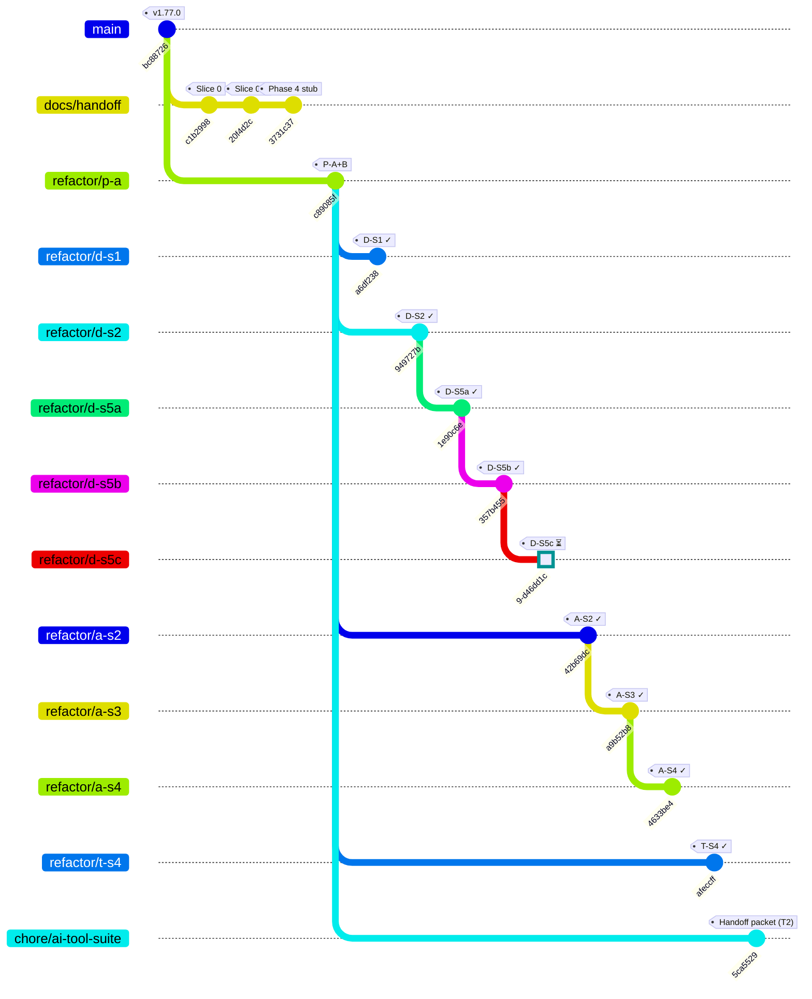
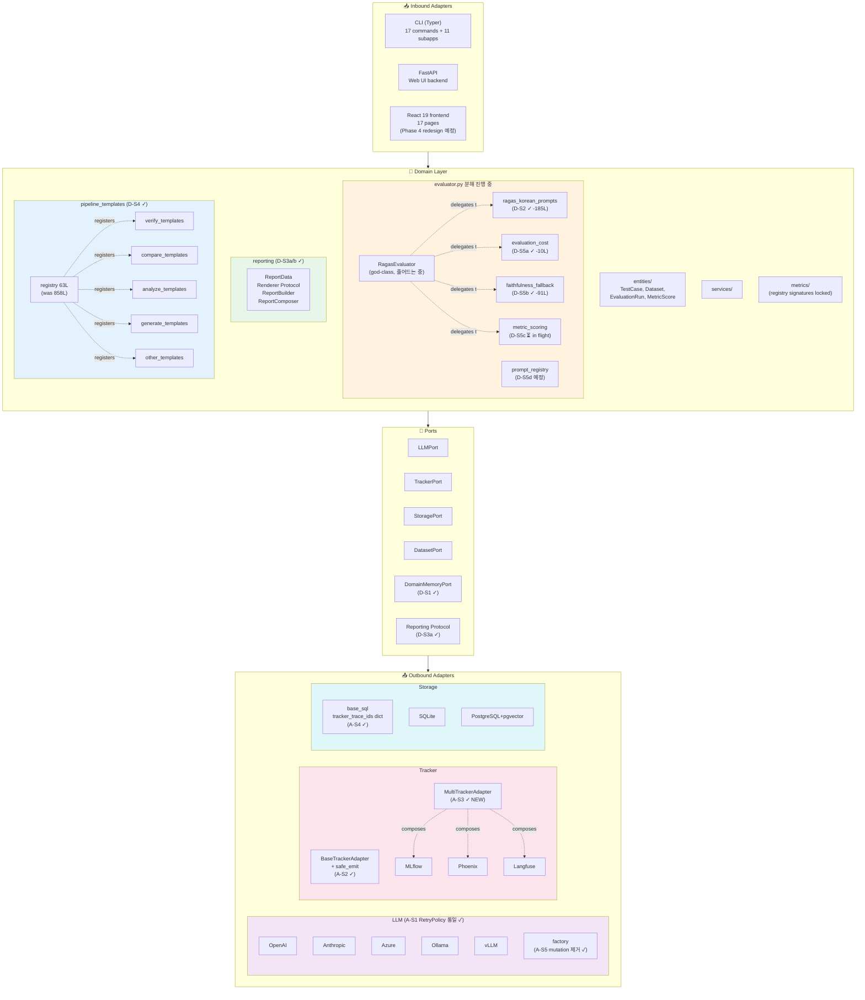
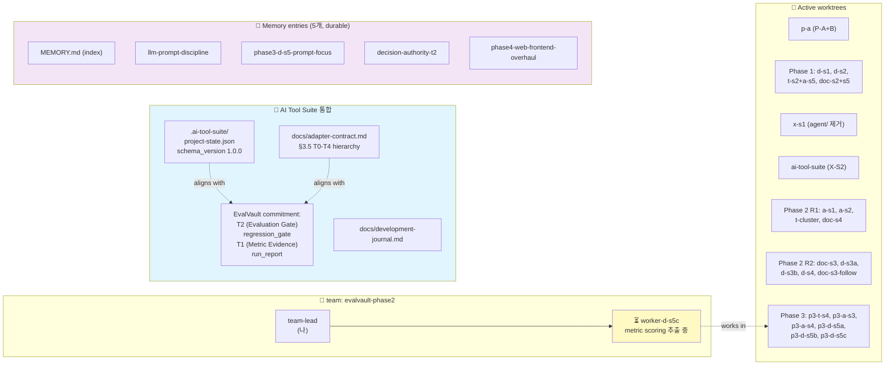

# EvalVault Project Composition (Mermaid Snapshot)

> **문서 성격**: 진행 중인 리팩토링 상태의 시각화 스냅샷. 브랜치 의존성·코드 아키텍처·활성 worker를 Mermaid 다이어그램으로 정리한다.
>
> **스냅샷 일자**: 2026-05-21
> **기준 커밋**: `c89085f` (Pre-flight A+B) — 모든 리팩토링 브랜치의 공통 베이스
> **짝 문서**: [`docs/PROJECT_STATE.md`](PROJECT_STATE.md) (현재 상태 SSoT), [`docs/REFACTOR_DIAGNOSIS.md`](REFACTOR_DIAGNOSIS.md) (실행 계획), [`.ai-tool-suite/project-state.json`](../.ai-tool-suite/project-state.json) (외부 통합 패킷)

---

## 1. 브랜치 의존성 그래프 (Phase 1 + Phase 2 + Phase 3 in-flight)

**해석**: 모든 리팩토링 브랜치는 `c89085f` (P-A+B HEAD)를 공통 베이스로 한다. D-S5 sub-slice들은 직렬 의존 (D-S2 → D-S5a → D-S5b → D-S5c → D-S5d 예정). A-S 계열은 A-S2 (Tracker base) → A-S3 (MultiTracker) → A-S4 (`tracker_trace_ids` 마이그레이션) 의존.

---

## 2. 코드 아키텍처 — 헥사고날 + 리팩토링 후 신규 모듈

**해석**:
- 헥사고날 아키텍처가 유지된다. 도메인은 어댑터를 import하지 않는다 (D-S1에서 마지막 위반 docstring example 제거).
- `RagasEvaluator` god-class는 점진적으로 분해 중 — Korean prompts (D-S2), cost (D-S5a), fallback (D-S5b)가 별도 모듈로 이동. D-S5c (scoring loop) 진행 중, D-S5d (prompt registry + Instructor) 예정.
- 트래커 계층은 base + safe_emit (A-S2) → MultiTracker 구현 (A-S3) → `tracker_trace_ids` 스키마 (A-S4)로 정합화 완료.

---

## 3. 활성 상태 — worktrees + workers + AI Tool Suite 통합

**해석**:
- 현재 활성 worker는 `worker-d-s5c` 하나 (metric scoring 추출 중). 다른 worker들은 작업 완료 후 graceful shutdown 됨.
- 17개 worktree는 각 슬라이스의 격리된 작업 공간 — 모두 c89085f를 공통 베이스로 한다 (Phase 3의 일부는 직전 슬라이스 HEAD 위에 stacked).
- AI Tool Suite 통합은 T0-T4 권한 계층을 채택. EvalVault는 T2 (Evaluation Gate)까지만 권한 행사 — release-level T3 (promote/rollback)는 Reverra-Gate가 소유.
- Memory entries 5개가 다음 세션을 위해 영구 기록된 directive를 보관 (LLM 프롬프트 디스시플린, D-S5 프롬프트 포커스, T2 권한, Phase 4 웹 개편).

---

## 진행 상황 요약

| Phase | 슬라이스 | 상태 | 커밋 |
|---|---|---|---|
| Pre-flight | P-A+B | ✅ | c89085f |
| Phase 1 | D-S1, D-S2, T-S2+A-S5, DOC-S2+S5 | ✅ 7 커밋 / 4 브랜치 | a6df238, 949727b, 3ba839e+f1e33b6, b9f3b7b+bf794b7 |
| 추가 cleanup | X-S1 (agent/ 제거), X-S2 (AI Tool Suite handoff) | ✅ | 5fc329b, 2fd67cf+5ca5529 |
| Phase 2 R1 | A-S1, A-S2, T-cluster, DOC-S4 | ✅ 7 커밋 / 4 브랜치 | 9806cc0, 42b69dc, 8d67315+fa2407c+f4cd350, e9fc813+4af0da2 |
| Phase 2 R2 | DOC-S3, D-S3a, D-S3b, D-S4 + follow-up | ✅ 5 커밋 / 5 브랜치 | f55455a, 69ec13f, 110203d, fcc90b8, 96e3d58 |
| Phase 3 | T-S4, A-S3, A-S4 | ✅ 4 커밋 / 3 브랜치 | afeccff, a9b52b8, 4ed8a74+4633be4 |
| Phase 3 | D-S5a, D-S5b | ✅ 2 커밋 / 2 브랜치 | 1e90c6e, 357b455 |
| Phase 3 | **D-S5c** | ⏳ in-flight | worker-d-s5c |
| Phase 3 | D-S5d (prompt registry + Instructor) | pending | LLM 프롬프트 디스시플린 적용 |
| **Phase 4** | Web frontend Claude design overhaul | 계획 (REFACTOR_DIAGNOSIS §3.5) | Phase 3 안정화 후 시작 |

**총계**: 17 브랜치, 27+ 커밋. Phase 1, Phase 2 R1, Phase 2 R2, Phase 3 (T-S4/A-S3/A-S4) 모두 origin 푸시 완료. D-S5a/D-S5b는 로컬 (이후 푸시 예정). worker-d-s5c가 metric scoring 작업 중.

---

## 문서 유지보수

- 이 문서는 진행 중인 리팩토링의 **시각 스냅샷**이다 — Phase 3 완료 시점에 갱신 필요.
- 새 슬라이스가 추가되거나 머지되면 §1 git graph + §3 활성 worker 섹션 갱신.
- 다이어그램은 mkdocs Material + pymdownx-superfences-mermaid로 렌더링됨 (mkdocs.yml의 `pymdownx.superfences` 확장).
